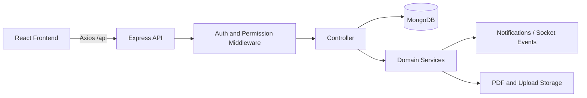

# AMS ERP

AMS ERP is a full-stack automobile dealership and service management system. It combines CRM, sales, quotations, bookings, invoices, vehicle and parts inventory, service operations, HR, finance, notifications, PDF templates, audit logs and role-based access control in one web application.

## Ownership

- **Developer:** Hussain Developer
- **Email:** hussaintmerng@gmail.com
- **Phone:** +92 319 1634446

## Technology

- Frontend: React 18, React Router, Axios, Chart.js
- Backend: Node.js, Express, Swagger UI
- Data: MongoDB with Mongoose and supporting relational integrations where configured
- Runtime: Socket.IO-ready event layer, scheduled background work and PDF workers

## Repository Layout

```text
frontend/src/
  components/     Reusable UI and interaction components
  context/        Shared data and authentication state
  pages/           Route-level screens
  services/       API clients
  styles/         Application styles
backend/
  routes/         HTTP route definitions and Swagger annotations
  controllers/    Request orchestration and validation
  models/         Mongoose schemas
  middleware/     Authentication, logging and error handling
  services/       PDF, notifications, search and background services
  utils/          Shared server utilities
```

## Request Flow



## Authentication and Permissions

Users authenticate through `/api/auth/login`. The server issues an HTTP-only cookie and the frontend also supports a bearer-token fallback for proxy deployments. Protected routes use `authenticate`; role and page permissions are enforced by authorization middleware and server-side data scopes.

## Main Modules

- CRM: leads, customers and assignments
- Sales: quotations, bookings, sales orders and invoices
- Inventory: vehicles, parts, warehouses and master data
- Service: appointments, job cards, labor and parts
- Administration: users, roles, departments, server management and audit logs
- Finance and HR: expenses, ledger, payments, employees, leaves and payroll
- Documents: PDF template management, variables, downloads and bulk generation
- Communication: notifications, email templates, queue and SMTP configuration

## Local Development

1. Copy the appropriate environment template to `.env` and set database, JWT and mail values.
2. Install dependencies in `backend` and `frontend`.
3. Start the API on port `3002` and the React development server on port `3000`.
4. Open `http://localhost:3000`.

Never commit real passwords, tokens or production `.env` files. Use `.env.example` for shareable configuration names only.

## API Documentation and Health

- Swagger UI: `http://localhost:3002/api-documentation`
- OpenAPI JSON: `http://localhost:3002/api-documentation/swagger.json`
- Health: `http://localhost:3002/health`
- API health: `http://localhost:3002/api/health`

Swagger supports the **Authorize** button for a bearer token and sends browser cookies when available.

## Verification

```bash
npm test --prefix backend
npm run build --prefix frontend
```

Keep new features organized as route -> controller -> service/model and keep business logic out of page components whenever a reusable hook or service is appropriate.
