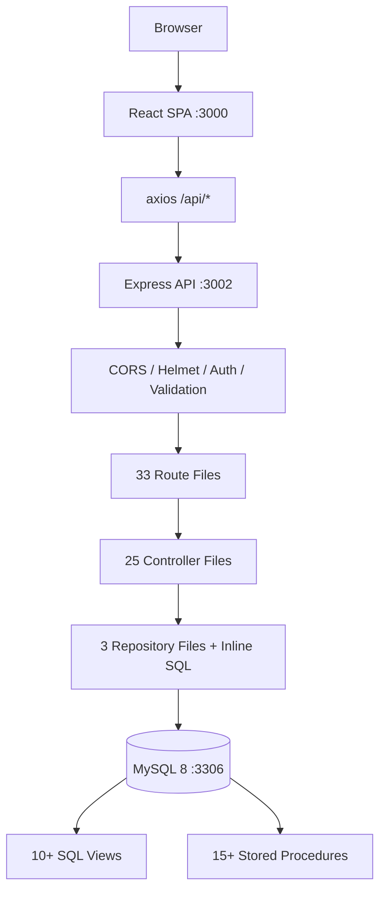

# AMSERP — AI Context (Project DNA)

> Generated for future AI coding assistants.
> After reading ONLY this file, an AI should understand architecture, patterns, rules, and safe modification strategy.

---

## 1. PROJECT IDENTITY

| Field | Value |
|---|---|
| **Project Name** | AMSERP — Auto Management System ERP |
| **Client** | OMODA \| JAECOO GULBERG (Lahore, Pakistan) |
| **Creator** | LOGIXINVENTOR (PVT) Ltd. |
| **Business Domain** | Automobile dealership CRM + ERP |
| **Application Type** | Single-page admin panel (React SPA) + REST API |
| **Architecture** | 3-tier: Frontend (React) → Backend (Express) → Database (MySQL) |
| **Backend** | Node.js 18 / Express 4.18 / plain JS (no TypeScript) |
| **Frontend** | React 18.2 (Create React App 5) / plain JS (no TypeScript) |
| **Database** | MySQL 8 / raw SQL via mysql2/promise (no ORM) |
| **Auth** | JWT (jsonwebtoken) + bcryptjs / 9 roles / RBAC |
| **UI** | Custom CSS (no Tailwind, no Material UI) |
| **Deployment** | Hostinger VPS / Ubuntu 22.04 / PM2 / nginx |

---

## 2. PROJECT ARCHITECTURE



**Data flow per request:**
1. Browser → React Router → Page component mounts
2. Page calls API helper → axios with JWT Bearer token
3. Express middleware: cors → json → auth (verify token) → authorize (check role) → route
4. Route → controller function → runs SQL query → returns JSON
5. Response: `{ success: true/false, data: ..., message: ..., resolution: ... }`

---

## 3. IMPORTANT DIRECTORIES

| Directory | Purpose | AI Should Modify? |
|---|---|---|
| `backend/server.js` | Main entry, middleware, route registration | NO (use routes) |
| `backend/config/database.js` | MySQL pool, query helpers | NO |
| `backend/routes/` | 33 route files (thin, delegate to controllers) | WITH CAUTION |
| `backend/controllers/` | 25 controller files (business logic + SQL) | **YES** |
| `backend/repositories/` | 3 repo classes (BaseRepository + specialized) | WITH CAUTION |
| `backend/middleware/` | auth.js, errorHandler.js, validation.js | NO (unless adding new middleware) |
| `backend/utils/` | logger.js, AppError.js, phone.util.js, bulkImport.parse.js | WITH CAUTION |
| `backend/scripts/` | seed/admin creation scripts | WITH CAUTION |
| `backend/constants/` | defaultDocumentTemplates.js | NO |
| `backend/models/` | orderForm.model.js only | WITH CAUTION |
| `frontend/src/pages/` | 29 page components | **YES** |
| `frontend/src/components/` | 21 shared components | **YES** |
| `frontend/src/services/api.js` | Axios instance + all API endpoint definitions | WITH CAUTION |
| `frontend/src/context/AuthContext.js` | Auth state, login/logout, role checking | NO (unless auth changes) |
| `frontend/src/hooks/` | Custom React hooks | **YES** |
| `frontend/src/utils/` | eventBus.js, template rendering, exports | WITH CAUTION |
| `frontend/src/styles/` | 15 CSS files | **YES** |
| `frontend/src/assets/` | Logo images | NO |
| `frontend/public/` | index.html, favicon, sample files | NO (except index.html) |
| `backend/logs/` | Runtime logs | NEVER |
| `frontend/build/` | Production build output | NEVER |

---

## 4. ENTRY POINTS

| Purpose | File |
|---|---|
| Frontend entry | `frontend/src/index.js` (BrowserRouter + AuthProvider) |
| Backend entry | `backend/server.js` (Express app, port 3002) |
| Database config | `backend/config/database.js` (mysql2 pool) |
| Auth middleware | `backend/middleware/auth.js` (JWT verify, role check, permission check) |
| Error handling | `backend/middleware/errorHandler.js` (AppError class + global handler) |
| Validation | `backend/middleware/validation.js` (express-validator wrapper) |
| API client | `frontend/src/services/api.js` (all API definitions) |
| Auth context | `frontend/src/context/AuthContext.js` (login, logout, hasRole) |
| Environment | `.env` (development), `.env.production.server` (production) |
| Proxy | `frontend/src/setupProxy.js` (proxies /api to :3002 in dev) |
| Build | `frontend/package.json` (react-scripts), `backend/package.json` (node server.js) |

---

## 5. BUSINESS MODULES

### 5.1 Leads (CRM)
- **Purpose:** Track potential customers from inquiry to conversion
- **Frontend:** `pages/Leads.js` — CRUD, filters, bulk upload, convert to customer
- **Backend:** `controllers/leads.controller.js` via `routes/lead.routes.js`
- **Repository:** `repositories/LeadRepository.js` (extends BaseRepository)
- **DB Tables:** `leads`, `lead_sources`, `lead_statuses`, `lead_followups`
- **Main APIs:** `GET/POST/PUT/DELETE /api/leads`, `POST /api/leads/:id/convert`

### 5.2 Customers
- **Purpose:** Manage registered customers with purchase history
- **Frontend:** `pages/Customers.js`
- **Backend:** `controllers/customers.controller.js` via `routes/customer.routes.js`
- **Repository:** `repositories/CustomerRepository.js` (extends BaseRepository)
- **DB Tables:** `customers`
- **Main APIs:** `GET/POST/PUT/DELETE /api/customers`, `GET /api/customers/stats`

### 5.3 Sales (Quotations → Bookings → Orders → Invoices)
- **Purpose:** End-to-end sales pipeline
- **Frontend:** `pages/Sales.js` — sections: quotations, bookings, orders, invoices
- **Backend:** `controllers/salesManagement.controller.js` via `routes/sales.routes.js`, `routes/quotation.routes.js`, `routes/booking.routes.js`, `routes/invoice.routes.js`
- **DB Tables:** `quotations`, `bookings`, `sales_orders`, `invoices`, `invoice_items`, `payments`
- **Main APIs:**
  - `GET/POST/PUT/DELETE /api/quotations`, `/api/quotations/:id/convert`
  - `GET/POST/PUT/DELETE /api/bookings`, `/api/bookings/:id/allocate`, `/api/bookings/:id/convert`
  - `GET/POST/PUT/DELETE /api/sales`, `/api/sales/direct`, `/api/sales/:id/invoice`
  - `GET/POST/PUT/DELETE /api/invoices`, `/api/invoices/:id/payments`

### 5.4 Vehicles & Parts Inventory
- **Purpose:** Track vehicle stock, parts inventory, branding
- **Frontend:** `pages/Vehicles.js`, `pages/PartsInventory.js`, `pages/VehicleBranding.js`
- **Backend:** `controllers/vehicleInventory.controller.js`, `controllers/partsInventory.controller.js`, `controllers/vehicleBranding.controller.js`
- **DB Tables:** `vehicles`, `vehicle_variants`, `vehicle_models`, `vehicle_makes`, `vehicle_colors`, `parts`, `part_categories`, `stock_movements`, `vehicle_branding`
- **Main APIs:** `GET/POST/PUT/DELETE /api/vehicles`, `/api/parts`, `/api/vehicle-branding`

### 5.5 Service (Appointments → Job Cards)
- **Purpose:** Manage service appointments and workshop job cards
- **Frontend:** `pages/Service.js` — appointments + job cards
- **Backend:** `controllers/serviceManagement.controller.js` via `routes/service.routes.js`
- **DB Tables:** `service_appointments`, `job_cards`, `job_card_services`, `job_card_parts`, `service_types`
- **Main APIs:** `/api/services/appointments/*`, `/api/services/job-cards/*`

### 5.6 Master Data
- **Purpose:** Configuration tables (makes, models, variants, colors, service types, suppliers)
- **Frontend:** `pages/MasterDataHub.js`, `pages/VehicleMasterData.js`, `pages/ServiceMasterData.js`, `pages/LeadMasterData.js`, `pages/SalesMasterData.js`
- **Backend:** `controllers/vehicleMaster.controller.js`, `controllers/serviceMasterController.js`, `controllers/salesMaster.controller.js` via respective route files
- **DB Tables:** `vehicle_makes`, `vehicle_models`, `vehicle_variants`, `vehicle_colors`, `service_types`, `labor_rates`, `service_packages`, `warranties`

### 5.7 HR & Payroll
- **Purpose:** Employee management, payroll, leaves, expenses
- **Frontend:** `pages/Employees.js`, `pages/Payroll.js`, `pages/Leaves.js`, `pages/Expenses.js`
- **Backend:** `controllers/employees.controller.js`, `controllers/payroll.controller.js`, `controllers/leaves.controller.js`, `controllers/expenses.controller.js`
- **DB Tables:** `employees`, `departments`, `payroll_periods`, `payroll_lines`, `leave_requests`, `leave_balances`, `expenses`, `expense_accounts`
- **Main APIs:** `/api/employees/*`, `/api/payroll/*`, `/api/leaves/*`, `/api/expenses/*`

### 5.8 Finance & Ledger
- **Purpose:** Unified financial view across all transactions
- **Frontend:** `pages/Ledger.js`
- **Backend:** `controllers/ledger.controller.js` via `routes/ledger.routes.js`
- **DB Views:** `vw_unified_ledger`
- **Main APIs:** `GET /api/ledger`

### 5.9 Reports
- **Purpose:** Predefined + custom dynamic reports
- **Frontend:** `pages/Reports.js`
- **Backend:** `controllers/reports.controller.js` via `routes/reports.routes.js`
- **DB Tables:** `reports` (metadata for dynamic reports)
- **Main APIs:** `GET /api/reports/sales-performance`, `/inventory-health`, `/customer-receivables`, etc.

### 5.10 Admin
- **Purpose:** User, role, department, status management
- **Frontend:** `pages/UserManagement.js`, `pages/RoleManagement.js`, `pages/DepartmentManagement.js`, `pages/StatusManagement.js`
- **Backend:** `controllers/userManagement.controller.js`, `controllers/roleManagement.controller.js`, `controllers/departmentManagement.controller.js`, `controllers/statusManagement.controller.js`
- **DB Tables:** `users`, `roles`, `role_permissions`, `permissions`, `departments`, `status_management`

### 5.11 Uploader (Order Form)
- **Purpose:** Bulk import customer orders from Excel files
- **Frontend:** `pages/OrderFormUpload.js`
- **Backend:** `controllers/uploader.controller.js`, `models/orderForm.model.js`
- **DB Tables:** `of_customers`, `of_products`, `of_orders`

### 5.12 Settings
- **Purpose:** ERP configuration, companies, branches, currencies, taxes, document templates
- **Frontend:** `pages/Settings.js`
- **Backend:** `controllers/erpSettings.controller.js`
- **DB Tables:** `erp_settings`, `companies`, `branches`, `currencies`, `taxes`, `document_templates`

### 5.13 Warehouses
- **Purpose:** Warehouse/storage location management
- **Frontend:** `pages/WarehouseManagement.js`
- **Backend:** `controllers/warehouseManagement.controller.js`
- **DB Tables:** `warehouses`, linked to `parts`, `vehicles`

### 5.14 Vehicle Branding
- **Purpose:** Track branding/logos applied to vehicles
- **Frontend:** `pages/VehicleBranding.js`
- **Backend:** `controllers/vehicleBranding.controller.js`
- **DB Tables:** `vehicle_branding`

---

## 6. DATABASE QUICK MAP

### Most Important Tables

| Table | Purpose | Key Relationships |
|---|---|---|
| `users` | System users (login, auth) | roles.id, departments.id |
| `roles` | 9 roles for RBAC | — |
| `leads` | Sales leads pipeline | lead_sources.id, users.id (assigned_to) |
| `customers` | Registered customers | — |
| `quotations` | Price quotes | customers.id, vehicle_variants.id |
| `bookings` | Booking/orders | quotations.id, customers.id, vehicles.id |
| `sales_orders` | Final sale orders | bookings.id, customers.id, vehicles.id |
| `invoices` | Generated invoices | sales_orders.id, customers.id |
| `vehicles` | Vehicle inventory | vehicle_variants.id, warehouses.id |
| `parts` | Parts inventory | part_categories.id, suppliers.id, warehouses.id |
| `employees` | Staff records | departments.id, users.id |
| `payroll_periods` | Payroll cycles | — |
| `payroll_lines` | Individual employee pay | payroll_periods.id, employees.id |
| `expenses` | Business expenses | expense_accounts.id, expense_categories.id |
| `service_appointments` | Service bookings | customers.id |
| `job_cards` | Workshop job tracking | service_appointments.id, customers.id |

### Key Views
- `vw_users_full` — Users with role/department info
- `vw_employee_directory` — Employee display view
- `vw_quotations_full` — Quotations with customer/vehicle details
- `vw_bookings_full` — Bookings with full details
- `vw_sales_orders_full` — Sales orders with customer/vehicle
- `vw_appointments_list` — Service appointments
- `vw_job_cards_list` — Job cards with status
- `vw_partsinventoryfull` — Parts with category/supplier/warehouse
- `vw_unified_ledger` — All financial transactions unioned
- `vw_sales_stats` — Aggregated sales statistics

### Key Stored Procedures
- `sp_filter_leads_advanced` — Lead search with advanced filters
- `sp_create_lead` / `sp_update_lead` / `sp_delete_lead` — Lead CRUD
- `sp_create_quotation` / `sp_update_quotation` / `sp_delete_quotation`
- `sp_create_booking` / `sp_update_booking` / `sp_delete_booking`
- `sp_create_sales_order` / `sp_update_sales_order` / `sp_delete_sales_order`
- `sp_convert_lead_to_opportunity`
- `sp_create_user` / `sp_update_user` / `sp_delete_user`
- `SP_GetPartsBySourceType` / `SP_CreatePart` / `SP_UpdatePart` / `SP_DeletePart` / `SP_AdjustPartStock`

---

## 7. API PATTERNS

### Route Pattern
```js
// routes/example.routes.js
const express = require('express');
const router = express.Router();
const { authenticate, authorize } = require('../middleware/auth');
const ctrl = require('../controllers/example.controller');

router.get('/', authenticate, authorize('role1', 'role2'), ctrl.list);
router.get('/:id', authenticate, authorize('role1'), ctrl.getById);
router.post('/', authenticate, authorize('role1'), ctrl.create);
router.put('/:id', authenticate, authorize('role1'), ctrl.update);
router.delete('/:id', authenticate, authorize('role1'), ctrl.remove);

module.exports = router;
```

### Controller Pattern
```js
const { query } = require('../config/database');
const { AppError } = require('../middleware/errorHandler');
const logger = require('../utils/logger');

const list = async (req, res, next) => {
    try {
        const { page = 1, limit = 20, ...filters } = req.query;
        const offset = (parseInt(page) - 1) * parseInt(limit);

        let sql = `SELECT * FROM vw_some_view WHERE 1=1`;
        const params = [];

        if (filters.status) { sql += ' AND status = ?'; params.push(filters.status); }

        const countSql = sql.replace('SELECT *', 'SELECT COUNT(*) as total');
        const rows = await query(sql + ' ORDER BY created_at DESC LIMIT ? OFFSET ?', [...params, parseInt(limit), offset]);
        const [{ total }] = await query(countSql, params);

        res.json({ success: true, data: rows, pagination: { page, limit, total, totalPages: Math.ceil(total / limit) } });
    } catch (e) { next(e); }
};

const create = async (req, res, next) => {
    try {
        // Validation inline
        if (!req.body.name) throw new AppError('Name is required', 400);
        const result = await query('INSERT INTO table (...) VALUES (?)', [values]);
        res.status(201).json({ success: true, data: { id: result.insertId } });
    } catch (e) { next(e); }
};
```

### Response Format (Standard)
```json
// Success:
{ "success": true, "data": { ... }, "pagination": { "page": 1, "limit": 20, "total": 100, "totalPages": 5 } }
{ "success": true, "data": { ... }, "message": "Created successfully" }
{ "success": true, "message": "Deleted successfully" }

// Error (via errorHandler middleware):
{ "success": false, "message": "Human-readable error", "resolution": "How to fix it (optional)" }
```

### Validation Pattern
Uses `express-validator` via `middleware/validation.js` wrapper:
```js
// In route file
const { validateRequest } = require('../middleware/validation');
router.post('/', authenticate, validateRequest({
    name: { isString: true, notEmpty: { errorMessage: 'Name is required' } }
}), controller.create);
```

---

## 8. FRONTEND PATTERNS

### Routing
```js
// frontend/src/App.js
// Public routes when not logged in: /login
// Authenticated routes in AppLayout: dashboard, leads, customers, sales/*, service/*, etc.
// Admin routes: admin/users, admin/roles, admin/departments, admin/statuses
// HR routes: hr/employees, hr/payroll, hr/leaves, hr/expenses, hr/ledger
```

### Page Pattern
```js
function PageName() {
    const [data, setData] = useState([]);
    const [loading, setLoading] = useState(true);
    const [pagination, setPagination] = useState({ page: 1, limit: 20, total: 0 });
    const [filters, setFilters] = useState({ search: '', status: '' });

    useEffect(() => { fetchData(); }, [filters, pagination.page]);

    const fetchData = async () => {
        try {
            const res = await apiModule.getAll({ ...filters, page: pagination.page, limit: pagination.limit });
            setData(res.data.data);
            setPagination(prev => ({ ...prev, ...res.data.pagination }));
        } catch (e) { /* handled by api.js interceptor */ }
        finally { setLoading(false); }
    };

    return (/* JSX */);
}
```

### API Calls
All API calls go through `frontend/src/services/api.js`:
```js
import { leadAPI } from '../services/api';
// GET with params: leadAPI.getAll({ status: 'new', page: 1 })
// GET by ID: leadAPI.getById(id)
// POST: leadAPI.create(formData)
// PUT: leadAPI.update(id, formData)
// DELETE: leadAPI.delete(id)
```

### State Management
- **Auth state:** React Context (`AuthContext.js`)
- **Page state:** Local `useState` + `useEffect`
- **Form state:** Local `useState` per form
- **Search debounce:** Custom `useDebounce` hook (defined in each page)
- **Notifications:** `react-hot-toast` (`toast.success()`, `toast.error()`)
- **Global errors:** `eventBus.js` → `ErrorPopup.js` component

### API Response Interceptor (api.js)
```js
// 401 → clear token, redirect to /login
// 403 → silent (expected permission denial)
// 404 GET → suppress toast (empty list is normal)
// Other errors → show toast + dispatch to ErrorPopup for critical errors
```

---

## 9. AUTHENTICATION

### JWT Flow
1. Login: `POST /api/auth/login` → returns `{ user, token, refreshToken }`
2. Token stored in `localStorage.getItem('token')`
3. Every request includes `Authorization: Bearer <token>` (added by axios interceptor)
4. Backend verifies via `middleware/auth.js` → `authenticate` middleware
5. Token expiry: 24h (JWT_EXPIRES_IN), refresh: 7d (JWT_REFRESH_EXPIRES_IN)

### Roles (9 roles)
| ID | Role | Access Level |
|---|---|---|
| 1 | super_admin | Full system access |
| 2 | admin | Administrative (no system config) |
| 3 | manager | Managerial access |
| 4 | sales_manager | Sales team + reports |
| 5 | sales_executive | Create leads, quotations, bookings |
| 6 | service_manager | Service operations |
| 7 | service_advisor | Appointments, job cards |
| 8 | inventory_manager | Vehicles + parts inventory |
| 9 | customer | Customer portal (unused) |

### Authorization Methods
```js
// Role-based (used in routes):
authorize('super_admin', 'admin', 'sales_manager')

// Permission-based (fine-grained, used when needed):
checkPermission('users', 'create')
// super_admin bypasses permission check automatically
```

### Protected Routes (Frontend)
- `PrivateRoute` component in `App.js` wraps authenticated routes
- Route-level role filtering is NOT done in PrivateRoute (unused in current App.js)
- Sidebar filters nav items client-side using `hasRole()`
- Actual API protection happens on the backend via `authorize()` middleware

---

## 10. CODING CONVENTIONS

### Naming
| Convention | Pattern | Examples |
|---|---|---|
| Files | kebab-case | `userManagement.controller.js`, `auth.routes.js` |
| Classes | PascalCase | `BaseRepository`, `CustomerRepository`, `AppError` |
| Functions | camelCase | `getAllUsers`, `createQuotation`, `recalculateJobCardTotals` |
| Variables | camelCase | `page`, `limit`, `searchTerm` |
| SQL tables | snake_case plural | `sales_orders`, `job_cards`, `vehicle_variants` |
| SQL views | vw_ prefix | `vw_users_full`, `vw_sales_orders_full` |
| SQL SPs | sp_ prefix | `sp_create_lead`, `sp_create_quotation` |
| API routes | kebab-case plural | `/api/leads`, `/api/sales-master`, `/api/vehicle-branding` |

### Controller Structure
```js
// Always: try/catch with next(error) pattern
const list = async (req, res, next) => {
    try {
        // ... logic
        res.json({ success: true, data: ... });
    } catch (error) {
        next(error); // Always pass to error handler
    }
};
```

### Error Format
```js
// Standard AppError
throw new AppError('Human-readable message', statusCode);
// With resolution hint (shown in ErrorPopup)
throw new AppError('Message', 400, 'Suggestion on how to fix');
```

### SQL Style
- Raw SQL strings in controllers (no ORM)
- Parameterized queries always (`?` placeholders, never string interpolation)
- Views for complex joins
- Stored procedures for stateful business logic (lead creation with number generation)
- Pagination: `LIMIT ? OFFSET ?`

### Logging
```js
const logger = require('../utils/logger');
logger.info('User logged in:', email);   // General info
logger.warn('Something unusual');         // Warning
logger.error('Operation failed:', err);   // Errors (logged to file + console)
```

---

## 11. FILES AI SHOULD NEVER MODIFY

| File | Reason |
|---|---|
| `backend/config/database.js` | Database connection pool; breaking it kills all queries |
| `backend/middleware/auth.js` | Authentication logic; breaking it compromises security |
| `backend/middleware/errorHandler.js` | Global error handling; breaking it hides all errors |
| `backend/middleware/validation.js` | Validation infrastructure |
| `backend/server.js` | App bootstrap + route registration (add routes only) |
| `.env` / `.env.production` / `.env.production.server` | Environment secrets |
| `frontend/src/context/AuthContext.js` | Auth state management |
| `frontend/src/services/api.js` | Axios interceptors + all API definitions (add new endpoints, don't break existing) |
| `backend/utils/logger.js` | Logging infrastructure |
| `backend/repositories/BaseRepository.js` | Base CRUD class; extending is OK, modifying base methods is NOT |
| `backend/database/setup_auth_data.sql` | Seed data for auth setup |
| `frontend/src/index.js` | App mount + provider wrapping |
| `frontend/src/setupProxy.js` | Dev proxy configuration |
| `frontend/public/index.html` | HTML shell (rarely modified) |

---

## 12. FILES SAFE TO MODIFY

| Category | Files | Notes |
|---|---|---|
| **Controllers** | `backend/controllers/*.js` | Business logic + SQL queries. Most common modification target |
| **Routes** | `backend/routes/*.js` | Add endpoints, change auth roles, wire new controllers |
| **Frontend Pages** | `frontend/src/pages/*.js` | Add/change UI for each module |
| **Frontend Components** | `frontend/src/components/*.js` | Reusable UI components |
| **API Service** | `frontend/src/services/api.js` | Add new API endpoint definitions (don't remove existing) |
| **Styles** | `frontend/src/styles/*.css` | CSS changes |
| **Utils** | `frontend/src/utils/*.js` | Utility functions |
| **Custom Hooks** | `frontend/src/hooks/*.js` | Custom React hooks |
| **Scripts** | `backend/scripts/*.js` | Admin/seed scripts |

---

## 13. COMMON PITFALLS

### Architecture Traps
- **Skipping the repository layer:** Some controllers use direct SQL, some use repositories. When adding new DB operations, follow the existing pattern of that controller. Don't mix.
- **Two report systems:** There are TWO report systems: (1) predefined functions in `reports.controller.js` (e.g., `getSalesPerformance`), and (2) dynamic reports via `sp_create_report`. When adding, use system (1) for simple reports, system (2) for user-configurable reports.
- **No migration system:** There is no migration framework. All DB changes must be applied via SQL script or manually.

### Duplicate Code Risks
- Pagination logic is duplicated in almost every controller (see pattern in §7). Always follow the same pagination pattern.
- `sanitizeId()` helper is duplicated in multiple controllers. Don't refactor all at once — follow local pattern.

### SQL Risks
- **SQL injection:** Always use parameterized queries (`?` placeholders). Never string concatenate user input.
- **Spelling:** `employees` table (not `employees`) — the DB uses `employees` consistently.
- **View updates:** Views (e.g., `vw_quotations_full`) are used heavily. If you add a column to a table, update the view too.
- **Stored procedure signatures:** SP parameter counts change. The code has fallback logic for parts inventory and direct sales when SPs mismatch — be careful when modifying.

### Deployment Risks
- **Port mismatch:** Frontend (:3000), backend API (:3002). Proxy in dev mode maps `/api` → `:3002`.
- **Build:** Run `npm run build` in `frontend/`, serve from `frontend/build/` via nginx.
- **Production env:** `.env.production.server` has production DB credentials — NOT in `.env`.

### Authentication Mistakes
- **Token in cookie vs header:** Token is sent as `Authorization: Bearer <token>` header, NOT cookie.
- **Role normalization:** Roles are normalized (lowercase, underscore) in `middleware/auth.js`. When adding new role checks, use `authorize('role_name')` with underscored format.
- **Permission check order:** `authenticate` MUST come before `authorize`. Always chain: `authenticate, authorize(...), handler`.

### State Management Mistakes
- **No global state library:** There's no Redux, Zustand, or similar. Only React Context for auth. All other state is local.
- **Refresh on navigation:** Pages fetch fresh data on mount. Don't rely on stale data.
- **Error popup vs toast:** Critical errors (500) and errors with `resolution` show ErrorPopup. Minor errors show toast. Event: `eventBus.dispatch('api:error', {...})`.

---

## 14. SAFE FEATURE IMPLEMENTATION GUIDE

### Adding a New API
1. Create controller function in the appropriate `controllers/*.js` (or new file)
2. Add route in the appropriate `routes/*.js` — wire with `authenticate` + `authorize`
3. Add API definition in `frontend/src/services/api.js`
4. Create/update frontend page to consume the new endpoint
5. Response must follow `{ success, data/message }` format

### Adding a New Page
1. Create page file in `frontend/src/pages/`
2. Add route in `frontend/src/App.js` within `<AppLayout>` (or outside for public)
3. Add sidebar nav item in `frontend/src/components/Sidebar.js`
4. Add CSS in `frontend/src/styles/` if needed

### Adding a New Table
1. Create SQL: `CREATE TABLE ...` with `created_at`/`updated_at` timestamps
2. Create optional view (vw_ prefix) for complex joins
3. Create optional stored procedure (sp_ prefix) for business logic
4. Create controller (or add to existing) — either use `new BaseRepository('table')` or inline SQL
5. Create routes
6. Update API definitions
7. Create/update frontend page

### Adding a New Module
1. DB: Create tables + views + SPs
2. Backend: Create controller + routes
3. Frontend: Create page + sidebar item + API definitions
4. Wire everything: routes in `server.js`, sidebar in `Sidebar.js`

### Adding a New Route (Frontend)
Add a `<Route path="..." element={<Component />} />` inside `<AppLayout>` in `App.js`.

### Adding a New Report
- Predefined: Add function in `controllers/reports.controller.js`, route in `routes/reports.routes.js`, and call in `frontend/src/pages/Reports.js`
- Dynamic: Create via `POST /api/reports` (stores query in `reports` table), execute via `POST /api/reports/:id/execute`

### Adding a New Authentication Rule
1. Add role in DB `roles` table
2. Add role checks in routes: `authorize('new_role')`
3. Add role to sidebar filter in `Sidebar.js`

---

## 15. SAFE BUG FIX STRATEGY

### Step-by-step debugging
1. **Reproduce the bug** — identify exact input, expected vs actual output
2. **Check the frontend** — is the API call correct? Check `frontend/src/services/api.js` for the endpoint definition
3. **Check the network** — browser DevTools → Network tab → inspect request/response
4. **Check the controller** — find the controller in `backend/controllers/` that handles the route
5. **Check the SQL** — look for the raw query. Run it manually in MySQL to verify
6. **Check the view** — if using a view (`vw_*`), the view definition may be outdated
7. **Check the stored procedure** — if using an SP (`sp_*`), verify parameter count and logic

### Files to inspect first (by error type)
| Issue | Start With |
|---|---|
| API returns 500 | Controller → SQL query → view definition |
| API returns 404 | Controller findById → DB record exists? |
| API returns 401 | Auth middleware → token valid? user active? |
| API returns 403 | authorize() role check → user has correct role? |
| UI shows no data | API call in page → response format matches expectation |
| Data not saving | Controller create/update → validation → SQL insert/update |
| Wrong data shown | View definition → SQL join conditions |
| Auth loop | AuthContext restoreSession → token in localStorage |

### How to avoid regressions
- **Never change a controller's response format** — it breaks the frontend
- **Never remove a column from a view** without checking all consumers
- **Never change a stored procedure's parameter signature** without updating all callers
- **Prefer additive changes** — add new functions, don't modify existing ones unless necessary
- **Test manually after every change** — there are no automated tests

---

## 16. DEPLOYMENT NOTES

### Hostinger VPS Details
- **OS:** Ubuntu 22.04
- **Backend:** Node.js 18 + Express on port 3002 via PM2
- **Frontend:** React build served by nginx on port 80/443
- **Database:** MySQL 8 on localhost:3306
- **Domain:** smartbuyersclub.online (old), migrating to omodajaecoogulberg.com

### Environment
- Dev: `.env` (DB: root/no password, localhost)
- Production: `.env.production.server` (DB: db_ams, user: db_ams, on production)

### Build & Deploy
```bash
# Frontend build
cd frontend && npm run build

# Backend (no build needed)
cd backend && npm start  # or PM2: pm2 start server.js

# Nginx serves frontend/build/ and proxies /api to :3002
```

### Database
- Host: 127.0.0.1:3306
- Dev name: `ams_db`
- Production name: `db_ams`
- No migration system — apply SQL manually

### Uploads
- Path: `./uploads` (relative to backend)
- Max file: 10MB
- Multer for file handling

---

## 17. PROJECT RULES

### Critical Rules
1. **Never hardcode credentials** — always use `.env` variables
2. **Never bypass the repository/controller layer** — don't write SQL in routes
3. **Always use parameterized queries** — never string concatenate SQL with user input
4. **Always validate input** — use inline checks or express-validator
5. **Always log critical errors** — use `logger.error()` with context
6. **Always follow existing response format** — `{ success, data/message }`
7. **Never change an API response format** — it breaks the frontend

### Architecture Rules
8. **Never rewrite the project** — prefer incremental improvements
9. **Never duplicate APIs** — check existing endpoints before adding new ones
10. **Never duplicate SQL logic** — use views for complex joins, SPs for business logic
11. **Always preserve the 3-tier architecture** — Frontend ↔ Backend ↔ Database
12. **Always use existing components** — check `components/` before creating new ones
13. **Routes must be thin** — all logic goes in controllers
14. **Controllers handle errors** — always use `try/catch + next(error)`

### Database Rules
15. **Always use snake_case for DB objects** — tables, columns, views, SPs
16. **Always prefix views with `vw_`** and stored procedures with `sp_`
17. **Always include `created_at` and `updated_at`** timestamps on new tables
18. **Never use SELECT \* in production views** — always specify columns in view definitions (existing views may use it; new ones should not)
19. **Use soft deletes** — prefer `is_active` or `is_deleted` flags over hard DELETE

### Frontend Rules
20. **Always reuse existing API definitions** — add to `api.js`, don't create new axios instances
21. **Never import axios directly in pages** — use API modules from `services/api.js`
22. **Never bypass the axios interceptor** — handle auth/errors through api.js
23. **Always use `react-hot-toast`** for user notifications
24. **CSS uses CSS custom properties** — defined in `index.css` under `:root`

### Security Rules
25. **All API routes must have `authenticate` middleware** except auth endpoints
26. **All API routes must have `authorize` or `checkPermission`** for access control
27. **Never expose DB errors to client** — error handler strips them in production
28. **Never log passwords or tokens** — logger must not capture sensitive data

### Maintenance Rules
29. **Update AI_CONTEXT.md** after every meaningful architecture or pattern change
30. **Update PROJECT_MEMORY.md** after every deployment, bug fix, or feature addition
31. **Never delete historical entries** — mark completed, don't remove
32. **Always preserve backward compatibility** — deprecated endpoints should be marked, not removed

---

## 18. AI WORKFLOW

When given a task, follow this exact order:

```
1. UNDERSTAND REQUEST
   → Parse what the user wants: bug fix? new feature? refactor?

2. IDENTIFY AFFECTED MODULE
   → Which business module? (Leads, Sales, Service, Inventory, HR, etc.)

3. LOCATE CONTROLLER
   → Find the controller file in backend/controllers/ that handles this module

4. LOCATE REPOSITORY (if used)
   → Check if the controller uses a repository or direct SQL

5. LOCATE FRONTEND PAGE
   → Find the page in frontend/src/pages/ for this module

6. LOCATE DATABASE TABLES
   → Find the relevant tables, views, or stored procedures

7. IMPLEMENT MINIMAL CHANGE
   → Make the smallest possible change to achieve the goal

8. REUSE EXISTING CODE
   → Follow patterns from existing controllers/pages (pagination, response format, error handling)

9. TEST MENTALLY
   → Trace through: route → auth → controller → SQL → response → frontend display

10. RETURN IMPLEMENTATION
    → Present the change with file paths and explanation
```

---

## 19. PROMPT TEMPLATES

### Fix Bug
```
I need to fix a bug in [MODULE].
The issue is: [DESCRIPTION].
Steps:
1. Find the controller for [MODULE] in backend/controllers/
2. Find the SQL query or logic that handles [OPERATION]
3. Identify the root cause
4. Fix with minimal change
5. Verify response format matches { success, data/message }
```

### Add Feature
```
I need to add [FEATURE] to [MODULE].
This feature should:
- [REQUIREMENT 1]
- [REQUIREMENT 2]
Implementation plan:
1. Add DB changes if needed (table/column/view/SP)
2. Update controller in backend/controllers/[MODULE]
3. Add route in backend/routes/ with auth
4. Add API definition in frontend/src/services/api.js
5. Update or create page in frontend/src/pages/
6. Follow existing pagination and response patterns
```

### Add API
```
Create a new API endpoint: [METHOD] /api/[PATH]
Purpose: [DESCRIPTION]
Implementation:
1. Add controller function in backend/controllers/[MODULE].controller.js
2. Add route in backend/routes/[MODULE].routes.js with authenticate + authorize
3. Add API definition in frontend/src/services/api.js
4. Response format: { success: true, data: ... }
Error handling: try/catch with next(error)
```

### Add Page
```
Create a new frontend page for [MODULE].
Requirements:
- CRUD operations via existing API
- Follow pagination pattern from existing pages
- Search and filter support
- Modal for create/edit forms
Implementation:
1. Create page in frontend/src/pages/[Name].js
2. Add route in App.js
3. Add sidebar item in Sidebar.js
4. Follow patterns from Leads.js or Customers.js
```

### Optimize SQL
```
I need to optimize the SQL for [MODULE/FUNCTION].
Current query: [QUERY]
Issues:
- Missing indexes
- N+1 queries
- Full table scan
Plan:
1. Check EXPLAIN for the query
2. Add indexes if needed
3. Rewrite joins to use indexed columns
4. Consider creating a view (vw_) for complex queries
```

---

## 20. FINAL AI INSTRUCTIONS

### Permanent instructions for every future AI assistant:

1. **Preserve architecture.** Never change the 3-tier pattern. Never introduce TypeScript, ORM, or state management libraries without explicit request.

2. **Never rewrite.** This project is built incrementally. Prefer small, targeted changes over large refactors.

3. **Reuse existing code.** Every controller follows the same pattern. Every page follows the same pattern. Copy and adapt.

4. **Follow project conventions.** snake_case in DB, camelCase in JS, kebab-case for files, `{ success, data }` for responses.

5. **Respect the folder structure.** Routes go in `routes/`, controllers in `controllers/`, pages in `pages/`, etc.

6. **Keep backward compatibility.** Never change an API response format. If you must deprecate, keep the old endpoint working.

7. **Avoid technical debt.** Don't duplicate logic. Don't add dead code. Don't leave TODO comments.

8. **Error handling is mandatory.** Every controller function must have try/catch with `next(error)`.

9. **Security is not optional.** Every route needs authentication. Every query needs parameterization.

10. **Verify mentally.** Before presenting any change, trace the full request lifecycle.

11. **Document what you do.** Update PROJECT_MEMORY.md with the change, and AI_CONTEXT.md if you change a pattern.

12. **No automated tests exist.** Manual verification is required. Test the happy path and error cases.

---

*This file is the definitive AI context for AMSERP. It should be updated whenever architecture, patterns, or rules change significantly.*
