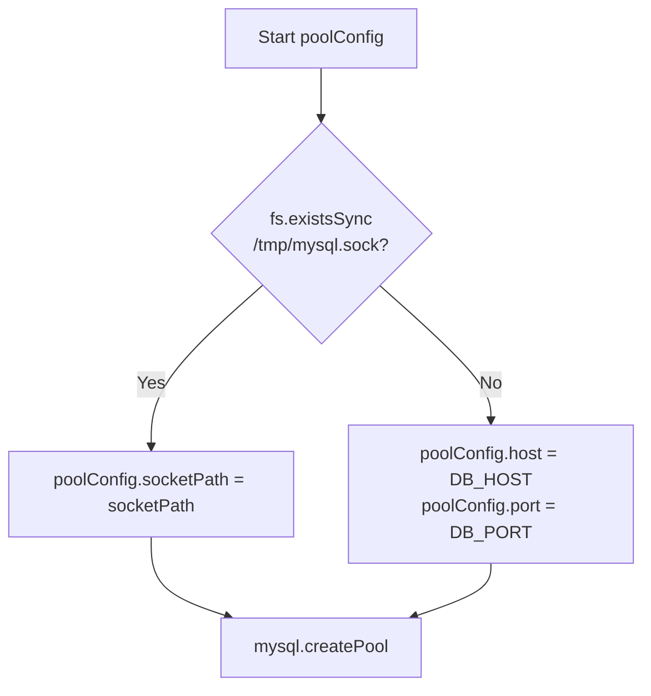
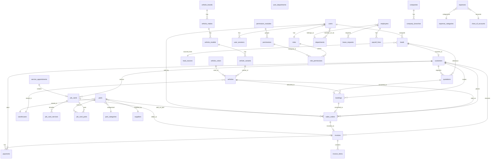

# Phase 2 — Database Analysis

> **Project:** AMS (Automotive Management System) by LOGIXINVENTOR (PVT) Ltd.  
> **Date:** 2026-06-30  
> **Scope:** Exhaustive analysis of all SQL queries, stored procedures, views, tables, data access patterns, and schema definitions found in the codebase.

---

## Table of Contents

01. [Database Configuration & Connection]               (#1-database-configuration--connection)
02. [Complete Table Inventory]                          (#2-complete-table-inventory)
03. [Stored Procedures — Complete Catalog]              (#3-stored-procedures--complete-catalog)
04. [SQL Views — Complete Catalog]                      (#4-sql-views--complete-catalog)
05. [MySQL Functions]                                   (#5-mysql-functions)
06. [Inline SQL Queries by Controller]                  (#6-inline-sql-queries-by-controller)
07. [Route-Level Inline SQL]                            (#7-route-level-inline-sql)
08. [Repository Data Access Layer]                      (#8-repository-data-access-layer)
09. [Data Access Patterns Summary]                      (#9-data-access-patterns-summary)
10. [Transaction Usage & Connection Handling]           (#10-transaction-usage--connection-handling)
11. [Pagination Patterns]                               (#11-pagination-patterns)
12. [Audit & Logging Tables]                            (#12-audit--logging-tables)
13. [Sequence / Auto-Numbering Mechanisms]              (#13-sequence--auto-numbering-mechanisms)
14. [Role-Based Data Filtering in Queries]              (#14-role-based-data-filtering-in-queries)
15. [Cross-Module Relationships]                        (#15-cross-module-relationships)
16. [Stored Procedure Definitions (from SQL file)]      (#16-stored-procedure-definitions-from-sql-file)
17. [Stored Procedures Referenced Only by Name]         (#17-stored-procedures-referenced-only-by-name)
18. [Security & Credential Exposure]                    (#18-security--credential-exposure)
19. [Referenced Scripts]                                (#19-referenced-scripts)
20. [Schema Diagram (Mermaid)]                          (#20-schema-diagram-mermaid)

---

## 1. Database Configuration & Connection

**File:** `backend/config/database.js`

### Connection Pool Configuration

|         Parameter       |               Value               |        Source       |
|-------------------------|-----------------------------------|---------------------|
| `user`                  | `process.env.DB_USER`             | Default: `'root'`   |
| `password`              | `process.env.DB_PASSWORD`         | Default: `''`       |
| `database`              | `process.env.DB_NAME`             | Default: `'ams_db'` |
| `connectionLimit`       | `process.env.DB_CONNECTION_LIMIT` | Default: `10`       |
| `waitForConnections`    | `true`                            | Hardcoded           |
| `queueLimit`            | `0`                               | Hardcoded           |
| `enableKeepAlive`       | `true`                            | Hardcoded           |
| `keepAliveInitialDelay` | `0`                               | Hardcoded           |

### Connection Method (Socket vs TCP)



- **Socket path:** `process.env.DB_SOCKET || '/tmp/mysql.sock'`
- **TCP fallback:** `process.env.DB_HOST || 'localhost'` on port `process.env.DB_PORT || 3306`

### Exported Helpers (7 exports)

| # | Export Name | Function Signature | Description |
|---|-------------|-------------------|-------------|
| 1 | `pool` | `mysql2/promise Pool` | Raw pool instance |
| 2 | `query(sql, params)` | `async (sql, params=[]) => [results]` | Parameterised query execution |
| 3 | `executeQuery(sql, params)` | `async (sql, params=[]) => [results]` | Alias for `query()` |
| 4 | `getFirstResult(sql, params)` | `async (sql, params=[]) => row` | Returns first row or `null` |
| 5 | `callProcedure(name, params)` | `async (name, params=[]) => [results]` | Builds `CALL name(?,?,...)` |
| 6 | `testConnection()` | `async () => boolean` | Acquires & releases a connection |
| 7 | `beginTransaction()` | `async () => connection` | Returns dedicated connection |
| 8 | `commitTransaction(connection)` | `async (conn) => void` | Commits & releases |
| 9 | `rollbackTransaction(connection)` | `async (conn) => void` | Rolls back & releases |

**Note:** Numbers 7–9 are separate exports (total 9), but the file header says 7. Counting `pool` + 6 helper functions yields 7 logical units.

### Database Names per Environment

| Environment | DB Name Source | Value |
|-------------|---------------|-------|
| Development | `.env` | `ams_db` |
| Production | `.env.production.server` | `db_ams` |

---

## 2. Complete Table Inventory

All tables referenced across the codebase by module:

### Authentication & Users

| Table | Referenced In | Description |
|-------|--------------|-------------|
| `users` | auth.routes, userManagement.controller, middleware/auth, dashboard.routes, profile.controller, roleManagement.controller, employees.controller | System users |
| `user_sessions` | auth.routes, userManagement.controller | JWT session tracking |
| `user_preferences` | userManagement.controller | Per-user UI preferences |
| `user_departments` | userManagement.controller, departmentManagement.controller | Many-to-many user ↔ department |
| `user_activity_logs` | userManagement.controller, profile.controller, departmentManagement.controller, roleManagement.controller, statusManagement.controller | Audit trail |
| `roles` | auth.routes, userManagement.controller, roleManagement.controller, middleware/auth, serviceManagement.controller | Role definitions |
| `role_permissions` | userManagement.controller, roleManagement.controller | Many-to-many role ↔ permission |
| `permissions` | roleManagement.controller | Available permissions |
| `permission_modules` | roleManagement.controller | Module grouping for permissions |

### Customers & Leads

| Table | Referenced In | Description |
|-------|--------------|-------------|
| `customers` | customer.routes, CustomerRepository, invoiceManagement.controller, reports.controller, dashboard.routes | Customer master |
| `leads` | LeadRepository, bulkImport.controller, uploader.controller, dashboard.routes, customer.routes | Sales leads |
| `leads_audit_log` | LeadRepository (via SP) | Lead change history |
| `lead_sources` | LeadRepository, bulkImport.controller | Lead source definitions |

### Vehicle Master Data

| Table | Referenced In | Description |
|-------|--------------|-------------|
| `vehicle_brands` | vehicleBranding.controller, bulkImport.controller | Brand-level (top of hierarchy) |
| `vehicle_makes` | vehicleMaster.controller, vehicleInventory.controller, uploader.controller, reports.controller, dashboard.routes, vehicleBranding.controller | Makes (Toyota, Honda, etc.) |
| `vehicle_models` | vehicleMaster.controller, vehicleInventory.controller, uploader.controller | Models (Corolla, Civic, etc.) |
| `vehicle_variants` | vehicleMaster.controller, vehicleInventory.controller, uploader.controller | Variants (1.6L, 1.8L, etc.) |
| `vehicle_colors` | vehicleMaster.controller, vehicleInventory.controller, uploader.controller | Colour master |
| `vehicles` | vehicleInventory.controller, salesManagement.controller, uploader.controller, reports.controller, dashboard.routes, warehouseManagement.controller, bulkImport.controller | Individual vehicle inventory |
| `vehicle_audit_log` | vehicleInventory.controller | Vehicle change audit |

### Sales & Invoicing

| Table | Referenced In | Description |
|-------|--------------|-------------|
| `quotations` | salesManagement.controller | Quotations |
| `bookings` | salesManagement.controller, customer.routes | Booking / reservation |
| `sales_orders` | salesManagement.controller, invoiceManagement.controller, uploader.controller, reports.controller, dashboard.routes, customer.routes | Sales orders |
| `sales_order_audit` | salesManagement.controller | SO audit trail |
| `sales_order_items` | Not referenced directly (via SPs) | Line items |
| `invoices` | invoiceManagement.controller, reports.controller, dashboard.routes | Invoices |
| `invoice_items` | invoiceManagement.controller | Invoice line items |
| `payments` | invoiceManagement.controller, paymentMethods.controller | Payment records |
| `payment_methods` | invoiceManagement.controller, paymentMethods.controller | Payment method master |
| `payment_transactions` | Not referenced directly (via SPs) | Payment gateway transactions |

### Service Module

| Table | Referenced In | Description |
|-------|--------------|-------------|
| `service_appointments` | serviceManagement.controller, dashboard.routes | Service appointments |
| `service_types` | serviceManagement.controller, serviceMasterController | Service type master |
| `service_packages` | serviceMasterController | Service packages |
| `service_package_items` | serviceMasterController | Package line items |
| `service_categories` | serviceMasterController | Service category groups |
| `labor_rates` | serviceMasterController | Labor rate definitions |
| `warranty_types` | serviceMasterController | Warranty type master |
| `job_cards` | serviceManagement.controller, dashboard.routes | Job cards |
| `job_card_services` | serviceManagement.controller | Job card service lines |
| `job_card_parts` | serviceManagement.controller | Job card parts used |

### HR & Payroll

| Table | Referenced In | Description |
|-------|--------------|-------------|
| `employees` | employees.controller, leaves.controller, payroll.controller, dashboard.routes | Employee master |
| `employee_documents` | employees.controller | Employee document attachments |
| `departments` | departmentManagement.controller, userManagement.controller | Department hierarchy |
| `leave_types` | leaves.controller | Leave type definitions |
| `leave_balances` | leaves.controller | Per-employee leave balance |
| `leave_requests` | leaves.controller, dashboard.routes | Leave applications |
| `payroll_periods` | payroll.controller, dashboard.routes | Payroll period definitions |
| `payroll_lines` | payroll.controller | Per-employee payroll lines |

### Inventory & Parts

| Table | Referenced In | Description |
|-------|--------------|-------------|
| `parts` | partsInventory.controller, serviceManagement.controller, reports.controller, dashboard.routes, warehouseManagement.controller | Parts inventory |
| `part_categories` | vehicleMaster.controller, partsInventory.controller | Part categories |
| `stock_movements` | reports.controller | Stock movement history |
| `warehouses` | warehouseManagement.controller, vehicleInventory.controller, partsInventory.controller | Warehouse master |

### Finance

| Table | Referenced In | Description |
|-------|--------------|-------------|
| `expenses` | expenses.controller, dashboard.routes | Expense records |
| `expense_categories` | expenses.controller | Expense category master |
| `chart_of_accounts` | expenses.controller | COA definitions |
| `financial_transactions` | expenses.controller, ledger.controller | Journal entries |
| `currencies` | erpSettings.controller | Currency master |
| `tax_configurations` | erpSettings.controller | Tax rate definitions |

### Suppliers & Purchasing

| Table | Referenced In | Description |
|-------|--------------|-------------|
| `suppliers` | vehicleMaster.controller, partsInventory.controller | Supplier master (referenced in SQL file) |
| `purchase_orders` | Referenced in SP definition but not in controllers | PO tracking |
| `purchase_order_items` | Referenced in SP definition but not in controllers | PO line items |

### Company & Branch

| Table | Referenced In | Description |
|-------|--------------|-------------|
| `companies` | erpSettings.controller, invoiceManagement.controller | Company master |
| `company_branches` | erpSettings.controller | Branch/location master |
| `system_settings` | erpSettings.controller, invoiceManagement.controller | Key-value settings |
| `document_templates` | erpSettings.controller | HTML print templates |

### Status & System

| Table | Referenced In | Description |
|-------|--------------|-------------|
| `system_statuses` | statusManagement.controller | Centralized status definitions |
| `reports` | reports.controller | Saved report definitions |
| `report_executions` | reports.controller (via SP) | Report execution log |
| `activity_logs` | userManagement.controller | System-wide activity log |
| `system_logs` | database.js (logger) | Application error logs |
| `table_sequences` | Not found on disk | Auto-number sequences |
| `of_order_uploads` | uploader.controller | Order form upload tracking |

### Non-Existent Referenced Files

| Referenced Path | Referenced From | Status |
|----------------|----------------|--------|
| `database/vehicle_inventory_procedures.sql` | `refresh_vehicle_procedures.js` | **NOT FOUND** |
| `database/clean_and_seed_vehicles.sql` | `run_seed.js` | **NOT FOUND** |

---

## 3. Stored Procedures — Complete Catalog

Every stored procedure referenced in the codebase, grouped by module:

### Supplier Module (defined in `supplier_management_live.sql`)

```sql
CALL sp_get_suppliers(p_search, p_is_active, p_limit, p_offset)
CALL sp_create_supplier(p_supplier_code, p_name, p_type, p_contact_person, p_email, p_phone, p_address, p_city, p_country, p_tax_number, p_payment_terms, p_credit_limit, p_is_active, OUT p_supplier_id)
CALL sp_update_supplier(p_id, p_supplier_code, p_name, p_type, p_contact_person, p_email, p_phone, p_address, p_city, p_country, p_tax_number, p_payment_terms, p_credit_limit, p_is_active)
CALL sp_delete_supplier(p_id)
```

### Vehicle Master Module

```sql
CALL sp_get_makes(p_search, p_is_active, p_limit, p_offset)
CALL sp_create_make(p_name, p_country, p_logo, p_is_active, OUT @id)
CALL sp_update_make(p_id, p_name, p_country, p_logo, p_is_active)
CALL sp_delete_make(p_id)
CALL sp_get_models(p_make_id, p_search, p_is_active, p_limit, p_offset)
CALL sp_create_model(p_make_id, p_name, p_year, p_body_type, p_fuel_type, p_transmission, p_engine_capacity, p_seating_capacity, p_is_active, OUT @id)
CALL sp_update_model(p_id, p_make_id, p_name, p_year, p_body_type, p_fuel_type, p_transmission, p_engine_capacity, p_seating_capacity, p_is_active)
CALL sp_delete_model(p_id)
CALL sp_get_variants(p_model_id, p_make_id, p_search, p_is_active, p_limit, p_offset)
CALL sp_create_variant(p_model_id, p_name, p_base_price, p_features, p_specifications, p_is_active, OUT @id)
CALL sp_update_variant(p_id, p_model_id, p_name, p_base_price, p_features, p_specifications, p_is_active)
CALL sp_delete_variant(p_id)
CALL sp_get_colors(p_search, p_is_active, p_limit, p_offset)
CALL sp_create_color(p_name, p_hex_code, p_is_metallic, p_additional_cost, p_is_active, OUT @id)
CALL sp_update_color(p_id, p_name, p_hex_code, p_is_metallic, p_additional_cost, p_is_active)
CALL sp_delete_color(p_id)
CALL sp_get_part_categories(p_search, p_is_active, p_parent_id, p_limit, p_offset)
CALL sp_create_part_category(p_name, p_description, p_parent_id, p_is_active, OUT @id, OUT @success, OUT @message)
CALL sp_update_part_category(p_id, p_name, p_description, p_parent_id, p_is_active, OUT @success, OUT @message)
CALL sp_delete_part_category(p_id, OUT @success, OUT @message)
```

### Vehicle Inventory Module

```sql
CALL sp_create_vehicle(p_vin, p_engine_number, p_variant_id, p_color_id, p_year, p_status, p_condition_type, p_mileage, p_purchase_price, p_selling_price, p_location, p_warehouse_id, p_arrival_date, p_notes, p_created_by, OUT @id)
CALL sp_update_vehicle(p_id, p_vin, p_engine_number, p_variant_id, p_color_id, p_year, p_condition_type, p_mileage, p_purchase_price, p_selling_price, p_location, p_warehouse_id, p_arrival_date, p_notes, p_user_id)
CALL sp_delete_vehicle(p_id, p_user_id)
CALL sp_update_vehicle_status(p_id, p_status, p_user_id)
```

### Parts Inventory Module

```sql
CALL SP_GetPartsBySourceType(p_sourceType, p_page, p_limit, p_search, p_categoryId, p_supplierId, p_warehouseId, p_stockStatus)
CALL SP_CreatePart(p_partNumber, p_name, p_categoryId, p_description, p_brand, p_sourceType, p_supplierId, p_unit, p_purchasePrice, p_sellingPrice, p_currentStock, p_minimumStock, p_maximumStock, p_reorderLevel, p_warehouseId, p_binLocation, p_userId, OUT @partId, OUT @success, OUT @message)
CALL SP_UpdatePart(p_id, p_partNumber, p_name, p_categoryId, p_description, p_brand, p_sourceType, p_supplierId, p_unit, p_purchasePrice, p_sellingPrice, p_minimumStock, p_maximumStock, p_reorderLevel, p_warehouseId, p_binLocation, p_userId, OUT @success, OUT @message)
CALL SP_DeletePart(p_id, p_userId, OUT @success, OUT @message)
CALL SP_AdjustPartStock(p_id, p_adjustmentType, p_quantity, p_reason, p_userId, OUT @success, OUT @message, OUT @newStock)
CALL SP_GetPartsInventoryStats()
```

### Lead Module

```sql
CALL sp_filter_leads_advanced(p_search, p_status, p_source_id, p_priority, p_city, p_assigned_to, p_date_from, p_date_to, p_page, p_limit, p_sort_by, p_sort_order)
CALL sp_create_lead(p_first_name, p_last_name, p_email, p_phone, p_alternate_phone, p_address, p_city, p_state, p_postal_code, p_source_id, p_status, p_priority, p_interested_in, p_budget_range, p_notes, p_assigned_to, p_created_by, OUT @p_lead_id, OUT @p_lead_num)
CALL sp_update_lead(p_id, p_first_name, p_last_name, p_email, p_phone, p_alternate_phone, p_address, p_city, p_state, p_postal_code, p_source_id, p_status, p_priority, p_interested_in, p_budget_range, p_notes, p_assigned_to, p_updated_by)
CALL sp_delete_lead(p_id, p_deleted_by)
CALL sp_convert_lead_to_opportunity(p_lead_id, p_user_id)
CALL sp_get_lead_filter_options()
CALL sp_get_lead_analytics()
```

### Sales Module

```sql
CALL sp_create_quotation(p_customerId, p_leadId, p_opportunityId, p_saleType, p_vehicleVariantId, p_vehicleColorId, p_partId, p_partQuantity, p_vehiclePrice, p_discountAmount, p_discountPercentage, p_taxAmount, p_additionalCharges, p_validityDays, p_termsAndConditions, p_notes, p_createdBy, OUT @id, OUT @num)
CALL sp_update_quotation(p_id, p_customerId, p_saleType, p_vehicleVariantId, p_vehicleColorId, p_partId, p_partQuantity, p_vehiclePrice, p_discountAmount, p_discountPercentage, p_taxAmount, p_additionalCharges, p_validityDays, p_status, p_termsAndConditions, p_notes, p_userId)
CALL sp_delete_quotation(p_id, p_userId)
CALL sp_create_booking(p_quotationId, p_customerId, p_saleType, p_vehicleVariantId, p_vehicleColorId, p_vehicleId, p_partId, p_partQuantity, p_bookingAmount, p_totalAmount, p_expectedDeliveryDate, p_priority, p_notes, p_createdBy, OUT @id, OUT @num)
CALL sp_update_booking(p_id, p_customerId, p_saleType, p_vehicleVariantId, p_vehicleColorId, p_vehicleId, p_partId, p_partQuantity, p_bookingAmount, p_totalAmount, p_expectedDeliveryDate, p_status, p_priority, p_notes)
CALL sp_delete_booking(p_id, p_cancellationReason, p_userId)
CALL sp_create_sales_order(p_bookingId, p_customerId, p_saleType, p_vehicleId, p_partId, p_partQuantity, p_vehiclePrice, p_accessoriesTotal, p_discountAmount, p_taxAmount, p_registrationCharges, p_insuranceCharges, p_otherCharges, p_paidAmount, p_paymentMode, p_financeCompany, p_financeAmount, p_exchangeVehicleDetails, p_exchangeValue, p_expectedDeliveryDate, p_notes, p_salesExecutiveId, p_customOrderNumber, OUT @id, OUT @num)
CALL sp_create_direct_sales_order(p_customerId, p_saleType, p_vehicleId, p_partId, p_partQuantity, ..., p_salesExecutiveId, OUT @id, OUT @num)
CALL sp_update_sales_order(p_id, p_vehiclePrice, p_accessoriesTotal, p_discountAmount, p_taxAmount, p_registrationCharges, p_insuranceCharges, p_otherCharges, p_paidAmount, p_paymentMode, p_financeCompany, p_financeAmount, p_exchangeVehicleDetails, p_exchangeValue, p_status, p_expectedDeliveryDate, p_notes, p_userId)
CALL sp_delete_sales_order(p_id, p_userId)
CALL sp_deliver_sales_order(p_id, p_userId)
CALL sp_update_sales_order_status(p_id, p_status, p_userId, p_notes)
CALL sp_convert_sales_order_to_invoice(p_salesOrderId, p_userId, p_dueDays, OUT @invoice_id, OUT @invoice_num)
CALL sp_get_sales_order_history(p_salesOrderId)
```

### Invoice Module

```sql
CALL sp_create_invoice_from_sales_order(p_salesOrderId, p_userId, p_dueDays, OUT @invoice_id, OUT @invoice_number)
CALL sp_update_invoice_totals(p_invoiceId)
CALL sp_update_invoice_status(p_invoiceId, p_status)
CALL sp_add_invoice_item(p_invoiceId, p_description, p_quantity, p_unitPrice, p_taxId, OUT @item_id)
CALL sp_update_invoice_item(p_itemId, p_description, p_quantity, p_unitPrice, p_taxId)
CALL sp_delete_invoice_item(p_itemId)
CALL sp_record_invoice_payment(p_invoiceId, p_amount, p_paymentMethodId, p_referenceNumber, p_receivedBy, p_notes, OUT @payment_id)
CALL sp_send_invoice(p_invoiceId, p_userId)
CALL sp_get_invoice_history(p_invoiceId)
CALL fn_get_invoice_qr_data(p_invoiceId)  -- Note: Called as SELECT fn_get_invoice_qr_data(?) (function, not procedure)
```

### User Management Module

```sql
CALL sp_create_user(p_email, p_password, p_first_name, p_last_name, p_phone, p_role_id, p_department_id, p_job_title, p_created_by, OUT @id, OUT @empid)
CALL sp_update_user(p_id, p_email, p_first_name, p_last_name, p_phone, p_role_id, p_department_id, p_job_title, p_is_active, p_updated_by)
CALL sp_delete_user(p_id, p_deleted_by)
```

### Role Management Module

```sql
CALL sp_create_role(p_name, p_description, p_created_by, OUT @role_id)
CALL sp_update_role(p_id, p_name, p_description, p_is_active, p_updated_by)
CALL sp_delete_role(p_id)
CALL sp_assign_permission(p_role_id, p_permission_id, p_assigned_by)
```

### Department Management Module

```sql
CALL sp_create_department(p_name, p_code, p_description, p_manager_id, p_parent_id, p_created_by, OUT @dept_id)
CALL sp_update_department(p_id, p_name, p_code, p_description, p_manager_id, p_parent_id, p_is_active, p_updated_by)
CALL sp_delete_department(p_id, p_deleted_by)
```

### Status Management Module

```sql
CALL sp_create_status(p_tableName, p_tableSlug, p_statusCode, p_statusName, p_statusColor, p_statusBgColor, p_statusIcon, p_isDefault, p_isFinal, p_canDelete, p_requiresApproval, p_allowedNextStatuses, p_description, p_createdBy, OUT @status_id)
CALL sp_update_status(p_id, p_statusName, p_statusColor, p_statusBgColor, p_statusIcon, p_isDefault, p_isFinal, p_isActive, p_canDelete, p_requiresApproval, p_allowedNextStatuses, p_description)
CALL sp_delete_status(p_id)
```

### Profile Module

```sql
CALL sp_get_user_profile(p_user_id)
CALL sp_upsert_user_profile(p_userId, p_bio, p_address, p_city, p_country, p_postalCode, p_dob, p_gender, p_emergencyContactName, p_emergencyContactPhone, p_emergencyContactRelation, p_socialLinks)
```

### Service Master Module

```sql
CALL sp_get_service_types_master(p_search, p_categoryId, p_limit, p_offset)
CALL sp_create_service_type(p_name, p_description, p_basePrice, p_estimatedHours, p_categoryId)
CALL sp_update_service_type(p_id, p_name, p_description, p_basePrice, p_estimatedHours, p_categoryId)
CALL sp_delete_service_type(p_id)
CALL sp_get_labor_rates(p_search)
CALL sp_create_labor_rate(p_name, p_hourlyRate, p_description, p_isActive)
CALL sp_update_labor_rate(p_id, p_name, p_hourlyRate, p_description, p_isActive)
CALL sp_delete_labor_rate(p_id)
CALL sp_get_service_packages(p_search, p_makeId, p_limit, p_offset)
CALL sp_get_package_details(p_id)
CALL sp_create_service_package(p_name, p_description, p_basePrice, p_makeId, p_modelId, p_isActive)
CALL sp_update_service_package(p_id, p_name, p_description, p_basePrice, p_makeId, p_modelId, p_isActive)
CALL sp_delete_service_package(p_id)
CALL sp_add_package_item(p_packageId, p_itemType, p_itemId, p_quantity, p_unitPrice)
CALL sp_remove_package_item(p_itemId)
CALL sp_get_warranty_types()
CALL sp_create_warranty_type(p_name, p_durationMonths, p_durationKm, p_description, p_terms, p_isActive)
CALL sp_update_warranty_type(p_id, p_name, p_durationMonths, p_durationKm, p_description, p_terms, p_isActive)
CALL sp_delete_warranty_type(p_id)
CALL sp_get_service_categories()
```

### ERP Settings Module

```sql
CALL sp_create_company(p_companyName, p_legalName, p_registrationNumber, p_taxId, p_email, p_phone, p_address, p_city, p_country, p_createdBy, OUT @company_id, OUT @company_code)
CALL sp_create_branch(p_companyId, p_branchName, p_branchType, p_managerId, p_email, p_phone, p_address, p_city, p_createdBy, OUT @branch_id, OUT @branch_code)
CALL sp_update_system_setting(p_key, p_value, p_updatedBy, p_ipAddress)
```

### Warehouse Module

```sql
CALL sp_create_warehouse(p_name, p_code, p_type, p_address, p_city, p_state, p_country, p_capacity, p_managerId, p_createdBy, OUT @warehouse_id)
CALL sp_update_warehouse(p_id, p_name, p_code, p_type, p_address, p_city, p_state, p_country, p_capacity, p_managerId, p_isActive, p_userId)
CALL sp_delete_warehouse(p_id, p_userId)
```

### Global Search Module

```sql
CALL sp_global_search(p_query, p_limit)
```

### Reports Module

```sql
CALL sp_create_report(p_reportName, p_reportCategory, p_reportType, p_description, p_generatedBy, p_status, p_dataSource, p_parametersSchema, p_isPublic)
CALL sp_update_report(p_id, p_reportName, p_reportCategory, p_reportType, p_description, p_status, p_dataSource, p_parametersSchema, p_isPublic)
CALL sp_delete_report(p_id)
CALL sp_get_report_by_id(p_id)
CALL sp_search_reports(p_search, p_category, p_status, p_dateFrom, p_dateTo, p_generatedBy, p_isPublic, p_limit, p_offset)
```

### Payroll Module

```sql
CALL sp_payroll_post_period(p_periodId, p_userId)
```

### Expenses Module

```sql
CALL sp_post_expense_to_ledger(p_expenseId, p_userId, OUT @ft_id)
```

### Leaves Module

```sql
CALL sp_leave_request_submit(p_employee_id, p_leave_type_id, p_start_date, p_end_date, p_days_requested, p_reason, OUT @leave_req_id)
CALL sp_leave_request_set_status(p_request_id, p_status, p_approved_by)
```

### Employee Module (deprecated SP)

```sql
-- sp_employee_upsert is NOT called; the controller uses inline INSERT/UPDATE instead.
```

---

## 4. SQL Views — Complete Catalog

Every view referenced in the codebase, sorted by module:

| View Name | Referenced In | Purpose |
|-----------|--------------|---------|
| `vw_quotations_full` | salesManagement.controller | Quotations with customer/vehicle details |
| `vw_bookings_full` | salesManagement.controller | Bookings with full details |
| `vw_sales_orders_full` | salesManagement.controller | Sales orders with customer/vehicle details |
| `vw_sales_stats` | salesManagement.controller | Aggregate sales statistics |
| `vw_invoice_summary` | invoiceManagement.controller | Invoice listing with summary |
| `vw_invoice_stats` | invoiceManagement.controller | Invoice statistics |
| `vw_invoice_aging` | invoiceManagement.controller | Invoice aging analysis |
| `vw_appointments_list` | serviceManagement.controller | Appointments with customer/vehicle |
| `vw_job_cards_list` | serviceManagement.controller | Job cards with details |
| `vw_employee_directory` | employees.controller | Employee list with department/role |
| `vw_warehouses_full` | warehouseManagement.controller | Warehouses with inventory counts |
| `vw_company_summary` | erpSettings.controller | Company listing with details |
| `vw_branch_details` | erpSettings.controller | Branches with company details |
| `vw_users_full` | userManagement.controller | Users with role/department details |
| `vw_departments_full` | departmentManagement.controller | Departments with hierarchy |
| `vw_unified_ledger` | ledger.controller | Unified financial transactions view |
| `vw_vehicle_master_stats` | vehicleMaster.controller (also redefined in SQL file) | Aggregate counts for vehicle master data |
| `vw_settings_grouped` | erpSettings.controller | Settings grouped by category |
| `vw_erp_stats` | erpSettings.controller | ERP summary statistics |
| `vw_partsinventoryfull` | partsInventory.controller | Parts with category/supplier/warehouse |
| `VW_LowStockAlerts` | partsInventory.controller | Low stock parts alert |
| `vw_service_packages_list` | serviceMasterController | Service packages listing |

---

## 5. MySQL Functions

### 1. `fn_has_permission`

- **Called in:** `backend/middleware/auth.js:103`
- **Usage:** `SELECT fn_has_permission(?, ?, ?) as has_permission`
- **Parameters:** `(userId, module, action)`
- **Purpose:** Verifies if a user has a specific module/action permission. Used in `checkPermission()` middleware.

### 2. `fn_employee_full_name`

- **Called in:** `leaves.controller.js:39`, `payroll.controller.js:39`, `expenses.controller.js:74`
- **Usage:** `fn_employee_full_name(lr.employee_id)` or `fn_employee_full_name(e.employee_id)`
- **Parameters:** `(employeeId)`
- **Purpose:** Returns the full name of an employee by their ID.

### 3. `fn_get_invoice_qr_data`

- **Called in:** `invoiceManagement.controller.js:811`
- **Usage:** `SELECT fn_get_invoice_qr_data(?) as qr_data`
- **Parameters:** `(invoiceId)`
- **Purpose:** Generates structured QR data for invoices (likely a JSON string).

---

## 6. Inline SQL Queries by Controller

Every inline SQL query (not wrapped in SPs or views) found in each controller file:

### `salesManagement.controller.js`
- `UPDATE quotations SET status = ?, updated_at = NOW() WHERE id = ?`
- `SELECT * FROM quotations WHERE id = ?`
- `UPDATE vehicles SET status = "allocated", allocated_to_order_id = ? WHERE id = ?`
- `UPDATE bookings SET vehicle_id = ?, status = "processing" WHERE id = ?`
- `SELECT * FROM bookings WHERE id = ?`
- `SELECT COUNT(*) as total, SUM(...) ... FROM quotations WHERE status != 'cancelled'`
- `SELECT COUNT(*) as total, SUM(...) ... FROM bookings WHERE status != 'cancelled'`
- `SELECT COUNT(*) as total, SUM(...) ... FROM sales_orders WHERE status != 'cancelled'`
- `SELECT id, status FROM vehicles WHERE id = ?`
- `SELECT id, current_stock, selling_price FROM parts WHERE id = ?`
- `SELECT id, current_stock, selling_price FROM parts WHERE id = ? FOR UPDATE`
- `SELECT COALESCE(MAX(CAST(SUBSTRING(order_number, 9) AS UNSIGNED)), 0) + 1 AS seq FROM sales_orders WHERE order_number LIKE CONCAT('SO-', YEAR(CURDATE()), '-%')`
- `INSERT INTO sales_orders (...) VALUES (...)`
- `UPDATE parts SET current_stock = current_stock - ?, updated_at = NOW() WHERE id = ?`
- `INSERT INTO sales_order_audit (...) VALUES (...)`

### `invoiceManagement.controller.js`
- `SELECT id, status, subtotal FROM invoices WHERE id = ?`
- `SELECT id, status... FROM invoices WHERE id = ?`
- `UPDATE invoices SET ... WHERE id = ?`
- `UPDATE customers SET outstanding_balance = ... WHERE id = ?`
- `UPDATE sales_orders SET status = 'confirmed' WHERE id = ? AND status = 'invoiced'`
- `SELECT invoice_number FROM invoices WHERE id = ?`
- `INSERT INTO invoices (...) VALUES (...)`
- `INSERT INTO invoice_items (...) VALUES (...)`
- `SELECT id, invoice_number FROM invoices WHERE sales_order_id = ? AND status != 'cancelled'`
- `SELECT id, status, customer_id FROM sales_orders WHERE id = ?`
- `SELECT id, status, invoice_number FROM invoices WHERE id = ?`
- `SELECT name FROM payment_methods ... GROUP BY name ...`

### `serviceManagement.controller.js`
- `SELECT COALESCE(MAX(id), 0) + 1 AS next_num FROM service_appointments`
- `INSERT INTO service_appointments (...) VALUES (...)`
- `UPDATE service_appointments SET ... WHERE id = ?`
- `UPDATE service_appointments SET status = ?, updated_at = NOW() WHERE id = ?`
- `UPDATE service_appointments sa INNER JOIN job_cards jc ... SET sa.status = 'completed' ...`
- `SELECT COALESCE(SUM(total), 0) AS total FROM job_card_services WHERE job_card_id = ?`
- `SELECT COALESCE(SUM(total), 0) AS total FROM job_card_parts WHERE job_card_id = ? AND is_warranty = FALSE`
- `SELECT COALESCE(discount, 0) AS discount, COALESCE(tax_amount, 0) AS tax_amount FROM job_cards WHERE id = ?`
- `UPDATE job_cards SET labor_total = ?, parts_total = ?, grand_total = ?, updated_at = NOW() WHERE id = ?`
- `INSERT INTO job_card_services (...) VALUES (...)`
- `UPDATE job_card_services SET ... WHERE id = ? AND job_card_id = ?`
- `DELETE FROM job_card_services WHERE id = ? AND job_card_id = ?`
- `SELECT id FROM job_cards WHERE id = ?`
- `UPDATE job_cards SET ... WHERE id = ?`
- `SELECT current_stock, name FROM parts WHERE id = ?`
- `INSERT INTO job_card_parts (...) VALUES (...)`
- `UPDATE job_card_parts SET ... WHERE id = ?`
- `DELETE FROM job_card_parts WHERE id = ? AND job_card_id = ?`
- `SELECT part_id, quantity FROM job_card_parts WHERE id = ?`
- `UPDATE parts SET current_stock = ... WHERE id = ?`
- `SELECT * FROM service_types WHERE is_active = TRUE ORDER BY name`
- `SELECT u.id, CONCAT(u.first_name, ' ', u.last_name) AS name, r.name AS role FROM users u INNER JOIN roles r ... WHERE r.name IN ('technician', 'service_advisor', 'service_manager') ...`
- `SELECT u.id, CONCAT(u.first_name, ' ', u.last_name) AS name FROM users u INNER JOIN roles r ... WHERE r.name IN ('service_advisor', 'service_manager', 'super_admin') ...`

### `partsInventory.controller.js`
- `SELECT p.id, p.part_number, p.name, p.category_id, pc.name AS category_name, ... FROM parts p LEFT JOIN part_categories pc ... LEFT JOIN suppliers s ... LEFT JOIN warehouses w ... WHERE ...`
- `SELECT COUNT(*) as total FROM parts WHERE ...`
- `SELECT id, name FROM part_categories WHERE is_active = TRUE ORDER BY name`
- `SELECT id, name FROM suppliers WHERE is_active = TRUE ORDER BY name`
- `SELECT * FROM VW_LowStockAlerts LIMIT 20`

### `employees.controller.js`
- `SELECT * FROM vw_employee_directory WHERE 1=1 ...`
- `SELECT COUNT(*) AS total FROM vw_employee_directory e WHERE 1=1 ...`
- `SELECT * FROM vw_employee_directory WHERE id = ?`
- `SELECT * FROM employee_documents WHERE employee_id = ? ORDER BY uploaded_at DESC`
- `SELECT id FROM employees WHERE id = ? LIMIT 1`
- `SELECT COALESCE(MAX(CAST(SUBSTRING_INDEX(employee_code, '-', -1) AS UNSIGNED)), 0) + 1 AS next_seq FROM employees WHERE employee_code LIKE ?`
- `UPDATE employees SET ... WHERE id = ?`
- `INSERT INTO employees (...) VALUES (...)`
- `UPDATE employees SET is_active = FALSE, employment_status = ? WHERE id = ?`

### `userManagement.controller.js`
- `SELECT COUNT(*) as total FROM vw_users_full WHERE ...`
- `SELECT * FROM vw_users_full WHERE ...`
- `SELECT * FROM vw_users_full WHERE id = ?`
- `SELECT d.id, d.name, d.code, ud.is_primary, ud.position, ud.assigned_at FROM user_departments ud JOIN departments d ... WHERE ud.user_id = ?`
- `SELECT p.id, p.name, p.module, p.action, p.description FROM role_permissions rp JOIN permissions p ... WHERE rp.role_id = ?`
- `SELECT * FROM user_preferences WHERE user_id = ?`
- `SELECT action_type, module, description, created_at FROM user_activity_logs WHERE user_id = ? ORDER BY created_at DESC LIMIT 10`
- `SELECT is_active, email FROM users WHERE id = ?`
- `UPDATE users SET is_active = ?, updated_at = NOW() WHERE id = ?`
- `DELETE FROM user_sessions WHERE user_id = ?`
- `SELECT name FROM roles WHERE id = ? AND is_active = TRUE`
- `SELECT role_id, email FROM users WHERE id = ?`
- `UPDATE users SET role_id = ?, updated_at = NOW() WHERE id = ?`
- `SELECT name FROM departments WHERE id = ? AND is_active = TRUE`
- `UPDATE user_departments SET is_primary = FALSE WHERE user_id = ?`
- `UPDATE users SET department_id = ? WHERE id = ?`
- `INSERT INTO user_departments (...) VALUES (...) ON DUPLICATE KEY UPDATE ...`
- `DELETE FROM user_departments WHERE user_id = ? AND department_id = ?`
- `UPDATE users SET department_id = NULL WHERE id = ? AND department_id = ?`
- `SELECT (SELECT COUNT(*) FROM users) as total_users, (SELECT COUNT(*) FROM users WHERE is_active = TRUE) as active_users, ...`
- `SELECT r.name, COUNT(u.id) as count FROM roles r LEFT JOIN users u ... GROUP BY r.id, r.name`
- `SELECT d.name, d.code, COUNT(ud.user_id) as count FROM departments d LEFT JOIN user_departments ud ... LEFT JOIN users u ... GROUP BY d.id, d.name, d.code`
- `SELECT email FROM users WHERE id = ?`
- `UPDATE users SET password = ?, updated_at = NOW() WHERE id = ?`
- `DELETE FROM user_sessions WHERE user_id = ?`
- `INSERT INTO user_activity_logs (...) VALUES (...)`

### `vehicleInventory.controller.js`
- `SELECT COUNT(*) as total FROM vehicles v JOIN vehicle_variants vv ON v.variant_id = vv.id JOIN vehicle_models vm ON vv.model_id = vm.id JOIN vehicle_makes vmk ON vm.make_id = vmk.id WHERE ...`
- `SELECT v.id, v.vin, v.engine_number, ... FROM vehicles v JOIN vehicle_variants vv ... JOIN vehicle_models vm ... JOIN vehicle_makes vmk ... JOIN vehicle_colors vc ... LEFT JOIN warehouses w ... LEFT JOIN users u ... WHERE ...`
- `SELECT v.*, vv.name AS variant_name, ... FROM vehicles v JOIN vehicle_variants vv ... JOIN vehicle_models vm ... JOIN vehicle_makes vmk ... JOIN vehicle_colors vc ... LEFT JOIN warehouses w ... LEFT JOIN users u ... WHERE v.id = ?`
- `SELECT id, order_number, status, grand_total, order_date FROM sales_orders WHERE vehicle_id = ? ORDER BY created_at DESC LIMIT 5`
- `SELECT action_type, old_data, new_data, changed_at, CONCAT(u.first_name, ' ', u.last_name) AS changed_by_name FROM vehicle_audit_log val LEFT JOIN users u ... WHERE val.vehicle_id = ? ORDER BY val.changed_at DESC LIMIT 10`
- `SELECT COUNT(*) AS total_vehicles, SUM(...) ... FROM vehicles WHERE is_deleted = FALSE`
- `SELECT vmk.name AS make_name, COUNT(*) AS count FROM vehicles v JOIN vehicle_variants vv ... JOIN vehicle_models vm ... JOIN vehicle_makes vmk ... WHERE v.is_deleted = FALSE AND v.status NOT IN ('sold', 'delivered') GROUP BY vmk.id, vmk.name`
- `SELECT id, name, code FROM warehouses WHERE is_active = TRUE ORDER BY name`

### `vehicleMaster.controller.js`
- `SELECT COUNT(*) as total FROM vehicle_makes WHERE (? IS NULL OR ...)`
- `SELECT COUNT(*) as total FROM part_categories WHERE ...`
- `SELECT COUNT(*) as total FROM suppliers WHERE ...`

### `leave.controller.js`
- `SELECT * FROM leave_types WHERE is_active = TRUE ORDER BY name`
- `SELECT lb.*, lt.name AS leave_type_name, lt.code AS leave_type_code FROM leave_balances lb JOIN leave_types lt ... WHERE lb.employee_id = ? AND lb.year = ?`
- `SELECT lr.*, fn_employee_full_name(lr.employee_id) AS employee_name, e.employee_code, lt.name AS leave_type_name FROM leave_requests lr JOIN employees e ... JOIN leave_types lt ... WHERE 1=1 ...`
- `SELECT * FROM leave_requests WHERE id = ?`

### `payroll.controller.js`
- `SELECT pp.*, (SELECT COUNT(*) FROM payroll_lines pl WHERE pl.payroll_period_id = pp.id) AS line_count FROM payroll_periods pp ORDER BY pp.period_start DESC`
- `INSERT INTO payroll_periods (label, period_start, period_end, status, created_by) VALUES (?,?,?,?,?)`
- `SELECT * FROM payroll_periods WHERE id = ?`
- `SELECT pl.*, fn_employee_full_name(pl.employee_id) AS employee_name, e.employee_code FROM payroll_lines pl JOIN employees e ... WHERE pl.payroll_period_id = ?`
- `SELECT status FROM payroll_periods WHERE id = ?`
- `SELECT id, base_salary FROM employees WHERE is_active = TRUE AND employment_status IN ('active','probation','on_leave')`
- `INSERT IGNORE INTO payroll_lines (payroll_period_id, employee_id, gross_amount, deductions, net_amount) VALUES (?,?,?,?,?)`
- `SELECT * FROM payroll_lines WHERE payroll_period_id = ?`
- `UPDATE payroll_periods SET status = 'locked' WHERE id = ? AND status = 'draft'`
- `SELECT pl.*, pp.status AS period_status FROM payroll_lines pl JOIN payroll_periods pp ... WHERE pl.id = ?`
- `UPDATE payroll_lines SET gross_amount = ?, deductions = ?, net_amount = ?, notes = ? WHERE id = ?`
- `SELECT * FROM payroll_lines WHERE id = ?`

### `expenses.controller.js`
- `SELECT id, account_code, account_name, account_type FROM chart_of_accounts WHERE account_type = 'expense' AND is_active = TRUE ORDER BY account_code`
- `SELECT ec.*, coa.account_code, coa.account_name FROM expense_categories ec JOIN chart_of_accounts coa ... WHERE ec.is_active = TRUE ORDER BY ec.category_group, ec.name`
- `INSERT INTO expense_categories (name, code, category_group, account_id) VALUES (?,?,?,?)`
- `SELECT * FROM expense_categories WHERE id = ?`
- `UPDATE expense_categories SET ... WHERE id = ?`
- `SELECT e.*, ec.name AS category_name, ec.category_group, fn_employee_full_name(e.employee_id) AS employee_payee_name FROM expenses e JOIN expense_categories ec ... WHERE 1=1 ...`
- `SELECT COUNT(*) AS total FROM expenses e JOIN expense_categories ec ... WHERE 1=1 ...`
- `INSERT INTO expenses (expense_number, category_id, amount, expense_date, description, vendor_name, payment_method_id, employee_id, status, created_by) VALUES (NULL,?,?,?,?,?,?,?,?,?)`
- `SELECT * FROM expenses WHERE id = ?`
- `SELECT status, ledger_transaction_id FROM expenses WHERE id = ?`
- `UPDATE expenses SET ... WHERE id = ?`

### `ledger.controller.js`
- `SELECT * FROM vw_unified_ledger WHERE 1=1 ...`
- `SELECT COUNT(*) AS total FROM vw_unified_ledger WHERE 1=1 ...`
- `SELECT COALESCE(SUM(debit),0) AS total_debit, COALESCE(SUM(credit),0) AS total_credit FROM vw_unified_ledger WHERE 1=1 ...`

### `departmentManagement.controller.js`
- `SELECT * FROM vw_departments_full WHERE id = ?`
- `SELECT u.id, u.email, u.first_name, u.last_name, u.job_title, u.is_active, ud.is_primary, ud.position, r.name AS role_name FROM user_departments ud JOIN users u ... LEFT JOIN roles r ... WHERE ud.department_id = ?`
- `SELECT * FROM vw_departments_full WHERE parent_department_id = ?`
- `SELECT id FROM departments WHERE name = ? OR code = ?`
- `SELECT name FROM departments WHERE id = ?`
- `SELECT COUNT(*) as count FROM departments WHERE parent_department_id = ?`
- `SELECT name FROM departments WHERE id = ?`
- `SELECT first_name, last_name FROM users WHERE id = ? AND is_active = TRUE`
- `UPDATE departments SET manager_id = ?, updated_at = NOW() WHERE id = ?`
- `SELECT (SELECT COUNT(*) FROM departments) AS total_departments, ...`
- `SELECT d.name, d.code, COUNT(ud.user_id) as user_count FROM departments d LEFT JOIN user_departments ud ... WHERE d.is_active = TRUE GROUP BY d.id ORDER BY user_count DESC LIMIT 10`

### `roleManagement.controller.js`
- `SELECT r.id, r.name, r.description, r.is_active, r.created_at, (SELECT COUNT(*) FROM users WHERE role_id = r.id) AS user_count, ... FROM roles r ORDER BY r.id`
- `SELECT id, name, description, is_active, created_at FROM roles WHERE id = ?`
- `SELECT p.id, p.name, p.module, p.action, p.description, pm.display_name AS module_display_name, pm.icon AS module_icon, CASE WHEN rp.id IS NOT NULL THEN TRUE ELSE FALSE END AS is_assigned FROM permissions p LEFT JOIN permission_modules pm ON p.module = pm.name LEFT JOIN role_permissions rp ON p.id = rp.permission_id AND rp.role_id = ? WHERE p.is_active = TRUE ORDER BY pm.sort_order, p.action`
- `SELECT id, email, first_name, last_name, is_active FROM users WHERE role_id = ? ORDER BY first_name, last_name LIMIT 50`
- `SELECT id FROM roles WHERE name = ?`
- `DELETE FROM role_permissions WHERE role_id = ?`
- `INSERT INTO role_permissions (role_id, permission_id) VALUES ?`
- `SELECT p.id, p.name, p.module, p.action, p.description, p.is_active, pm.display_name AS module_display_name, pm.icon AS module_icon, pm.sort_order FROM permissions p LEFT JOIN permission_modules pm ON p.module = pm.name WHERE p.is_active = TRUE ORDER BY pm.sort_order, p.action`
- `SELECT id, name, description FROM roles WHERE is_active = TRUE ORDER BY id`
- `SELECT p.id AS permission_id, p.name AS permission_name, p.module, p.action, pm.display_name AS module_display_name, pm.sort_order, r.id AS role_id, CASE WHEN rp.id IS NOT NULL THEN 1 ELSE 0 END AS has_permission FROM permissions p CROSS JOIN roles r LEFT JOIN permission_modules pm ON p.module = pm.name LEFT JOIN role_permissions rp ON p.id = rp.permission_id AND r.id = rp.role_id WHERE p.is_active = TRUE AND r.is_active = TRUE ORDER BY pm.sort_order, p.action, r.id`
- `SELECT id, name, display_name, description, icon, sort_order, is_active FROM permission_modules WHERE is_active = TRUE ORDER BY sort_order`

### `statusManagement.controller.js`
- `SELECT id, table_name, table_slug, status_code, status_name, ... FROM system_statuses WHERE is_active = TRUE ORDER BY table_name, sort_order`
- `SELECT id, table_name, table_slug, status_code, status_name, ... FROM system_statuses WHERE table_name = ? ... ORDER BY sort_order`
- `SELECT * FROM system_statuses WHERE id = ?`
- `SELECT id FROM system_statuses WHERE table_name = ? AND status_code = ?`
- `SELECT table_name, status_name FROM system_statuses WHERE id = ?`
- `SELECT table_name, status_name FROM system_statuses WHERE id = ?`
- `UPDATE system_statuses SET sort_order = ? WHERE id = ? AND table_name = ?`
- `SELECT DISTINCT table_name, table_slug, COUNT(*) as status_count, SUM(CASE WHEN is_active = TRUE THEN 1 ELSE 0 END) as active_count FROM system_statuses GROUP BY table_name, table_slug ORDER BY table_name`
- `SELECT (SELECT COUNT(*) FROM system_statuses) AS total_statuses, (SELECT COUNT(*) FROM system_statuses WHERE is_active = TRUE) AS active_statuses, ...`

### `erpSettings.controller.js`
- `SELECT * FROM vw_company_summary WHERE 1=1 ...`
- `SELECT * FROM vw_company_summary WHERE id = ?`
- `SELECT * FROM vw_branch_details WHERE company_id = ?`
- `SELECT id FROM companies WHERE id = ?`
- `SELECT id FROM companies WHERE id = ?`
- `UPDATE companies SET ... WHERE id = ?`
- `SELECT * FROM vw_branch_details WHERE 1=1 ...`
- `SELECT * FROM vw_branch_details WHERE id = ?`
- `SELECT id FROM company_branches WHERE id = ?`
- `UPDATE company_branches SET ... WHERE id = ?`
- `SELECT id, branch_type FROM company_branches WHERE id = ?`
- `SELECT setting_key, setting_value, setting_type, category, display_name, description, is_editable FROM system_settings WHERE 1=1 ...`
- `SELECT * FROM vw_settings_grouped ORDER BY category`
- `SELECT * FROM currencies WHERE 1=1 ORDER BY is_default DESC, name`
- `SELECT id FROM currencies WHERE code = ?`
- `UPDATE currencies SET is_default = FALSE`
- `INSERT INTO currencies (...) VALUES (...)`
- `SELECT id FROM currencies WHERE id = ?`
- `UPDATE currencies SET ... WHERE id = ?`
- `SELECT id, is_default FROM currencies WHERE id = ?`
- `SELECT * FROM tax_configurations WHERE 1=1 ...`
- `SELECT id FROM tax_configurations WHERE tax_code = ?`
- `INSERT INTO tax_configurations (...) VALUES (...)`
- `SELECT id FROM tax_configurations WHERE id = ?`
- `UPDATE tax_configurations SET ... WHERE id = ?`
- `SELECT * FROM vw_erp_stats`
- `SELECT u.id, CONCAT(u.first_name, ' ', u.last_name) as name, u.email, r.name as role_name FROM users u LEFT JOIN roles r ... WHERE u.is_active = TRUE ORDER BY u.first_name`
- `SELECT COUNT(*) AS n FROM document_templates`
- `INSERT INTO document_templates (...) VALUES (?, ?, ?, NULL, TRUE, TRUE)`
- `UPDATE document_templates SET is_default = FALSE WHERE document_type = ? AND company_id IS NULL`
- `UPDATE document_templates SET is_default = FALSE WHERE document_type = ? AND company_id = ?`
- `SELECT id, document_type, name, company_id, is_default, is_active, created_at, updated_at, CHAR_LENGTH(html_content) AS html_length FROM document_templates WHERE 1=1 ...`
- `SELECT * FROM document_templates WHERE id = ?`
- `SELECT * FROM document_templates WHERE document_type = ? AND is_active = TRUE AND company_id = ? AND is_default = TRUE ...`
- `INSERT INTO document_templates (...) VALUES (?, ?, ?, ?, ?, TRUE, ?)`
- `UPDATE document_templates SET ... WHERE id = ?`
- `UPDATE document_templates SET is_active = FALSE, is_default = FALSE WHERE id = ?`
- `DELETE FROM document_templates`

### `warehouseManagement.controller.js`
- `SELECT COUNT(*) as total FROM vw_warehouses_full WHERE ...`
- `SELECT id, name, code, type, address, city, state, country, capacity, manager_id, manager_name, ... FROM vw_warehouses_full WHERE ...`
- `SELECT *, (SELECT COUNT(*) FROM vehicles WHERE warehouse_id = vw_warehouses_full.id) AS vehicle_count, ... FROM vw_warehouses_full WHERE id = ?`
- `SELECT (SELECT COUNT(*) FROM warehouses WHERE is_active = TRUE) AS total_warehouses, ...`
- `SELECT id, name FROM warehouses WHERE id = ?`
- `SELECT v.id, v.vin, v.engine_number, v.year, v.status, ... FROM vehicles v LEFT JOIN vehicle_variants vv ... LEFT JOIN vehicle_models vm ... LEFT JOIN vehicle_makes vmk ... LEFT JOIN vehicle_colors vc ... WHERE v.warehouse_id = ?`
- `SELECT p.id, p.part_number, p.name, p.brand, ... FROM parts p LEFT JOIN part_categories pc ... WHERE p.warehouse_id = ? AND p.is_active = TRUE`
- `SELECT DISTINCT city FROM warehouses WHERE city IS NOT NULL AND city != "" ORDER BY city`
- `SELECT u.id, CONCAT(u.first_name, ' ', u.last_name) AS name, u.email FROM users u WHERE u.is_active = TRUE ORDER BY u.first_name, u.last_name`

### `vehicleBranding.controller.js`
- `SELECT vb.id, vb.name, vb.description, ..., COUNT(DISTINCT vm.id) AS total_makes, COUNT(DISTINCT v.id) AS total_vehicles, ... FROM vehicle_brands vb LEFT JOIN vehicle_makes vm ON vb.id = vm.brand_id LEFT JOIN vehicle_models vmo ... LEFT JOIN vehicle_variants vv ... LEFT JOIN vehicles v ... LEFT JOIN users u_created ... LEFT JOIN users u_updated ... WHERE vb.deleted_at IS NULL ... GROUP BY ...`
- `SELECT COUNT(*) as total FROM vehicle_brands WHERE deleted_at IS NULL ...`
- `SELECT id, name FROM vehicle_brands WHERE id = ? AND deleted_at IS NULL`
- `SELECT COUNT(*) as count FROM vehicle_brands WHERE LOWER(TRIM(name)) = LOWER(TRIM(?)) AND deleted_at IS NULL`
- `SELECT COUNT(*) as count FROM vehicle_brands WHERE LOWER(TRIM(name)) = LOWER(TRIM(?)) AND id != ? AND deleted_at IS NULL`
- `INSERT INTO vehicle_brands (...) VALUES (?, ?, ?, ?, ?, ?, 1, ?, ?)`
- `UPDATE vehicle_brands SET ... WHERE id = ? AND deleted_at IS NULL`
- `SELECT COUNT(*) as count FROM vehicle_makes WHERE brand_id = ?`
- `UPDATE vehicle_brands SET deleted_at = NOW() WHERE id = ?`
- `SELECT id, name, logo_url, country_of_origin FROM vehicle_brands WHERE is_active = 1 AND deleted_at IS NULL ORDER BY display_order ASC, name ASC`
- `SELECT COUNT(*) as total_brands, SUM(CASE WHEN is_active = 1 THEN 1 ELSE 0 END) as active_brands, ... FROM vehicle_brands vb LEFT JOIN vehicle_makes vm ... LEFT JOIN vehicle_models vmo ... LEFT JOIN vehicle_variants vv ... LEFT JOIN vehicles v ... WHERE vb.deleted_at IS NULL`
- `UPDATE vehicle_brands SET is_active = ?, updated_by = ? WHERE deleted_at IS NULL AND id IN (?,?,...)`

### `paymentMethods.controller.js`
- `SELECT id, name, type, is_active, account_id, created_at, (SELECT COUNT(*) FROM payments WHERE payment_method_id = payment_methods.id) as usage_count FROM payment_methods WHERE 1=1 ...`
- `SELECT id, name, type, is_active, account_id, created_at, ... FROM payment_methods WHERE id = ?`
- `SELECT id FROM payment_methods WHERE name = ?`
- `INSERT INTO payment_methods (name, type, account_id, is_active) VALUES (?, ?, ?, TRUE)`
- `SELECT * FROM payment_methods WHERE id = ?`
- `SELECT id FROM payment_methods WHERE name = ? AND id != ?`
- `UPDATE payment_methods SET ... WHERE id = ?`
- `SELECT COUNT(*) as count FROM payments WHERE payment_method_id = ?`
- `DELETE FROM payment_methods WHERE id = ?`

### `reports.controller.js`
- `SELECT COALESCE(CONCAT(u.first_name, ' ', u.last_name), 'Unassigned') as sales_executive, COUNT(so.id) as total_orders, ... FROM sales_orders so LEFT JOIN users u ... WHERE ... GROUP BY so.sales_executive_id ...`
- `SELECT COALESCE(CONCAT(vmk.name, ' ', vm.name), vm.name, 'Unknown Model') as vehicle_model, COUNT(so.id) as orders_count, ... FROM sales_orders so LEFT JOIN vehicles v ... LEFT JOIN vehicle_variants vv ... LEFT JOIN vehicle_models vm ... LEFT JOIN vehicle_makes vmk ... WHERE ...`
- `SELECT p.part_number, p.name as part_name, COALESCE(pc.name, 'Uncategorized') as category, ... FROM parts p LEFT JOIN part_categories pc ... LEFT JOIN warehouses w ... WHERE p.is_active = TRUE ...`
- `SELECT sm.item_type, sm.item_id, CASE ... END as item_name, sm.movement_type, sm.quantity, ... FROM stock_movements sm LEFT JOIN parts p ... LEFT JOIN vehicles v ... LEFT JOIN accessories a ... LEFT JOIN warehouses fw ... LEFT JOIN warehouses tw ... WHERE ...`
- `SELECT w.name as warehouse, COUNT(p.id) as total_parts, COALESCE(SUM(p.current_stock), 0) as total_units, ... FROM parts p LEFT JOIN warehouses w ... WHERE p.is_active = TRUE ... GROUP BY w.id, w.name ...`
- `SELECT so.order_number, CONCAT(c.first_name, ' ', c.last_name) as customer_name, c.phone as customer_phone, v.vin, ... FROM sales_orders so JOIN customers c ... LEFT JOIN vehicles v ... LEFT JOIN vehicle_variants vv ... LEFT JOIN vehicle_models vm ... WHERE so.status IN ('confirmed', 'invoiced') ...`
- `SELECT c.id as customer_id, CONCAT(c.first_name, ' ', c.last_name) as customer_name, c.phone as customer_phone, COUNT(i.id) as pending_invoices, ... FROM invoices i JOIN customers c ... WHERE i.status NOT IN ('paid', 'cancelled') AND i.balance_amount > 0 ... GROUP BY c.id ...`
- `SELECT i.invoice_number, CONCAT(c.first_name, ' ', c.last_name) as customer_name, i.invoice_date, i.due_date, i.balance_amount, DATEDIFF(CURDATE(), i.due_date) as days_overdue, CASE ... END as aging_bucket FROM invoices i JOIN customers c ... WHERE i.status NOT IN ('paid', 'cancelled') AND i.balance_amount > 0 ...`
- `SELECT l.status, COUNT(*) as leads_count, ROUND(COUNT(*) * 100.0 / NULLIF(...), 1) as percentage FROM leads l WHERE ... GROUP BY l.status ...`
- `SELECT jc.status, COUNT(jc.id) as job_cards_count, COALESCE(SUM(jc.grand_total), 0) as total_revenue, ... FROM job_cards jc WHERE ... GROUP BY jc.status ...`
- `SELECT jc.job_card_number, CONCAT(c.first_name, ' ', c.last_name) as customer_name, jc.status, jc.created_at, CASE ... END as completed_at, jc.grand_total, TIMESTAMPDIFF(HOUR, ...) as turnaround_hours FROM job_cards jc LEFT JOIN customers c ... WHERE ...`
- `SELECT p.part_number, p.name as part_name, COALESCE(w.name, 'Unassigned') as warehouse, p.current_stock, p.reorder_level, (p.reorder_level - p.current_stock) as shortage FROM parts p LEFT JOIN warehouses w ... WHERE p.is_active = TRUE AND p.current_stock <= p.reorder_level ...`

---

## 7. Route-Level Inline SQL

Four route files contain inline SQL handlers instead of delegating to controllers:

### `auth.routes.js`
- `SELECT u.*, r.name as role_name FROM users u JOIN roles r ON u.role_id = r.id WHERE u.email = ? AND u.is_active = TRUE` (login)
- `UPDATE users SET last_login = NOW() WHERE id = ?` (login)
- `DELETE FROM user_sessions WHERE user_id = ? AND expires_at < NOW()` (login)
- `INSERT INTO user_sessions (user_id, token, ip_address, user_agent, expires_at) VALUES (?, ?, ?, ?, DATE_ADD(NOW(), INTERVAL 24 HOUR))` (login)
- `SELECT id FROM users WHERE email = ?` (register)
- `INSERT INTO users (uuid, email, password, first_name, last_name, phone, role_id) VALUES (?, ?, ?, ?, ?, ?, ?)` (register)
- `DELETE FROM user_sessions WHERE user_id = ?` (logout)

### `customer.routes.js`
- `SELECT COUNT(*) as total_customers, SUM(CASE WHEN customer_type = 'individual' THEN 1 ELSE 0 END) as individual_count, ... FROM customers`
- `SELECT DISTINCT city FROM customers WHERE city IS NOT NULL AND city != '' ORDER BY city`
- `INSERT INTO customers (...) SELECT l.lead_number, l.first_name, ... FROM leads l LEFT JOIN customers c_lead ... WHERE ...` (lead→customer sync)
- `SELECT c.id, c.customer_number, c.first_name, c.last_name, c.phone, c.company_name, c.is_active, c.created_at FROM customers c ORDER BY c.created_at DESC`
- `SELECT c.*, (SELECT COUNT(*) FROM sales_orders WHERE customer_id = c.id) as total_orders, ... FROM customers c LEFT JOIN users u ... WHERE 1=1 ...`
- `SELECT COUNT(*) as total FROM customers c WHERE 1=1 ...`
- `SELECT c.*, ... FROM customers c LEFT JOIN users u ... WHERE c.id = ?`
- `SELECT id FROM customers WHERE phone = ?`
- `SELECT id FROM customers WHERE email = ?`
- `SELECT COALESCE(MAX(id), 0) + 1 as next_id FROM customers`
- `INSERT INTO customers (...) VALUES (...)`
- `SELECT id FROM customers WHERE id = ?`
- `SELECT id FROM customers WHERE phone = ? AND id != ?`
- `SELECT id FROM customers WHERE email = ? AND id != ?`
- `UPDATE customers SET ... WHERE id = ?`
- `SELECT id, customer_number FROM customers WHERE id = ?`
- `SELECT COUNT(*) as count FROM sales_orders WHERE customer_id = ?`
- `SELECT COUNT(*) as count FROM invoices WHERE customer_id = ?`
- `SELECT COUNT(*) as count FROM bookings WHERE customer_id = ?`
- `UPDATE customers SET is_active = FALSE ... WHERE id = ?`
- `DELETE FROM customers WHERE id = ?`
- `UPDATE customers SET is_active = NOT is_active ... WHERE id = ?`
- `SELECT is_active FROM customers WHERE id = ?`

### `dashboard.routes.js`
- `SELECT COUNT(*) AS count FROM employees WHERE is_active = TRUE`
- `SELECT COUNT(*) AS count FROM leave_requests WHERE status = 'pending'`
- `SELECT COUNT(*) AS count FROM payroll_periods WHERE status = 'draft'`
- `SELECT COUNT(*) AS count FROM expenses WHERE status IN ('draft','submitted')`
- `SELECT COUNT(*) as count FROM leads WHERE status NOT IN ('converted', 'lost') ...`
- `SELECT COUNT(*) as count FROM customers WHERE is_active = TRUE`
- `SELECT COUNT(*) as count FROM vehicles WHERE status = "at_yard"`
- `SELECT COUNT(*) as count FROM sales_orders WHERE status IN ('confirmed', 'invoiced') ...`
- `SELECT COUNT(*) as count FROM job_cards WHERE status IN ('open', 'in_progress') ...`
- `SELECT COALESCE(SUM(balance_amount), 0) as total FROM invoices WHERE status NOT IN ("paid", "cancelled")`
- `SELECT COUNT(*) as count, COALESCE(SUM(grand_total), 0) as revenue FROM sales_orders WHERE MONTH(order_date) = MONTH(CURDATE()) ...`
- `SELECT COUNT(*) as count FROM service_appointments WHERE appointment_date = CURDATE() ...`
- `SELECT COUNT(*) as count FROM parts WHERE current_stock <= minimum_stock AND is_active = TRUE`
- `SELECT DATE_FORMAT(order_date, '%Y-%m') AS month, DATE_FORMAT(order_date, '%b') AS label, COUNT(*) AS orders, COALESCE(SUM(grand_total), 0) AS revenue, ... FROM sales_orders WHERE order_date >= DATE_SUB(CURDATE(), INTERVAL ? MONTH) AND status != 'cancelled' GROUP BY ...`
- `SELECT status AS label, COUNT(*) AS value FROM vehicles GROUP BY status`
- `SELECT COALESCE(vm.name, 'Unknown') AS label, COUNT(*) AS value FROM vehicles v LEFT JOIN vehicle_variants vv ... LEFT JOIN vehicle_models vmo ... LEFT JOIN vehicle_makes vm ... GROUP BY vm.name ... LIMIT 8`
- `SELECT COALESCE(pc.name, 'Uncategorized') AS label, COUNT(*) AS value FROM parts p LEFT JOIN part_categories pc ... WHERE p.is_active = TRUE GROUP BY pc.name ... LIMIT 8`
- `SELECT u.id, CONCAT(u.first_name, ' ', u.last_name) AS name, SUBSTRING(u.first_name, 1, 1) AS initials, COUNT(so.id) AS deals, COALESCE(SUM(so.grand_total), 0) AS revenue FROM users u INNER JOIN sales_orders so ... WHERE so.order_date >= ${startDate} AND so.status NOT IN ('cancelled') GROUP BY u.id ... LIMIT ?`
- `SELECT u.id, CONCAT(u.first_name, ' ', u.last_name) AS name, SUBSTRING(u.first_name, 1, 1) AS initials, COUNT(jc.id) AS jobs, COALESCE(SUM(jc.grand_total), 0) AS revenue FROM users u INNER JOIN job_cards jc ... WHERE jc.created_at >= ${startDate} AND jc.status = 'completed' GROUP BY u.id ... LIMIT ?`
- `(SELECT 'lead' AS type, l.id AS record_id, ... FROM leads l LEFT JOIN users u ... WHERE ...) UNION ALL (SELECT 'sale' AS type, ... FROM sales_orders so LEFT JOIN users u ...) UNION ALL ... ORDER BY time DESC LIMIT ?`
- `SELECT COALESCE(SUM(grand_total), 0) AS value FROM sales_orders WHERE MONTH(order_date) = MONTH(CURDATE()) ...`
- `SELECT COALESCE(SUM(grand_total), 0) AS value FROM sales_orders WHERE MONTH(order_date) = MONTH(DATE_SUB(CURDATE(), INTERVAL 1 MONTH)) ...`
- `SELECT COUNT(*) AS value FROM leads WHERE MONTH(created_at) = MONTH(CURDATE()) ...`
- `SELECT COUNT(*) AS value FROM leads WHERE MONTH(created_at) = MONTH(DATE_SUB(CURDATE(), INTERVAL 1 MONTH)) ...`
- `SELECT ROUND(COUNT(CASE WHEN status = 'converted' THEN 1 END) * 100.0 / NULLIF(COUNT(*), 0), 2) AS value FROM leads WHERE MONTH(created_at) = MONTH(CURDATE()) ...`
- `SELECT id, name, current_stock, minimum_stock FROM parts WHERE current_stock <= minimum_stock AND is_active = TRUE LIMIT 5`
- `SELECT id, invoice_number, balance_amount, due_date FROM invoices WHERE due_date < CURDATE() AND status NOT IN ('paid', 'cancelled') LIMIT 5`
- `SELECT id, order_number, order_date FROM sales_orders WHERE status IN ('confirmed', 'invoiced') AND order_date < DATE_SUB(CURDATE(), INTERVAL 7 DAY) LIMIT 5`
- `SELECT l.id, l.lead_number, CONCAT(l.first_name, ' ', l.last_name) as name, l.phone, l.status, l.created_at FROM leads l ORDER BY l.created_at DESC LIMIT 10`
- `SELECT so.id, so.order_number, CONCAT(c.first_name, ' ', c.last_name) as customer, so.grand_total, so.status, so.order_date FROM sales_orders so JOIN customers c ON so.customer_id = c.id ORDER BY so.created_at DESC LIMIT 10`
- `SELECT DATE_FORMAT(order_date, '%Y-%m') as month, COUNT(*) as count, SUM(grand_total) as revenue FROM sales_orders WHERE order_date >= DATE_SUB(CURDATE(), INTERVAL 12 MONTH) AND status != 'cancelled' GROUP BY DATE_FORMAT(order_date, '%Y-%m') ORDER BY month`
- `SELECT status, COUNT(*) as count FROM vehicles GROUP BY status`

### `report.routes.js`
This file references inline SQL in the `executeReport` function which dynamically executes stored SQL commands from the report definition's `data_source.query` field:
- `await db.executeQuery(sqlQuery)` where `sqlQuery` comes from the report definition's JSON data source
- Security check: only `SELECT`, `SHOW`, or `CALL` statements allowed; `DELETE`, `UPDATE`, `DROP`, `INSERT`, `ALTER` blocked

---

## 8. Repository Data Access Layer

### `BaseRepository.js` — Dynamic SQL Generator

| Method | SQL Pattern | Parameters |
|--------|-------------|------------|
| `findAll()` | `SELECT * FROM ${table} WHERE 1=1 AND col = ? ... ORDER BY col DIR LIMIT ? OFFSET ?` | `page`, `limit`, `sortBy`, `sortOrder`, `filters` |
| `findById()` | `SELECT * FROM ${table} WHERE ${pk} = ?` | `id` |
| `findWhere()` | `SELECT * FROM ${table} WHERE 1=1 AND col = ? ...` | `conditions` (object) |
| `create()` | `INSERT INTO ${table} (cols) VALUES (?,?,...)` | `data` (object) |
| `update()` | `UPDATE ${table} SET col = ?, ... WHERE ${pk} = ?` | `id`, `data` (object) |
| `delete()` | `DELETE FROM ${table} WHERE ${pk} = ?` | `id` |
| `bulkInsert()` | `INSERT INTO ${table} (cols) VALUES (?,?,...), (?,?,...), ...` | `records` (array) |
| `search()` | `SELECT * FROM ${table} WHERE field LIKE ? OR field LIKE ? ... LIMIT ? OFFSET ?` | `searchFields`, `searchTerm`, `page`, `limit` |

**Note:** Dynamic SQL with string interpolation of table/column names — the table name comes from the constructor, not user input, but `sortBy` and `sortOrder` in `findAll()` are passed through without sanitisation (though `sortOrder` is validated in controllers).

### `LeadRepository.js` — Extends BaseRepository

| Method | Access Pattern | Called SP |
|--------|---------------|-----------|
| `findAllWithFilters()` | `CALL sp_filter_leads_advanced(...)` | `sp_filter_leads_advanced` |
| `create()` | `CALL sp_create_lead(...)` then `SELECT @p_lead_id, @p_lead_num` | `sp_create_lead` |
| `update()` | `CALL sp_update_lead(...)` | `sp_update_lead` |
| `delete()` | `CALL sp_delete_lead(...)` | `sp_delete_lead` |
| `convertToCustomer()` | `CALL sp_convert_lead_to_opportunity(...)` | `sp_convert_lead_to_opportunity` |
| `getLeadSources()` | `SELECT id, name, description FROM lead_sources WHERE is_active = 1 ORDER BY name` | — |
| `getFilterOptions()` | `CALL sp_get_lead_filter_options()` with fallback to `SELECT DISTINCT status FROM leads` | `sp_get_lead_filter_options` |
| `getAnalytics()` | `CALL sp_get_lead_analytics()` | `sp_get_lead_analytics` |
| `getTodayFollowUps()` | `SELECT l.*, CONCAT(u.first_name, ' ', u.last_name) as assigned_to_name FROM leads l LEFT JOIN users u ON l.assigned_to = u.id WHERE DATE(l.follow_up_date) = CURDATE() ...` | — |

### `CustomerRepository.js` — Extends BaseRepository

| Method | SQL Pattern | Notes |
|--------|-------------|-------|
| `findAllWithPurchases()` | `SELECT c.*, COUNT(DISTINCT so.id) as total_purchases, COALESCE(SUM(so.total_amount), 0) as total_spent, MAX(so.created_at) as last_purchase_date FROM customers c LEFT JOIN sales_orders so ON c.id = so.customer_id WHERE 1=1 ... GROUP BY c.id ...` | Multi-table aggregation |
| `getLifetimeValue()` | `SELECT c.*, COUNT(DISTINCT so.id) as total_orders, COALESCE(SUM(so.total_amount), 0) as lifetime_value, ... FROM customers c LEFT JOIN sales_orders so ON c.id = so.customer_id WHERE c.id = ? GROUP BY c.id` | Single customer LTV |
| `searchCustomers()` | Delegates to `BaseRepository.search()` with fields `['first_name', 'last_name', 'email', 'phone', 'customer_number']` | Multi-field search |

---

## 9. Data Access Patterns Summary

### Pattern 1: Inline SQL via `query()` — Dominant (65%+ of queries)

Used extensively in controllers and routes. Raw SQL strings with `?` parameterised values.

**Example:**
```js
const result = await query(
    'UPDATE job_cards SET status = ?, updated_at = NOW() WHERE id = ?',
    [status, id]
);
```

### Pattern 2: Stored Procedure Calls via `query('CALL sp_*(...)', params)` — Heavy Use (75+ SPs)

Used in almost every module. Output parameters read via `SELECT @var` after `CALL`.

**Example:**
```js
await query('CALL sp_create_vehicle(?, ?, ?, ..., ?, @id)', [
    vin, engineNumber, variantId, colorId, year, ...
]);
const [{ vehicleId }] = await query('SELECT @id as vehicleId');
```

### Pattern 3: SQL Views — Read-Heavy Reporting (~20 views)

Used for list/detail endpoints to simplify complex joins. Nearly every GET endpoint with pagination queries a view.

**Example:**
```js
let sql = 'SELECT * FROM vw_quotations_full WHERE 1=1';
```

### Pattern 4: BaseRepository Dynamic SQL — Generic CRUD

Used for tables where no custom logic is needed. Inherits `BaseRepository` with `tableName` and `primaryKey`.

**Example:**
```js
class CustomerRepository extends BaseRepository {
    constructor() { super('customers', 'id'); }
}
```

### Pattern 5: Route-Level Inline SQL — Auth/Customer/Dashboard Routes

Four route files contain SQL directly in route handlers rather than delegating to controllers.

### Usage Frequency Chart

```
Inline SQL (query()):       ████████████████████████████████  ~350 queries
Stored Procedures (CALL):   ███████████████████████          ~200+ calls
SQL Views (SELECT * FROM):  ████████████                     ~60+ references
BaseRepository (dynamic):   ███                              ~8 methods × N tables
Route-level SQL:            ███                              ~60+ queries in 4 routes
```

---

## 10. Transaction Usage & Connection Handling

### Manual Transaction Pattern (2-phase commit)

Used in `salesManagement.controller.js` (direct sales order parts fallback) and `uploader.controller.js` (order form batch processing):

```js
const connection = await pool.getConnection();
try {
    await connection.beginTransaction();
    // ... multiple queries on the same connection ...
    await connection.commit();
} catch (error) {
    await connection.rollback();
    throw error;
} finally {
    connection.release();
}
```

### Explicit Transaction via `database.js` helpers (used in some controllers)

```js
const conn = await beginTransaction();
try {
    // queries using conn.query()
    await commitTransaction(conn);
} catch (error) {
    await rollbackTransaction(conn);
}
```

### Where Transactions Are Used

| File | Purpose |
|------|---------|
| `salesManagement.controller.js` (line 686–765) | Direct parts sales order creation — stock deduction with FOR UPDATE lock |
| `uploader.controller.js` (line 196–501) | Order form batch processing — leads, vehicles, customers, SOs in one TX |
| `reports.controller.js` (line 134–232) | No transaction — single-shot dynamic SQL execution |

### Locking

- `FOR UPDATE` used in `salesManagement.controller.js:691` for parts stock deduction:
  ```sql
  SELECT id, current_stock, selling_price FROM parts WHERE id = ? FOR UPDATE
  ```

---

## 11. Pagination Patterns

### Pattern A: LIMIT / OFFSET with separate COUNT query (most common)

Used in ~30+ endpoints across all controllers:

```js
const offset = (parseInt(page) - 1) * parseInt(limit);
// Data query
let sql = `SELECT * FROM vw_quotations_full WHERE 1=1 ... ORDER BY ${sortCol} ${sortDir} LIMIT ? OFFSET ?`;
// Count query
const countSql = sql.replace('SELECT *', 'SELECT COUNT(*) as total');
```

### Pattern B: Single query with total from SP (LeadRepository)

```js
const results = await query('CALL sp_filter_leads_advanced(..., ?, ?, ?, ?, ?)',
    [..., page, limit, sort_by, sort_order]
);
const leads = results[0];
const totalCount = (results[1] && results[1][0]) ? results[1][0].total_count : leads.length;
return {
    data: leads,
    pagination: { page, limit, total: totalCount, totalPages: Math.ceil(totalCount / limit) }
};
```

### Pattern C: Inline query with `COUNT(*)` subquery from SP second result set (reports.controller)

```js
const [result] = await db.query('CALL sp_create_report(...)');
```

### Default Pagination Values

| Module | Default Page | Default Limit | Max Limit |
|--------|-------------|---------------|-----------|
| Most list endpoints | 1 | 20 | — |
| Employees | 1 | 50 | 100 |
| Ledger | 1 | 100 | 500 |
| Expenses | 1 | 50 | 100 |
| Customers | 1 | 25 | — |
| Users | 1 | 25 | — |
| Warehouses | 1 | 15 | — |
| Reports (leads export) | 1 | 10,000 | — |

---

## 12. Audit & Logging Tables

| Table | Inserted By | Key Columns |
|-------|------------|-------------|
| `user_activity_logs` | Multiple controllers via `logActivity()` helper | `user_id, action_type, module, record_id, description, ip_address, user_agent, request_url` |
| `user_sessions` | `auth.routes.js` | `user_id, token, ip_address, user_agent, expires_at` |
| `vehicle_audit_log` | `sp_create_vehicle`, `sp_update_vehicle`, etc. | `vehicle_id, action_type, old_data, new_data, changed_by` |
| `leads_audit_log` | `sp_update_lead`, `sp_delete_lead` | `lead_id, action, old_value, new_value, changed_by` |
| `sales_order_audit` | `salesManagement.controller.js` direct insert | `sales_order_id, action, new_values, changed_by, notes` |
| `system_logs` | `logger.js` (winston) | Application-level error logs |
| `report_executions` | Reports module SPs | `report_id, parameters, result_summary, executed_by` |
| `of_order_uploads` | `uploader.controller.js` | `filename, file_size, total_records, status, inserted_leads, inserted_vehicles, inserted_sales_orders, error_message` |

### `logActivity()` Helper Pattern

Used in 7 controllers (userManagement, profile, departmentManagement, roleManagement, statusManagement) with identical SQL:

```js
const logActivity = async (userId, actionType, module, recordId, description, req) => {
    await query(`
        INSERT INTO user_activity_logs (
            user_id, action_type, module, record_id, description,
            ip_address, user_agent, request_url
        ) VALUES (?, ?, ?, ?, ?, ?, ?, ?)
    `, [
        userId, actionType, module, recordId, description,
        req.ip || req.connection.remoteAddress,
        req.get('User-Agent'),
        req.originalUrl
    ]);
};
```

---

## 13. Sequence / Auto-Numbering Mechanisms

### Strategy 1: `SELECT MAX(id) + 1`

```sql
SELECT COALESCE(MAX(id), 0) + 1 AS next_num FROM service_appointments
SELECT COALESCE(MAX(id), 0) + 1 as next_id FROM customers
SELECT COALESCE(MAX(CAST(SUBSTRING_INDEX(employee_code, '-', -1) AS UNSIGNED)), 0) + 1 AS next_seq FROM employees WHERE employee_code LIKE ?
SELECT COALESCE(MAX(CAST(SUBSTRING(order_number, 9) AS UNSIGNED)), 0) + 1 AS seq FROM sales_orders WHERE order_number LIKE CONCAT('SO-', YEAR(CURDATE()), '-%')
```

### Strategy 2: Stored Procedure Output Parameters

```sql
CALL sp_create_lead(..., @p_lead_id, @p_lead_num)
CALL sp_create_sales_order(..., @id, @num)
CALL sp_create_company(..., @company_id, @company_code)
```

### Strategy 3: Client-Side Generated Numbers

```js
const appointmentNumber = `APT${String(next_num).padStart(6, '0')}`;
const customerNumber = `CUST${String(nextId).padStart(6, '0')}`;
const employeeCode = `EMP-${year}-${String(nextSeq).padStart(5, '0')}`;
```

### Numbering Format Patterns

| Entity | Format | Generated By |
|--------|--------|-------------|
| Appointment | `APT000001` | Client (JS) |
| Customer | `CUST000001` | Client (JS) |
| Employee | `EMP-2026-00001` | Client (JS) |
| Sales Order | `SO-2026-000001` | Stored Procedure |
| Vehicle | N/A (VIN provided) | Client or import |
| Quotation | Via SP | Stored Procedure |
| Booking | Via SP | Stored Procedure |
| Invoice | Via trigger (? format unknown) | DB trigger |
| Lead | Via SP (`lead_number`) | Stored Procedure |
| Company | Via SP (`company_code`) | Stored Procedure |
| Branch | Via SP (`branch_code`) | Stored Procedure |

---

## 14. Role-Based Data Filtering in Queries

The `dashboard.routes.js` implements role-based row-level security by injecting `isAdmin` conditions:

```js
const isAdmin = ['super_admin', 'admin', 'manager'].includes(roleName);

// Leads query example:
`SELECT COUNT(*) as count FROM leads WHERE status NOT IN ('converted', 'lost')
 ${isAdmin ? '' : `AND (assigned_to = ${userId} OR created_by = ${userId})`}`
```

**Tables with role-based filtering:**
- `leads` — filtered by `assigned_to` or `created_by` for non-admins
- `sales_orders` — filtered by `sales_executive_id` for non-admins
- `job_cards` — filtered by `technician_id` for non-admins
- `service_appointments` — filtered by `service_advisor_id` for non-admins
- Low stock parts — admin-only check

**Important Security Note:** Values are concatenated directly into SQL strings (`AND so.sales_executive_id = ${userId}`) rather than using parameterised queries, which could be a SQL injection vector if `userId` were derived from user input (though in this case it comes from the JWT token).

---

## 15. Cross-Module Relationships



---

## 16. Stored Procedure Definitions (from SQL file)

The only SQL file on disk with SP definitions is `supplier_management_live.sql` (181 lines), containing:

### `sp_get_suppliers`
```sql
CREATE PROCEDURE sp_get_suppliers(
    IN p_search VARCHAR(100),
    IN p_is_active BOOLEAN,
    IN p_limit INT,
    IN p_offset INT
)
BEGIN
    SELECT s.id, s.supplier_code, s.name, s.type, s.contact_person, s.email, s.phone,
           s.address, s.city, s.country, s.tax_number, s.payment_terms, s.credit_limit,
           s.outstanding_balance, s.is_active, s.created_at,
           (SELECT COUNT(*) FROM parts WHERE supplier_id = s.id) AS parts_count,
           (SELECT COUNT(*) FROM purchase_orders WHERE supplier_id = s.id) AS po_count
    FROM suppliers s
    WHERE (p_search IS NULL OR p_search = '' OR
           s.name LIKE CONCAT('%', p_search, '%') OR
           s.supplier_code LIKE CONCAT('%', p_search, '%') OR
           s.contact_person LIKE CONCAT('%', p_search, '%'))
      AND (p_is_active IS NULL OR s.is_active = p_is_active)
    ORDER BY s.name
    LIMIT p_limit OFFSET p_offset;
END
```

### `sp_create_supplier`
```sql
CREATE PROCEDURE sp_create_supplier(
    IN p_supplier_code VARCHAR(20), IN p_name VARCHAR(255),
    IN p_type ENUM('oem', 'distributor', 'local_vendor'),
    IN p_contact_person VARCHAR(100), IN p_email VARCHAR(255),
    IN p_phone VARCHAR(20), IN p_address TEXT, IN p_city VARCHAR(100),
    IN p_country VARCHAR(100), IN p_tax_number VARCHAR(50),
    IN p_payment_terms VARCHAR(100), IN p_credit_limit DECIMAL(15,2),
    IN p_is_active BOOLEAN, OUT p_supplier_id INT
)
BEGIN
    IF EXISTS (SELECT 1 FROM suppliers WHERE supplier_code = p_supplier_code) THEN
        SIGNAL SQLSTATE '45000' SET MESSAGE_TEXT = 'Supplier code already exists';
    END IF;
    INSERT INTO suppliers (...) VALUES (...);
    SET p_supplier_id = LAST_INSERT_ID();
END
```

### `sp_update_supplier`
```sql
CREATE PROCEDURE sp_update_supplier(
    IN p_id INT, ... 14 total parameters
)
BEGIN
    IF NOT EXISTS (SELECT 1 FROM suppliers WHERE id = p_id) THEN
        SIGNAL SQLSTATE '45000' SET MESSAGE_TEXT = 'Supplier not found';
    END IF;
    IF EXISTS (SELECT 1 FROM suppliers WHERE supplier_code = p_supplier_code AND id != p_id) THEN
        SIGNAL SQLSTATE '45000' SET MESSAGE_TEXT = 'Supplier code already exists';
    END IF;
    UPDATE suppliers SET ... WHERE id = p_id;
END
```

### `sp_delete_supplier`
```sql
CREATE PROCEDURE sp_delete_supplier(IN p_id INT)
BEGIN
    DECLARE v_parts_count INT;
    DECLARE v_po_count INT;
    IF NOT EXISTS (SELECT 1 FROM suppliers WHERE id = p_id) THEN
        SIGNAL SQLSTATE '45000' SET MESSAGE_TEXT = 'Supplier not found';
    END IF;
    SELECT COUNT(*) INTO v_parts_count FROM parts WHERE supplier_id = p_id;
    SELECT COUNT(*) INTO v_po_count FROM purchase_orders WHERE supplier_id = p_id;
    IF v_parts_count > 0 OR v_po_count > 0 THEN
        SIGNAL SQLSTATE '45000' SET MESSAGE_TEXT = 'Cannot delete supplier with existing parts or purchase orders. Deactivate instead.';
    END IF;
    DELETE FROM suppliers WHERE id = p_id;
END
```

### `vw_vehicle_master_stats` (redefined in SQL file)
```sql
CREATE VIEW vw_vehicle_master_stats AS
SELECT
    (SELECT COUNT(*) FROM vehicle_makes WHERE is_active = TRUE) AS total_makes,
    (SELECT COUNT(*) FROM vehicle_models WHERE is_active = TRUE) AS total_models,
    (SELECT COUNT(*) FROM vehicle_variants WHERE is_active = TRUE) AS total_variants,
    (SELECT COUNT(*) FROM vehicle_colors WHERE is_active = TRUE) AS total_colors,
    (SELECT COUNT(*) FROM part_categories WHERE is_active = TRUE) AS total_categories,
    (SELECT COUNT(*) FROM suppliers WHERE is_active = TRUE) AS total_suppliers;
```

---

## 17. Stored Procedures Referenced Only by Name

These SPs are called in code but their definitions were **not found** on disk (they presumably exist in the live database or in SQL files not included in this repository):

| Module | SP Name | Definitive Reference |
|--------|---------|---------------------|
| Lead | `sp_filter_leads_advanced` | `LeadRepository.js:39` |
| Lead | `sp_create_lead` | `LeadRepository.js:80`, `uploader.controller.js:249` |
| Lead | `sp_update_lead` | `LeadRepository.js:120` |
| Lead | `sp_delete_lead` | `LeadRepository.js:154` |
| Lead | `sp_convert_lead_to_opportunity` | `LeadRepository.js:167` |
| Lead | `sp_get_lead_filter_options` | `LeadRepository.js:194` |
| Lead | `sp_get_lead_analytics` | `LeadRepository.js:213` |
| Vehicle Inventory | `sp_create_vehicle` | `vehicleInventory.controller.js:247` |
| Vehicle Inventory | `sp_update_vehicle` | `vehicleInventory.controller.js:329` |
| Vehicle Inventory | `sp_delete_vehicle` | `vehicleInventory.controller.js:354` |
| Vehicle Inventory | `sp_update_vehicle_status` | `vehicleInventory.controller.js:375` |
| Parts | `SP_GetPartsBySourceType` | `partsInventory.controller.js:38` |
| Parts | `SP_CreatePart` | `partsInventory.controller.js:200` |
| Parts | `SP_UpdatePart` | `partsInventory.controller.js:249` |
| Parts | `SP_DeletePart` | `partsInventory.controller.js:281` |
| Parts | `SP_AdjustPartStock` | `partsInventory.controller.js:312` |
| Parts | `SP_GetPartsInventoryStats` | `partsInventory.controller.js:341` |
| Sales | `sp_create_quotation` | `salesManagement.controller.js:118` |
| Sales | `sp_update_quotation` | `salesManagement.controller.js:154` |
| Sales | `sp_delete_quotation` | `salesManagement.controller.js:174` |
| Sales | `sp_create_booking` | `salesManagement.controller.js:219` |
| Sales | `sp_update_booking` | `salesManagement.controller.js:348` |
| Sales | `sp_delete_booking` | `salesManagement.controller.js:362` |
| Sales | `sp_create_sales_order` | `salesManagement.controller.js:398` |
| Sales | `sp_create_direct_sales_order` | `salesManagement.controller.js:678` |
| Sales | `sp_update_sales_order` | `salesManagement.controller.js:521` |
| Sales | `sp_delete_sales_order` | `salesManagement.controller.js:536` |
| Sales | `sp_deliver_sales_order` | `salesManagement.controller.js:545` |
| Sales | `sp_update_sales_order_status` | `salesManagement.controller.js:825` |
| Sales | `sp_convert_sales_order_to_invoice` | `salesManagement.controller.js:844` |
| Sales | `sp_get_sales_order_history` | `salesManagement.controller.js:869` |
| Invoice | `sp_create_invoice_from_sales_order` | `invoiceManagement.controller.js:421` |
| Invoice | `sp_update_invoice_totals` | `invoiceManagement.controller.js:362` |
| Invoice | `sp_update_invoice_status` | `invoiceManagement.controller.js:601` |
| Invoice | `sp_add_invoice_item` | `invoiceManagement.controller.js:639` |
| Invoice | `sp_update_invoice_item` | `invoiceManagement.controller.js:674` |
| Invoice | `sp_delete_invoice_item` | `invoiceManagement.controller.js:705` |
| Invoice | `sp_record_invoice_payment` | `invoiceManagement.controller.js:737` |
| Invoice | `sp_send_invoice` | `invoiceManagement.controller.js:847` |
| Invoice | `sp_get_invoice_history` | `invoiceManagement.controller.js:866` |
| User | `sp_create_user` | `userManagement.controller.js:172` |
| User | `sp_update_user` | `userManagement.controller.js:207` |
| User | `sp_delete_user` | `userManagement.controller.js:228` |
| Role | `sp_create_role` | `roleManagement.controller.js:146` |
| Role | `sp_update_role` | `roleManagement.controller.js:207` |
| Role | `sp_delete_role` | `roleManagement.controller.js:242` |
| Role | `sp_assign_permission` | `roleManagement.controller.js:157` |
| Department | `sp_create_department` | `departmentManagement.controller.js:131` |
| Department | `sp_update_department` | `departmentManagement.controller.js:186` |
| Department | `sp_delete_department` | `departmentManagement.controller.js:223` |
| Status | `sp_create_status` | `statusManagement.controller.js:165` |
| Status | `sp_update_status` | `statusManagement.controller.js:220` |
| Status | `sp_delete_status` | `statusManagement.controller.js:270` |
| Profile | `sp_get_user_profile` | `profile.controller.js:20` |
| Profile | `sp_upsert_user_profile` | `profile.controller.js:50` |
| Reporting | `sp_create_report` | `reports.controller.js:9` |
| Reporting | `sp_update_report` | `reports.controller.js:40` |
| Reporting | `sp_delete_report` | `reports.controller.js:72` |
| Reporting | `sp_get_report_by_id` | `reports.controller.js:83` |
| Reporting | `sp_search_reports` | `reports.controller.js:102` |
| ERP Settings | `sp_create_company` | `erpSettings.controller.js:101` |
| ERP Settings | `sp_create_branch` | `erpSettings.controller.js:310` |
| ERP Settings | `sp_update_system_setting` | `erpSettings.controller.js:496` |
| Vehicle Master | `sp_get_makes` | `vehicleMaster.controller.js:28` |
| Vehicle Master | `sp_create_make` | `vehicleMaster.controller.js:69` |
| Vehicle Master | `sp_update_make` | `vehicleMaster.controller.js:93` |
| Vehicle Master | `sp_delete_make` | `vehicleMaster.controller.js:114` |
| Vehicle Master | `sp_get_models` | `vehicleMaster.controller.js:141` |
| Vehicle Master | `sp_create_model` | `vehicleMaster.controller.js:168` |
| Vehicle Master | `sp_update_model` | `vehicleMaster.controller.js:193` |
| Vehicle Master | `sp_delete_model` | `vehicleMaster.controller.js:215` |
| Vehicle Master | `sp_get_variants` | `vehicleMaster.controller.js:242` |
| Vehicle Master | `sp_create_variant` | `vehicleMaster.controller.js:269` |
| Vehicle Master | `sp_update_variant` | `vehicleMaster.controller.js:294` |
| Vehicle Master | `sp_delete_variant` | `vehicleMaster.controller.js:316` |
| Vehicle Master | `sp_get_colors` | `vehicleMaster.controller.js:343` |
| Vehicle Master | `sp_create_color` | `vehicleMaster.controller.js:370` |
| Vehicle Master | `sp_update_color` | `vehicleMaster.controller.js:395` |
| Vehicle Master | `sp_delete_color` | `vehicleMaster.controller.js:416` |
| Vehicle Master | `sp_get_part_categories` | `vehicleMaster.controller.js:466` |
| Vehicle Master | `sp_create_part_category` | `vehicleMaster.controller.js:524` |
| Vehicle Master | `sp_update_part_category` | `vehicleMaster.controller.js:557` |
| Vehicle Master | `sp_delete_part_category` | `vehicleMaster.controller.js:587` |
| Vehicle Master | `sp_get_suppliers` | `vehicleMaster.controller.js:621` |
| Vehicle Master | `sp_create_supplier` | `vehicleMaster.controller.js:676` |
| Vehicle Master | `sp_update_supplier` | `vehicleMaster.controller.js:707` |
| Vehicle Master | `sp_delete_supplier` | `vehicleMaster.controller.js:731` |
| Service Master | `sp_get_service_types_master` | `serviceMasterController.js:43` |
| Service Master | `sp_create_service_type` | `serviceMasterController.js:73` |
| Service Master | `sp_update_service_type` | `serviceMasterController.js:93` |
| Service Master | `sp_delete_service_type` | `serviceMasterController.js:114` |
| Service Master | `sp_get_labor_rates` | `serviceMasterController.js:132` |
| Service Master | `sp_create_labor_rate` | `serviceMasterController.js:148` |
| Service Master | `sp_update_labor_rate` | `serviceMasterController.js:168` |
| Service Master | `sp_delete_labor_rate` | `serviceMasterController.js:185` |
| Service Master | `sp_get_service_packages` | `serviceMasterController.js:206` |
| Service Master | `sp_get_package_details` | `serviceMasterController.js:233` |
| Service Master | `sp_create_service_package` | `serviceMasterController.js:256` |
| Service Master | `sp_update_service_package` | `serviceMasterController.js:276` |
| Service Master | `sp_delete_service_package` | `serviceMasterController.js:293` |
| Service Master | `sp_add_package_item` | `serviceMasterController.js:310` |
| Service Master | `sp_remove_package_item` | `serviceMasterController.js:327` |
| Service Master | `sp_get_warranty_types` | `serviceMasterController.js:344` |
| Service Master | `sp_create_warranty_type` | `serviceMasterController.js:359` |
| Service Master | `sp_update_warranty_type` | `serviceMasterController.js:379` |
| Service Master | `sp_delete_warranty_type` | `serviceMasterController.js:396` |
| Service Master | `sp_get_service_categories` | `serviceMasterController.js:413` |
| Warehouse | `sp_create_warehouse` | `warehouseManagement.controller.js:156` |
| Warehouse | `sp_update_warehouse` | `warehouseManagement.controller.js:210` |
| Warehouse | `sp_delete_warehouse` | `warehouseManagement.controller.js:255` |
| Expenses | `sp_post_expense_to_ledger` | `expenses.controller.js:188` |
| Payroll | `sp_payroll_post_period` | `payroll.controller.js:96` |
| Leaves | `sp_leave_request_submit` | `leaves.controller.js:69` |
| Leaves | `sp_leave_request_set_status` | `leaves.controller.js:94` |
| Global Search | `sp_global_search` | `global-search.controller.js:31` |
| Customer (uploader) | `sp_create_customer` | `uploader.controller.js:300` |

---

## 18. Security & Credential Exposure

### Production Credentials Committed

- **File:** `.env.production.server` (committed to repository)
  - Contains production DB credentials (`db_ams` database, user `root`, port, etc.)
  
- **File:** `.tmp_fix_env.sh`
  - Contains hardcoded production paths and environment variable assignments

- **File:** `.tmp_webhook.js`
  - Contains hardcoded production file system paths

### SQL Injection Vectors

The `dashboard.routes.js` uses template literal injection for `userId` into SQL strings in ~15+ places:

```js
`${isAdmin ? '' : `AND so.sales_executive_id = ${userId}`}`
```

While `userId` currently comes from `req.user.id` (JWT-authenticated), direct string interpolation is a code quality concern vs parameterised queries.

### Report Editor SQL Injection Risk

The `reports.controller.js:executeReport` function accepts arbitrary SQL from report definitions and executes it via `db.executeQuery(sqlQuery)`. The code includes basic security checks (only SELECT/SHOW/CALL, no DML keywords), but these are naive keyword checks that could potentially be bypassed (e.g., `/**/DELETE/**/` or `INS ERT`). In production, the DB user should have read-only permissions.

---

## 19. Referenced Scripts

### `backend/scripts/run_seed.js`
- References: `database/clean_and_seed_vehicles.sql` — **File not found on disk**
- Purpose: Seeds vehicle master data (makes, models, variants, colors) into the database

### `backend/scripts/refresh_vehicle_procedures.js`
- References: `database/vehicle_inventory_procedures.sql` — **File not found on disk**
- Purpose: Re-loads vehicle-related stored procedures into the database

### `backend/scripts/create_super_admin.js`
- **File exists** (presumably in `backend/scripts/`)
- Purpose: Creates the initial super_admin user in the system

---

## 20. Schema Diagram (Mermaid)

```mermaid
erDiagram
    %% ── AUTH / USERS ──
    users {
        int id PK
        varchar uuid UK
        varchar email UK
        varchar password
        varchar first_name
        varchar last_name
        varchar phone
        int role_id FK
        int department_id FK
        varchar job_title
        boolean is_active
        datetime last_login
        datetime created_at
        datetime updated_at
    }
    roles {
        int id PK
        varchar name UK
        text description
        boolean is_active
    }
    role_permissions {
        int role_id FK
        int permission_id FK
    }
    permissions {
        int id PK
        varchar name
        varchar module
        varchar action
        text description
        boolean is_active
    }
    permission_modules {
        int id PK
        varchar name
        varchar display_name
        text description
        varchar icon
        int sort_order
    }
    user_sessions {
        int id PK
        int user_id FK
        text token
        varchar ip_address
        text user_agent
        datetime expires_at
    }
    user_departments {
        int user_id FK
        int department_id FK
        boolean is_primary
        varchar position
        datetime assigned_at
        int assigned_by
    }
    user_preferences {
        int id PK
        int user_id FK
        json preferences
    }
    user_activity_logs {
        int id PK
        int user_id FK
        varchar action_type
        varchar module
        int record_id
        text description
        varchar ip_address
        text user_agent
        text request_url
        datetime created_at
    }

    %% ── CUSTOMERS / LEADS ──
    customers {
        int id PK
        varchar customer_number UK
        varchar first_name
        varchar last_name
        varchar email
        varchar phone
        varchar alternate_phone
        date date_of_birth
        varchar gender
        varchar cnic_number
        text address
        varchar city
        varchar state
        varchar postal_code
        varchar country
        enum customer_type
        varchar company_name
        varchar company_ntn
        decimal credit_limit
        decimal outstanding_balance
        int lead_id FK
        boolean is_active
        int created_by FK
    }
    leads {
        int id PK
        varchar lead_number UK
        varchar first_name
        varchar last_name
        varchar email
        varchar phone
        varchar alternate_phone
        text address
        varchar city
        varchar state
        varchar postal_code
        int source_id FK
        varchar status
        varchar priority
        varchar interested_in
        varchar budget_range
        text notes
        date follow_up_date
        int assigned_to FK
        int created_by FK
        datetime created_at
        datetime updated_at
    }
    lead_sources {
        int id PK
        varchar name
        text description
        boolean is_active
    }
    leads_audit_log {
        int id PK
        int lead_id FK
        varchar action
        text old_value
        text new_value
        int changed_by FK
        datetime changed_at
    }

    %% ── VEHICLE MASTER ──
    vehicle_brands {
        int id PK
        varchar name UK
        text description
        varchar logo_url
        varchar country_of_origin
        int established_year
        varchar website
        boolean is_active
        int display_order
        int created_by FK
        int updated_by FK
        datetime deleted_at
    }
    vehicle_makes {
        int id PK
        int brand_id FK
        varchar name
        varchar country
        varchar logo
        boolean is_active
        int created_by FK
    }
    vehicle_models {
        int id PK
        int make_id FK
        varchar name
        int year
        varchar body_type
        varchar fuel_type
        varchar transmission
        varchar engine_capacity
        int seating_capacity
        boolean is_active
        int created_by FK
    }
    vehicle_variants {
        int id PK
        int model_id FK
        varchar name
        decimal base_price
        text features
        json specifications
        boolean is_active
        int created_by FK
    }
    vehicle_colors {
        int id PK
        varchar name
        varchar hex_code
        boolean is_metallic
        decimal additional_cost
        boolean is_active
    }
    vehicles {
        int id PK
        varchar vin UK
        varchar engine_number UK
        int variant_id FK
        int color_id FK
        int year
        varchar status
        varchar condition_type
        int mileage
        decimal purchase_price
        decimal selling_price
        varchar location
        int warehouse_id FK
        date arrival_date
        text notes
        boolean is_deleted
        int created_by FK
        varchar allocated_to_order_id
    }
    vehicle_audit_log {
        int id PK
        int vehicle_id FK
        varchar action_type
        json old_data
        json new_data
        int changed_by FK
        datetime changed_at
    }

    %% ── SALES ──
    quotations {
        int id PK
        varchar quotation_number UK
        int customer_id FK
        int lead_id FK
        int opportunity_id FK
        varchar sale_type
        int vehicle_variant_id FK
        int vehicle_color_id FK
        int part_id FK
        int part_quantity
        decimal vehicle_price
        decimal discount_amount
        decimal discount_percentage
        decimal tax_amount
        decimal additional_charges
        decimal total_amount
        int validity_days
        date valid_until
        varchar status
        text terms_and_conditions
        text notes
        int created_by FK
        datetime created_at
        datetime updated_at
    }
    bookings {
        int id PK
        varchar booking_number UK
        int quotation_id FK
        int customer_id FK
        varchar sale_type
        int vehicle_variant_id FK
        int vehicle_color_id FK
        int vehicle_id FK
        int part_id FK
        int part_quantity
        decimal booking_amount
        decimal total_amount
        date expected_delivery_date
        varchar priority
        varchar status
        text notes
        int created_by FK
        datetime created_at
        datetime updated_at
    }
    sales_orders {
        int id PK
        varchar order_number UK
        int booking_id FK
        int customer_id FK
        varchar sale_type
        int vehicle_id FK
        int part_id FK
        int part_quantity
        decimal vehicle_price
        decimal accessories_total
        decimal discount_amount
        decimal tax_amount
        decimal registration_charges
        decimal insurance_charges
        decimal other_charges
        decimal grand_total
        decimal paid_amount
        decimal balance_amount
        varchar payment_mode
        varchar finance_company
        decimal finance_amount
        text exchange_vehicle_details
        decimal exchange_value
        date expected_delivery_date
        varchar status
        text notes
        int sales_executive_id FK
        datetime order_date
    }
    sales_order_audit {
        int id PK
        int sales_order_id FK
        varchar action
        json new_values
        int changed_by FK
        text notes
        datetime changed_at
    }

    %% ── INVOICING ──
    invoices {
        int id PK
        varchar invoice_number UK
        varchar invoice_type
        int sales_order_id FK
        int job_card_id FK
        int customer_id FK
        varchar company_name
        text company_address
        varchar company_phone
        varchar company_email
        varchar company_ntn
        text company_logo
        date invoice_date
        date due_date
        decimal subtotal
        decimal discount_amount
        decimal tax_amount
        decimal total_amount
        decimal paid_amount
        decimal balance_amount
        varchar status
        text notes
        text terms_and_conditions
        int created_by FK
    }
    invoice_items {
        int id PK
        int invoice_id FK
        text description
        int quantity
        decimal unit_price
        int tax_id FK
        decimal tax_amount
        decimal total
    }
    payments {
        int id PK
        int invoice_id FK
        decimal amount
        int payment_method_id FK
        varchar reference_number
        int received_by FK
        text notes
        date payment_date
    }
    payment_methods {
        int id PK
        varchar name
        varchar type
        int account_id FK
        boolean is_active
    }

    %% ── SERVICE ──
    service_appointments {
        int id PK
        varchar appointment_number UK
        int customer_id FK
        int vehicle_id FK
        varchar customer_vehicle_number
        varchar customer_vehicle_make
        varchar customer_vehicle_model
        int customer_vehicle_year
        varchar customer_vehicle_vin
        int service_type_id FK
        date appointment_date
        time appointment_time
        int estimated_duration
        text customer_concerns
        text notes
        int service_advisor_id FK
        varchar status
        int created_by FK
    }
    service_types {
        int id PK
        varchar name
        text description
        decimal base_price
        decimal estimated_hours
        int category_id FK
        boolean is_active
    }
    service_packages {
        int id PK
        varchar name
        text description
        decimal base_price
        int make_id FK
        int model_id FK
        boolean is_active
    }
    service_package_items {
        int id PK
        int package_id FK
        varchar item_type
        int item_id
        int quantity
        decimal unit_price
    }
    labor_rates {
        int id PK
        varchar name
        decimal hourly_rate
        text description
        boolean is_active
    }
    warranty_types {
        int id PK
        varchar name
        int duration_months
        int duration_km
        text description
        text terms
        boolean is_active
    }
    job_cards {
        int id PK
        varchar job_card_number UK
        int appointment_id FK
        int customer_id FK
        int vehicle_id FK
        varchar customer_vehicle_number
        varchar customer_vehicle_make
        varchar customer_vehicle_model
        varchar customer_vehicle_vin
        int odometer_reading
        varchar fuel_level
        datetime received_date
        date promised_date
        datetime actual_completion_date
        text customer_remarks
        text technician_remarks
        int service_advisor_id FK
        int technician_id FK
        decimal labor_total
        decimal parts_total
        decimal discount
        decimal tax_amount
        decimal grand_total
        varchar status
        int created_by FK
    }
    job_card_services {
        int id PK
        int job_card_id FK
        int service_type_id FK
        text description
        decimal hours
        decimal rate
        decimal total
        int technician_id FK
        varchar status
    }
    job_card_parts {
        int id PK
        int job_card_id FK
        int part_id FK
        int quantity
        decimal unit_price
        decimal total
        boolean is_warranty
    }

    %% ── HR / PAYROLL ──
    employees {
        int id PK
        varchar employee_code UK
        int user_id FK
        int department_id FK
        varchar first_name
        varchar last_name
        varchar email
        varchar phone
        varchar national_id
        date date_of_birth
        varchar gender
        text address
        varchar city
        varchar country
        date hire_date
        date termination_date
        varchar employment_status
        varchar job_title
        decimal base_salary
        varchar bank_name
        varchar bank_account
        varchar emergency_contact_name
        varchar emergency_contact_phone
        text notes
        boolean is_active
        int created_by FK
    }
    employee_documents {
        int id PK
        int employee_id FK
        varchar document_type
        text file_path
        text description
        datetime uploaded_at
    }
    departments {
        int id PK
        varchar name
        varchar code UK
        text description
        int parent_id FK
        int manager_id FK
        boolean is_active
        int created_by FK
    }
    leave_types {
        int id PK
        varchar name
        varchar code
        int max_days_per_year
        boolean is_active
    }
    leave_balances {
        int id PK
        int employee_id FK
        int leave_type_id FK
        int year
        decimal total_days
        decimal used_days
        decimal remaining_days
    }
    leave_requests {
        int id PK
        int employee_id FK
        int leave_type_id FK
        date start_date
        date end_date
        decimal days_requested
        text reason
        varchar status
        int approved_by FK
        datetime created_at
    }
    payroll_periods {
        int id PK
        varchar label
        date period_start
        date period_end
        varchar status
        int created_by FK
    }
    payroll_lines {
        int id PK
        int payroll_period_id FK
        int employee_id FK
        decimal gross_amount
        decimal deductions
        decimal net_amount
        text notes
    }

    %% ── PARTS / INVENTORY ──
    parts {
        int id PK
        varchar part_number UK
        varchar name
        int category_id FK
        text description
        varchar brand
        varchar source_type
        int supplier_id FK
        varchar unit
        decimal purchase_price
        decimal selling_price
        int current_stock
        int minimum_stock
        int maximum_stock
        int reorder_level
        int warehouse_id FK
        varchar bin_location
        boolean is_active
        boolean is_deleted
    }
    part_categories {
        int id PK
        varchar name
        text description
        int parent_id FK
        boolean is_active
    }
    stock_movements {
        int id PK
        varchar item_type
        int item_id
        varchar movement_type
        int quantity
        int from_warehouse_id FK
        int to_warehouse_id FK
        varchar reference_type
        int reference_id
        datetime created_at
    }
    warehouses {
        int id PK
        varchar name
        varchar code UK
        varchar type
        text address
        varchar city
        varchar state
        varchar country
        int capacity
        int manager_id FK
        boolean is_active
    }

    %% ── SUPPLIERS / PURCHASING ──
    suppliers {
        int id PK
        varchar supplier_code UK
        varchar name
        enum type
        varchar contact_person
        varchar email
        varchar phone
        text address
        varchar city
        varchar country
        varchar tax_number
        varchar payment_terms
        decimal credit_limit
        decimal outstanding_balance
        boolean is_active
    }
    purchase_orders {
        int id PK
        varchar po_number UK
        int supplier_id FK
        date order_date
        date expected_date
        varchar status
        decimal total_amount
        int created_by FK
    }
    purchase_order_items {
        int id PK
        int po_id FK
        int part_id FK
        int quantity
        decimal unit_price
        decimal total_price
        int received_quantity
    }

    %% ── FINANCE ──
    expenses {
        int id PK
        varchar expense_number UK
        int category_id FK
        decimal amount
        date expense_date
        text description
        varchar vendor_name
        int payment_method_id FK
        int employee_id FK
        varchar status
        int ledger_transaction_id FK
        int created_by FK
    }
    expense_categories {
        int id PK
        varchar name
        varchar code UK
        varchar category_group
        int account_id FK
        boolean is_active
    }
    chart_of_accounts {
        int id PK
        varchar account_code UK
        varchar account_name
        varchar account_type
        boolean is_active
    }
    financial_transactions {
        int id PK
        int account_id FK
        varchar reference_type
        int reference_id
        decimal amount
        varchar transaction_type
        text description
        date transaction_date
    }
    currencies {
        int id PK
        varchar code UK
        varchar name
        varchar symbol
        decimal exchange_rate
        int decimal_places
        boolean is_default
        boolean is_active
    }
    tax_configurations {
        int id PK
        varchar tax_name
        varchar tax_code UK
        decimal tax_rate
        varchar tax_type
        text description
        boolean is_compound
        varchar applies_to
        boolean is_active
    }

    %% ── COMPANY / BRANCH ──
    companies {
        int id PK
        varchar company_code UK
        varchar company_name
        varchar legal_name
        varchar registration_number
        varchar tax_id
        varchar email
        varchar phone
        varchar fax
        varchar website
        text address
        varchar city
        varchar state
        varchar country
        varchar postal_code
        varchar currency_code
        varchar fiscal_year_start
        varchar timezone
        text logo
        boolean is_active
        int created_by FK
    }
    company_branches {
        int id PK
        varchar branch_code UK
        int company_id FK
        varchar branch_name
        varchar branch_type
        int manager_id FK
        varchar email
        varchar phone
        varchar fax
        text address
        varchar city
        varchar state
        varchar country
        varchar postal_code
        decimal latitude
        decimal longitude
        json opening_hours
        boolean is_active
        int created_by FK
    }

    %% ── SYSTEM ──
    system_settings {
        int id PK
        varchar setting_key UK
        text setting_value
        varchar setting_type
        varchar category
        varchar display_name
        text description
        boolean is_editable
    }
    system_statuses {
        int id PK
        varchar table_name
        varchar table_slug
        varchar status_code
        varchar status_name
        varchar status_color
        varchar status_bg_color
        varchar status_icon
        int sort_order
        boolean is_default
        boolean is_final
        boolean is_active
        boolean can_delete
        boolean requires_approval
        json allowed_next_statuses
        text description
        json metadata
    }
    reports {
        int id PK
        varchar report_name
        varchar report_category
        varchar report_type
        text description
        varchar status
        json data_source
        json parameters_schema
        boolean is_public
        int generated_by FK
    }
    report_executions {
        int id PK
        int report_id FK
        json parameters
        json result_summary
        int executed_by FK
        datetime executed_at
    }
    document_templates {
        int id PK
        varchar document_type
        varchar name
        text html_content
        int company_id FK
        boolean is_default
        boolean is_active
        int created_by FK
    }
    of_order_uploads {
        int id PK
        varchar filename
        int file_size
        int total_records
        varchar status
        int inserted_leads
        int inserted_vehicles
        int inserted_sales_orders
        int skipped_orders
        text error_message
        int uploaded_by FK
        datetime created_at
    }
    activity_logs {
        int id PK
        int user_id FK
        varchar action
        varchar module
        int record_id
        text description
        datetime created_at
    }

    %% ── RELATIONSHIPS ──
    users }o--|| roles : "has"
    users }o--|| departments : "primary_department"
    roles ||--o{ role_permissions : "has"
    permissions ||--o{ role_permissions : "assigned_to"
    permission_modules ||--o{ permissions : "groups"
    users ||--o{ user_sessions : "has"
    users ||--o{ user_departments : "belongs_to"
    departments ||--o{ user_departments : "members"

    customers ||--o{ sales_orders : "orders"
    customers ||--o{ invoices : "bills"
    customers ||--o{ quotations : "requests"
    customers ||--o{ bookings : "reserves"
    customers ||--o{ job_cards : "service"
    leads ||--o{ customers : "converts_to"
    leads }o--|| lead_sources : "source"
    leads ||--o{ quotations : "references"

    vehicle_brands ||--o{ vehicle_makes : "has"
    vehicle_makes ||--o{ vehicle_models : "has"
    vehicle_models ||--o{ vehicle_variants : "has"
    vehicle_variants ||--o{ vehicles : "variant_of"
    vehicle_colors ||--o{ vehicles : "colored_as"

    quotations ||--o| bookings : "converts_to"
    bookings ||--o| sales_orders : "converts_to"
    sales_orders ||--o| invoices : "invoiced_as"
    invoices ||--o{ invoice_items : "contains"
    invoices ||--o{ payments : "receives"
    payment_methods ||--o{ payments : "method"

    service_appointments ||--o| job_cards : "creates"
    job_cards ||--o{ job_card_services : "has_services"
    job_cards ||--o{ job_card_parts : "has_parts"
    service_types ||--o{ job_card_services : "type_of"

    employees ||--o{ leave_requests : "requests"
    employees ||--o{ payroll_lines : "salaries"
    departments ||--o{ employees : "employs"
    leave_types ||--o{ leave_requests : "type"

    parts }o--|| part_categories : "category"
    parts }o--|| suppliers : "supplier"
    parts }o--|| warehouses : "warehouse"
    warehouses ||--o{ vehicles : "stores"
    parts ||--o{ job_card_parts : "used_in_service"

    companies ||--o{ company_branches : "has"
    expense_categories }o--|| chart_of_accounts : "accounts"
```

---

*End of Phase 2 Database Analysis — 20 sections, exhaustive coverage of all database interactions in the AMS codebase.*
