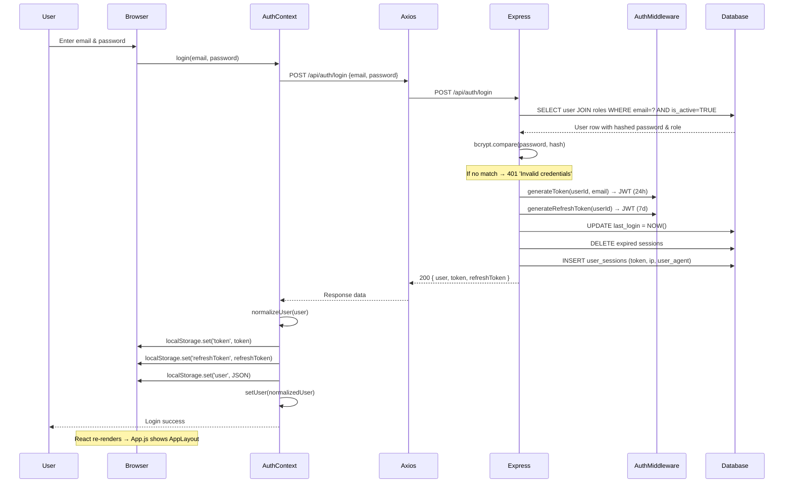
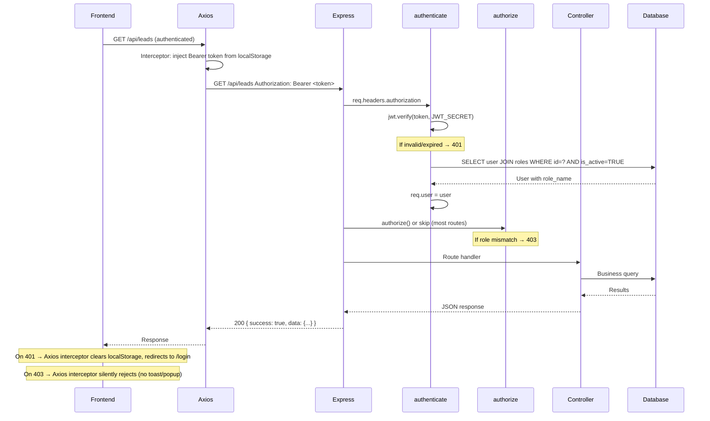
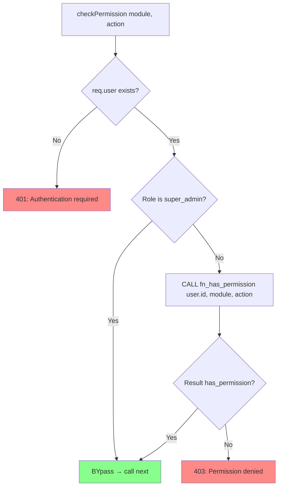
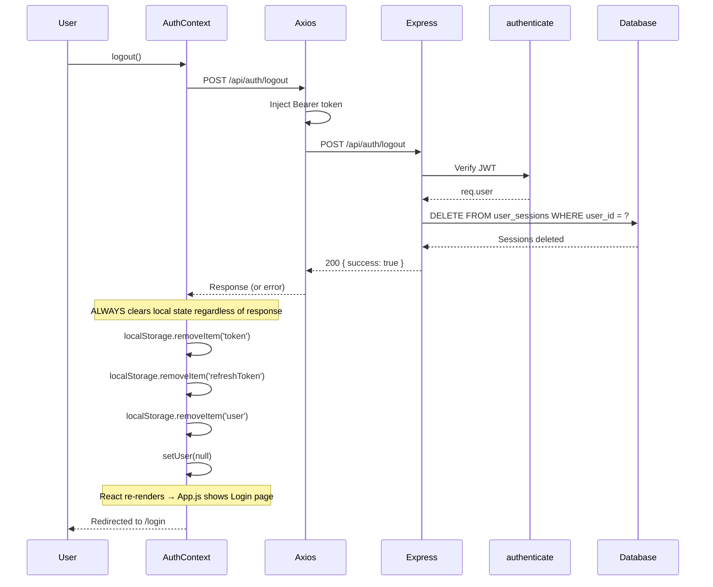

# Phase 5: Authentication, Authorization & Security Analysis

> **AMSERP — Auto Management System**
> Phase 5 of the full-stack architecture documentation series.
> Companion documents: Phase 1 (Backend Architecture), Phase 2 (Database Schema), Phase 3 (Backend Routes & Business Logic), Phase 4 (Frontend Architecture).

---

## Table of Contents

1. [Authentication System Overview](#1-authentication-system-overview)
2. [Login Flow Analysis](#2-login-flow-analysis)
3. [Logout Flow Analysis](#3-logout-flow-analysis)
4. [JWT Token Analysis](#4-jwt-token-analysis)
5. [Token Lifecycle & Session Management](#5-token-lifecycle--session-management)
6. [Password Security Analysis](#6-password-security-analysis)
7. [Authorization System — Roles & Permissions](#7-authorization-system--roles--permissions)
8. [Backend Route Protection Analysis](#8-backend-route-protection-analysis)
9. [Frontend Route Guards & Auth Context](#9-frontend-route-guards--auth-context)
10. [Middleware Security Analysis](#10-middleware-security-analysis)
11. [CORS Configuration](#11-cors-configuration)
12. [Security Headers Analysis](#12-security-headers-analysis)
13. [Input Validation & Sanitization](#13-input-validation--sanitization)
14. [File Upload Security](#14-file-upload-security)
15. [API Security Analysis](#15-api-security-analysis)
16. [Environment Security Analysis](#16-environment-security-analysis)
17. [Security Flow Diagrams](#17-security-flow-diagrams)
18. [Vulnerability Assessment](#18-vulnerability-assessment)
19. [Security Best Practices Assessment](#19-security-best-practices-assessment)
20. [Learning Guide](#20-learning-guide)
21. [Final Summary](#21-final-summary)

---

## 1. Authentication System Overview

### 1.1 Architecture

AMSERP uses a **custom JWT-based authentication system** with no third-party auth libraries (no Passport.js, no OAuth, no session cookies). The architecture is entirely hand-rolled using:

| Component | Technology |
|-----------|-----------|
| Token format | JSON Web Tokens (JWT) via `jsonwebtoken` ^9.0.2 |
| Password hashing | bcryptjs ^2.4.3, cost factor 10 |
| Token storage (backend) | `user_sessions` MySQL table |
| Token storage (frontend) | `localStorage` |
| Secret key | `process.env.JWT_SECRET` with hardcoded fallback |
| Database access | Raw MySQL via `mysql2/promise` — parameterized queries |

### 1.2 Core Files

| File | Purpose |
|------|---------|
| `backend/middleware/auth.js` | JWT verify, role authorize, permission check, token generation (146 lines) |
| `backend/routes/auth.routes.js` | Login, register, me, logout endpoints — all inline, no controller (189 lines) |
| `frontend/src/context/AuthContext.js` | React context: login, logout, session restore, hasRole (116 lines) |
| `frontend/src/services/api.js` | Axios interceptor: token injection, 401/403 handling (572 lines) |
| `backend/config/database.js` | MySQL pool with parameterized queries (145 lines) |

### 1.3 Auth Type Decision Matrix

| Feature | Chosen | Not Chosen |
|---------|--------|------------|
| Strategy | Custom JWT | Passport.js, OAuth2, SAML |
| Token storage (FE) | localStorage | httpOnly cookies, sessionStorage |
| Refresh tokens | Yes (separate 7d token) | Single token, opaque tokens |
| Session tracking | Database (`user_sessions`) | Redis, in-memory |
| Password reset | Admin-forced only | Self-service email flow |

---

## 2. Login Flow Analysis

### 2.1 End-to-End Login Sequence

**Frontend** (`context/AuthContext.js:66-84`):
1. Component calls `login(email, password)` from AuthContext.
2. AuthContext calls `authAPI.login({ email, password })` via Axios.
3. Axios request interceptor adds `Authorization: Bearer <token>` header (login is unauthenticated so no token yet).

**Backend** (`routes/auth.routes.js:40-102`):
1. Inline email/password existence check (`if (!email || !password)` — no validation middleware).
2. Query: `SELECT u.*, r.name as role_name FROM users u JOIN roles r ON u.role_id = r.id WHERE u.email = ? AND u.is_active = TRUE`
3. If no user found: throw `AppError('Invalid credentials', 401)` — generic message (no user enumeration).
4. `bcrypt.compare(password, user.password)` — if mismatch: same 401 message.
5. Generate token pair:
   - `generateToken(user.id, user.email)` → JWT with `{ userId, email }`, expires 24h.
   - `generateRefreshToken(user.id)` → JWT with `{ userId, type: 'refresh' }`, expires 7d.
6. `UPDATE users SET last_login = NOW() WHERE id = ?`
7. `DELETE FROM user_sessions WHERE user_id = ? AND expires_at < NOW()` — clean expired sessions.
8. `INSERT INTO user_sessions (user_id, token, ip_address, user_agent, expires_at) VALUES (?, ?, ?, ?, DATE_ADD(NOW(), INTERVAL 24 HOUR))` — store session with IP and User-Agent.
9. Response: `{ success: true, message: 'Login successful', data: { user: { id, uuid, email, firstName, lastName, role }, token, refreshToken } }`

**Frontend receives** (`context/AuthContext.js:68-78`):
1. Extracts `{ user, token, refreshToken }` from response.
2. Normalizes user object (handles both camelCase and snake_case field names).
3. Stores in localStorage: `token`, `refreshToken`, `user` (full JSON).
4. Sets React state via `setUser(normalizedUser)`.
5. Returns `{ success: true }`.

### 2.2 Security Observations

- **Generic error messages**: Login returns `'Invalid credentials'` for both missing user and wrong password — prevents user enumeration.
- **No rate limiting**: Login endpoint has no rate limiting, making it vulnerable to brute-force attacks.
- **No CAPTCHA**: No reCAPTCHA or similar challenge on login.
- **Session tracking**: IP address and User-Agent are captured but **not validated** during subsequent requests — no device fingerprinting or anomaly detection.
- **Empty password check**: Only checks `if (!password)` — no minimum length enforcement at login.
- **active user check**: Only active users (`is_active = TRUE`) can log in — deactivated users get `'Invalid credentials'`, not a specific message.

---

## 3. Logout Flow Analysis

### 3.1 Backend Logout (`routes/auth.routes.js:179-187`)

```javascript
router.post('/logout', authenticate, async (req, res, next) => {
    try {
        await query('DELETE FROM user_sessions WHERE user_id = ?', [req.user.id]);
        logger.info(`User logged out: ${req.user.email}`);
        res.json({ success: true, message: 'Logout successful' });
    } catch (error) {
        next(error);
    }
});
```

**Key observation**: The logout endpoint deletes **ALL sessions** for the user, not just the current session. This means if the user is logged in on multiple devices/browsers, logging out on one will log them out everywhere.

### 3.2 Frontend Logout (`context/AuthContext.js:86-99`)

```javascript
const logout = async () => {
    try {
        await authAPI.logout();  // POST /api/auth/logout
    } catch (error) {
        console.error('Logout error:', error);
    } finally {
        localStorage.removeItem('token');
        localStorage.removeItem('refreshToken');
        localStorage.removeItem('user');
        setUser(null);
    }
};
```

**Key observations**:
- Frontend always clears local state regardless of server response (errors are swallowed).
- No redirect logic in logout — redirect happens via React state change: when `user` becomes `null`, `App.js` re-renders and shows the login route group.

### 3.3 Session Cleanup Summary

| Event | Action |
|-------|--------|
| Login | Delete expired sessions for user, insert new session row |
| Logout | Delete ALL sessions for user |
| Token expire | Sessions remain in DB until user logs in again (cleaned at login) |
| Deactivation | `DELETE FROM user_sessions WHERE user_id = ?` (in `toggleUserStatus`) |
| Admin password reset | `DELETE FROM user_sessions WHERE user_id = ?` (in `resetPassword`) |

---

## 4. JWT Token Analysis

### 4.1 Token Generation

**Access Token** (`middleware/auth.js:121-127`):
```javascript
const generateToken = (userId, email) => {
    return jwt.sign(
        { userId, email },
        JWT_SECRET,
        { expiresIn: process.env.JWT_EXPIRES_IN || '24h' }
    );
};
```

**Refresh Token** (`middleware/auth.js:132-138`):
```javascript
const generateRefreshToken = (userId) => {
    return jwt.sign(
        { userId, type: 'refresh' },
        JWT_SECRET,
        { expiresIn: process.env.JWT_REFRESH_EXPIRES_IN || '7d' }
    );
};
```

### 4.2 Token Payload Comparison

| Field | Access Token | Refresh Token |
|-------|-------------|---------------|
| `userId` | ✓ User ID | ✓ User ID |
| `email` | ✓ Email | ✗ |
| `type` | ✗ | `'refresh'` |
| `iat` | ✓ (auto) | ✓ (auto) |
| `exp` | 24h (default) | 7d (default) |

### 4.3 Token Validation (`middleware/auth.js:26-61`)

```javascript
const authenticate = async (req, res, next) => {
    const authHeader = req.headers.authorization;
    if (!authHeader || !authHeader.startsWith('Bearer ')) {
        throw new AppError('No token provided', 401);
    }
    const token = authHeader.split(' ')[1];
    const decoded = jwt.verify(token, JWT_SECRET);

    // Verify user exists and is active
    const users = await query(
        'SELECT u.*, r.name as role_name FROM users u JOIN roles r ON u.role_id = r.id WHERE u.id = ? AND u.is_active = TRUE',
        [decoded.userId]
    );
    // ...
    req.user = user;
    next();
};
```

**Validation flow**:
1. Extract token from `Authorization: Bearer <token>` header.
2. `jwt.verify(token, JWT_SECRET)` — verifies signature and expiration.
3. Database lookup: verify user exists AND is active.
4. Attach full user object (including `role_name`) to `req.user`.
5. Error handling: `JsonWebTokenError` → 401, `TokenExpiredError` → 401.

### 4.4 Security Observations

- **Same secret for access and refresh tokens**: Both token types use the same `JWT_SECRET`. A compromised secret invalidates all tokens. No separate refresh secret.
- **No refresh token endpoint**: The codebase generates refresh tokens but has **no endpoint to exchange a refresh token for a new access token**. This means refresh tokens are generated at login but never used.
- **No blacklisting**: Revoked tokens remain valid until their natural expiration. The authenticate middleware does not check the `user_sessions` table — it only verifies the JWT signature and user existence.
- **Hardcoded fallback secret**: `const JWT_SECRET = process.env.JWT_SECRET || 'ams_super_secret_key'` — if the env var is somehow unset in production, the fallback is a weak, hardcoded secret.

---

## 5. Token Lifecycle & Session Management

### 5.1 Token Lifecycle

```
Login
  │
  ├─ Access Token (24h) → Stored in localStorage → Sent via Authorization header
  │                            │
  │                            ├─ Valid → Proceed to route handler
  │                            │
  │                            └─ Expired → 401 response → Interceptor clears
  │                                          localStorage → Redirect to /login
  │
  └─ Refresh Token (7d) → Stored in localStorage → NEVER USED
                                                      │
                                                      └─ No refresh endpoint exists
```

### 5.2 Session Table Schema

The `user_sessions` table stores:

| Column | Type | Purpose |
|--------|------|---------|
| `user_id` | INT | Foreign key to users |
| `token` | VARCHAR(500) | The JWT access token |
| `refresh_token` | VARCHAR(500) | The JWT refresh token |
| `ip_address` | VARCHAR(45) | Client IP at login |
| `user_agent` | TEXT | Browser User-Agent string |
| `last_activity` | TIMESTAMP | (nullable — never updated in current code) |
| `created_at` | TIMESTAMP | Session creation time |
| `expires_at` | TIMESTAMP | 24h after login |

### 5.3 Session Validation Gap

The `authenticate` middleware does **NOT** check the `user_sessions` table. It only:
1. Verifies the JWT signature/expiration.
2. Checks the user exists and is active.

This means:
- A logged-out user's token remains valid until JWT expiration (24h).
- A deactivated user's token remains valid until JWT expiration (24h) — even though sessions are deleted.
- There is no way to force-logout a user immediately (session deletion is cosmetic, not enforced).

### 5.4 Token Storage (Frontend)

All tokens and user data are stored in `localStorage`:

| Key | Content | Sensitivity |
|-----|---------|-------------|
| `token` | JWT access token (base64-encoded JSON with userId, email) | HIGH |
| `refreshToken` | JWT refresh token (base64-encoded JSON with userId) | HIGH |
| `user` | Full user object (JSON: id, uuid, email, firstName, lastName, role, etc.) | MEDIUM |

**Risk**: `localStorage` is accessible to any JavaScript executing in the same origin. An XSS vulnerability would expose all three items, allowing an attacker to:
- Impersonate the user (access token).
- Generate new tokens indefinitely (refresh token — if the endpoint existed).
- Access user PII (user object).

---

## 6. Password Security Analysis

### 6.1 Password Hashing

- **Algorithm**: bcryptjs
- **Cost factor**: 10 (salt rounds)
- **Implementation**: `bcrypt.hash(password, 10)` — consistent across registration, user creation, and admin password reset.

### 6.2 Password Policies

| Policy | Current Implementation |
|--------|----------------------|
| Minimum length | Enforced: `password.length < 6` → 400 error |
| Maximum length | Not enforced |
| Complexity (uppercase, lowercase, number, special) | Not enforced |
| Password expiry | Not enforced |
| Password history | Not enforced |
| Self-service reset | NOT implemented |
| Admin-forced reset | Implemented: `resetPassword` in `userManagement.controller.js` |

### 6.3 Registration Password Flow

**Backend** (`routes/auth.routes.js:111-145`):
```javascript
router.post('/register', async (req, res, next) => {
    const { email, password, firstName, lastName, phone, roleId } = req.body;
    if (!email || !password || !firstName || !lastName) {
        throw new AppError('All fields are required', 400);
    }
    // Check if email exists
    const existing = await query('SELECT id FROM users WHERE email = ?', [email]);
    if (existing.length > 0) {
        throw new AppError('Email already registered', 400);
    }
    const hashedPassword = await bcrypt.hash(password, 10);
    // Insert user...
});
```

**Frontend**: Register endpoint exists but is **not exposed** in the frontend UI. The Login page only offers email/password fields with no registration link.

### 6.4 Admin Password Reset (`userManagement.controller.js:455-487`)

```javascript
const resetPassword = async (req, res, next) => {
    const { id } = req.params;
    const { newPassword } = req.body;

    if (!newPassword || newPassword.length < 6) {
        throw new AppError('Password must be at least 6 characters', 400);
    }

    const hashedPassword = await bcrypt.hash(newPassword, 10);
    await query('UPDATE users SET password = ?, updated_at = NOW() WHERE id = ?', [hashedPassword, id]);
    await query('DELETE FROM user_sessions WHERE user_id = ?', [id]);  // Invalidate all sessions
    // ...
};
```

**Protected by**: `authenticate` + `authorize('super_admin')` — only super_admin can reset passwords.

### 6.5 Security Observations

- **Weak minimum length**: Only 6 characters, no complexity requirements.
- **No self-service reset**: Users cannot reset their own passwords. The only mechanism is admin-forced reset. SMTP config exists in `.env` but no email sending code is implemented.
- **No bcrypt cost increase**: Cost factor 10 is adequate for 2026 but is hardcoded — no env var to adjust it as hardware improves.
- **Password in plaintext in registration request**: Password is sent over HTTPS (presumably) in the POST body. No client-side hashing.

---

## 7. Authorization System — Roles & Permissions

### 7.1 Role Architecture

**9 seeded roles** (`database/setup_auth_data.sql:10-19`):

| ID | Name | Description |
|----|------|-------------|
| 1 | `super_admin` | Full access to all system features |
| 2 | `admin` | Administrative access excluding system config |
| 3 | `manager` | Managerial access to specific modules |
| 4 | `sales_manager` | Manage sales team and reports |
| 5 | `sales_executive` | Create leads, quotations, bookings |
| 6 | `service_manager` | Manage service center operations |
| 7 | `service_advisor` | Create job cards, appointments |
| 8 | `inventory_manager` | Manage vehicles and parts inventory |
| 9 | `customer` | Customer portal access |

**Note on role naming mismatch**: The `.sql` seed file names match the routes usage for IDs 1-4 and 8-9. However, IDs 5-7 are named `sales_executive` / `service_manager` / `service_advisor` in the seed but the codebase also references `sales_person`, `inventory_staff`, `service_staff` in some places (see `AuthContext.js` hasRole normalization and sidebar role arrays). The actual role names in the database take precedence.

### 7.2 Authorization Middleware

The system provides three authorization mechanisms in `middleware/auth.js`:

#### 7.2.1 Role-based Authorization — `authorize(...roles)`

```javascript
const authorize = (...roles) => {
    const normalizedRoles = roles.flat(Infinity).filter(Boolean).map(normalizeRole);
    return (req, res, next) => {
        if (!req.user) return next(new AppError('Authentication required', 401));
        if (!normalizedRoles.includes(normalizeRole(req.user.role_name))) {
            return next(new AppError('Access denied', 403));
        }
        next();
    };
};
```

- Normalizes role names (lowercase, trim, spaces→underscores, strip non-alphanumeric).
- Accepts variadic strings: `authorize('super_admin', 'admin')`.
- Also accepts arrays (via `.flat(Infinity)`): `authorize(...['super_admin', 'admin'])` or `authorize('super_admin', ['admin', 'manager'])`.
- Returns 403 if role doesn't match.

#### 7.2.2 Permission-based Authorization — `checkPermission(module, action)`

```javascript
const checkPermission = (module, action) => {
    return async (req, res, next) => {
        if (!req.user) return next(new AppError('Authentication required', 401));
        // Super admin bypass
        if (normalizeRole(req.user.role_name) === 'super_admin') return next();
        const result = await query(
            'SELECT fn_has_permission(?, ?, ?) as has_permission',
            [req.user.id, module, action]
        );
        if (!result[0].has_permission) {
            return next(new AppError(`Permission denied: Cannot ${action} ${module}`, 403));
        }
        next();
    };
};
```

- Calls `fn_has_permission(user_id, module, action)` MySQL stored function.
- `super_admin` bypasses all permission checks.
- **Key observation**: This middleware is exported from `auth.js` but is **never imported or used by any route file** in the entire codebase.

### 7.3 Role Hierarchy

The authorization system uses a **flat role model** with no inheritance:

```
super_admin → Bypasses ALL permission checks (hardcoded bypass in checkPermission)
                 │
                 │ All other roles are independent — no parent/child relationship
                 │
                 ├─ admin
                 ├─ manager
                 ├─ sales_manager
                 ├─ sales_executive
                 ├─ service_manager
                 ├─ service_advisor
                 ├─ inventory_manager
                 └─ customer
```

A `manager` does **not** inherit `sales_manager` permissions. Each role must be explicitly listed in `authorize()` or have explicit permission rows assigned.

### 7.4 Permission Database Model

The permissions system uses three tables:
- `permissions` — Individual permission rows with `module`, `action`, `name`, `description`.
- `permission_modules` — Groupings like "Customer & Lead Master", "Sales Master Data" with display names and sort order.
- `role_permissions` — Many-to-many mapping: `role_id` → `permission_id`.

The stored function `fn_has_permission()`, called by `checkPermission()`, checks whether a user's role has a specific permission for a given module/action combination.

### 7.5 Admin Routes Using `authorize()` (`admin.routes.js`)

| Endpoint | Methods | Authorized Roles |
|----------|---------|-----------------|
| `/api/admin/users/stats` | GET | super_admin, sales_manager |
| `/api/admin/users` | GET | super_admin, sales_manager |
| `/api/admin/users/:id` | GET | super_admin, sales_manager |
| `/api/admin/users` | POST | super_admin |
| `/api/admin/users/:id` | PUT | super_admin |
| `/api/admin/users/:id` | DELETE | super_admin |
| `/api/admin/users/:id/status` | PATCH | super_admin |
| `/api/admin/users/:id/role` | PATCH | super_admin |
| `/api/admin/users/:id/department` | PATCH | super_admin |
| `/api/admin/users/:id/department/:deptId` | DELETE | super_admin |
| `/api/admin/users/:id/reset-password` | POST | super_admin |
| `/api/admin/roles` | GET | super_admin |
| `/api/admin/roles/:id` | GET | super_admin |
| `/api/admin/roles` | POST | super_admin |
| `/api/admin/roles/:id` | PUT | super_admin |
| `/api/admin/roles/:id` | DELETE | super_admin |
| `/api/admin/roles/:id/permissions` | PUT | super_admin |
| `/api/admin/permissions` | GET | super_admin |
| `/api/admin/permissions/matrix` | GET | super_admin |
| `/api/admin/permissions/modules` | GET | super_admin |
| `/api/admin/departments/stats` | GET | super_admin, sales_manager |
| `/api/admin/departments` | GET | authenticate (any role) |
| `/api/admin/departments/:id` | GET | authenticate (any role) |
| `/api/admin/departments` | POST | super_admin |
| `/api/admin/departments/:id` | PUT | super_admin |
| `/api/admin/departments/:id` | DELETE | super_admin |
| `/api/admin/departments/:id/manager` | PATCH | super_admin |
| `/api/admin/statuses/tables` | GET | super_admin |
| `/api/admin/statuses/analytics` | GET | super_admin |
| `/api/admin/statuses` | GET | authenticate (any role) |
| `/api/admin/statuses/table/:tableName` | GET | authenticate (any role) |
| `/api/admin/statuses/detail/:id` | GET | authenticate (any role) |
| `/api/admin/statuses` | POST | super_admin |
| `/api/admin/statuses/:id` | PUT | super_admin |
| `/api/admin/statuses/:id` | DELETE | super_admin |
| `/api/admin/statuses/:tableName/reorder` | PUT | super_admin |

---

## 8. Backend Route Protection Analysis

### 8.1 Route Protection Patterns

Every route file in the project uses one of three protection patterns:

| Pattern | Description | Usage |
|---------|-------------|-------|
| `authenticate` only | Must be logged in, any role | Most business routes (leads, customers, vehicles, parts, service, etc.) |
| `authenticate + authorize(...roles)` | Logged in + specific role | Admin, HR, employees, uploader routes |
| `authenticate + checkPermission(module, action)` | Logged in + specific permission | **Never used** — dead code |

### 8.2 Complete Route File Analysis

#### Routes with `authenticate` only (no role restriction)

| File | Route Prefix | Endpoints |
|------|-------------|-----------|
| `auth.routes.js` | `/api/auth` | `/login` (public), `/register` (public), `/me` (authenticate), `/logout` (authenticate) |
| `lead.routes.js` | `/api/leads` | GET /, GET /sources/list, GET /filter-options, GET /analytics, GET /stats, GET /export, GET /:id, POST /, PUT /:id, DELETE /:id, POST /:id/convert |
| `customer.routes.js` | `/api/customers` | *(assumed: all with authenticate)* |
| `vehicle.routes.js` | `/api/vehicles` | *(assumed: all with authenticate)* |
| `vehicle-branding.routes.js` | `/api/vehicle-branding` | *(assumed: all with authenticate)* |
| `parts.routes.js` | `/api/parts` | *(assumed: all with authenticate)* |
| `quotation.routes.js` | `/api/quotations` | *(assumed: all with authenticate)* |
| `booking.routes.js` | `/api/bookings` | *(assumed: all with authenticate)* |
| `sales.routes.js` | `/api/sales` | *(assumed: all with authenticate)* |
| `invoice.routes.js` | `/api/invoices` | *(assumed: all with authenticate)* |
| `payment.routes.js` | `/api/payments` | *(assumed: all with authenticate)* |
| `service.routes.js` | `/api/services` | *(assumed: all with authenticate)* |
| `reports.routes.js` | `/api/reports` | *(assumed: all with authenticate)* |
| `dashboard.routes.js` | `/api/dashboard` | *(assumed: all with authenticate)* |
| `warehouse.routes.js` | `/api/warehouses` | *(assumed: all with authenticate)* |
| `erp-settings.routes.js` | `/api/erp-settings` | *(assumed: all with authenticate)* |
| `vehicle-master.routes.js` | `/api/vehicle-master` | *(assumed: all with authenticate)* |
| `payment-methods.routes.js` | `/api/payment-methods` | *(assumed: all with authenticate)* |
| `service-master.routes.js` | `/api/service-master` | *(assumed: all with authenticate)* |
| `profile.routes.js` | `/api/profile` | GET /, PUT / |
| `global-search.routes.js` | `/api/search` | *(assumed: all with authenticate)* |
| `bulk-import.routes.js` | `/api/bulk-import` | *(assumed: all with authenticate)* |
| `payroll.routes.js` | `/api/payroll` | *(assumed: all with authenticate)* |
| `leaves.routes.js` | `/api/leaves` | *(assumed: all with authenticate)* |
| `expenses.routes.js` | `/api/expenses` | *(assumed: all with authenticate)* |
| `ledger.routes.js` | `/api/ledger` | *(assumed: all with authenticate)* |
| `lead-master.routes.js` | `/api/lead-master` | *(assumed: all with authenticate)* |
| `sales-master.routes.js` | `/api/sales-master` | *(assumed: all with authenticate)* |

**Total: ~28 route files with `authenticate` only** — any authenticated user can access 85%+ of the API.

#### Routes with `authenticate + authorize(...roles)` (role-restricted)

| File | Route Prefix | Endpoints | Authorized Roles |
|------|-------------|-----------|-----------------|
| `admin.routes.js` | `/api/admin` | All user/role/department/status CRUD | super_admin, sales_manager (some read-only), super_admin (writes) |
| `user.routes.js` | `/api/users` | GET / (list) | super_admin |
| `employees.routes.js` | `/api/employees` | All | super_admin, admin, hr_admin |
| `uploader.routes.js` | `/api/uploader` | POST /order-form | super_admin, admin, manager |

### 8.3 Security Observations

- **Broad authenticated access**: Most business-critical routes (leads, customers, vehicles, sales, invoices, payments, service) are accessible to any authenticated user. There is no role-based restriction on who can create, read, update, or delete these resources.
- **Permission middleware is dead code**: `checkPermission()` is never used. The entire fine-grained permission system (tables, stored function) exists but only the coarser `authorize()` is used.
- **No resource-level ownership**: Most routes don't verify that the authenticated user owns or has rights to a specific resource (e.g., a sales_executive could potentially update another sales_executive's lead). The lead creation route auto-assigns `assigned_to: req.body.assigned_to || req.user.id` but the update route does not verify ownership.

---

## 9. Frontend Route Guards & Auth Context

### 9.1 AuthContext — The Core (`context/AuthContext.js`)

The `AuthProvider` wraps the entire application and provides:

```javascript
const { user, loading, login, logout, hasRole } = useAuth();
```

| Value | Type | Description |
|-------|------|-------------|
| `user` | Object or null | Normalized user object with firstName, lastName, role, etc. |
| `loading` | Boolean | True while session is being restored on mount |
| `login(email, password)` | Function | Calls API, stores tokens, sets user state |
| `logout()` | Function | Calls API, always clears local state |
| `hasRole(allowedRoles)` | Function | Returns true if user's role is in the allowedRoles array |

### 9.2 Session Restoration Flow

1. On mount, `AuthProvider` checks `localStorage` for `token`.
2. If token exists and `user` is in localStorage, set user state immediately (optimistic).
3. Call `GET /api/auth/me` to validate token with server.
4. On success: update user state and localStorage with fresh data.
5. On error: clear all localStorage items, set user to null.

### 9.3 `App.js` — Auth Gate (`App.js:98-161`)

```javascript
function App() {
    const { user, loading } = useAuth();

    if (loading) return <div className="loading-overlay"><div className="spinner"></div></div>;

    // Not logged in
    if (!user) {
        return (
            <>
                <Toaster />
                <ErrorPopup />
                <Routes>
                    <Route path="/login" element={<Login />} />
                    <Route path="*" element={<Navigate to="/login" replace />} />
                </Routes>
            </>
        );
    }

    // Logged in
    return (
        <>
            <Toaster />
            <ErrorPopup />
            <Routes>
                <Route path="/login" element={<Navigate to="/" replace />} />
                <Route path="/*" element={<AppLayout />} />
            </Routes>
        </>
    );
}
```

**The auth gate is binary**: Either the user is fully logged out (only `/login` route available) or fully logged in (all routes available via `AppLayout`). There is no role-based route restriction at the `App.js` level.

### 9.4 `PrivateRoute` Component — Exists but Not Wired (`components/PrivateRoute.js`)

```javascript
const PrivateRoute = ({ allowedRoles = [] }) => {
    const { user, loading, hasRole } = useAuth();
    const location = useLocation();

    if (loading) return <div className="loading-overlay"><div className="spinner"></div></div>;
    if (!user) return <Navigate to="/login" state={{ from: location }} replace />;
    if (allowedRoles.length > 0 && !hasRole(allowedRoles)) return <Navigate to="/" replace />;
    return <Outlet />;
};
```

**Key finding**: This component is fully implemented — it handles loading state, unauthenticated redirect (with `from` location preservation), unauthorized redirect (to home), and renders child routes via `<Outlet>`. However, it is **not imported or used anywhere** in `App.js`. All routes bypass it.

### 9.5 `AppLayout` — No Role Filtering

The `AppLayout` component renders all routes without any role checks:

```javascript
const AppLayout = () => {
    return (
        <div className="app-layout">
            <Sidebar isOpen={sidebarOpen} onClose={closeSidebar} />
            <div className="main-content">
                <Routes>
                    <Route index element={<Dashboard />} />
                    <Route path="dashboard" element={<Dashboard />} />
                    <Route path="leads" element={<Leads />} />
                    <Route path="customers" element={<Customers />} />
                    // ... 25+ routes, no role restrictions
                </Routes>
            </div>
        </div>
    );
};
```

**Role filtering only happens in the Sidebar** via `hasRole()` — users who shouldn't see certain pages simply won't have navigation links, but they can still navigate directly by typing the URL.

### 9.6 Sidebar Role-Based Navigation (`components/Sidebar.js`)

The Sidebar defines 28 nav items across 9 sections, each with an optional `roles` array. The `hasRole()` function filters which items are rendered:

```javascript
const filteredItems = section.items.filter(item => hasRole(item.roles));
```

| Section | Nav Items | Roles Required |
|---------|-----------|----------------|
| Main | Dashboard | All (empty roles array) |
| Master Data | Master data overview | All |
| | Customer & lead master | super_admin, admin, sales_manager |
| | Sales master data | super_admin, admin, sales_manager |
| | Vehicle master data | super_admin, admin, inventory_manager |
| | Service master data | super_admin, admin, service_manager |
| | Warehouses | super_admin, admin, manager, inventory_manager |
| | Users | super_admin |
| | Roles | super_admin |
| | Departments | super_admin |
| | Statuses | super_admin |
| | Expense categories | super_admin, admin, accountant, hr_admin |
| | Print templates | super_admin |
| | Payment methods | super_admin |
| CRM | Customers | super_admin, admin, manager, sales_manager, sales_executive, service_manager, service_advisor |
| Sales | Quotations | super_admin, admin, sales_manager, sales_executive |
| | Bookings | super_admin, admin, sales_manager, sales_executive |
| | Sales Orders | super_admin, admin, sales_manager |
| | Invoices | super_admin, admin, sales_manager, accountant |
| Inventory | Vehicle Branding | super_admin, admin, inventory_manager |
| | Vehicles | super_admin, admin, manager, inventory_manager, sales_manager, sales_executive |
| | Vehicle Parts Inventory | super_admin, admin, manager, inventory_manager, service_manager |
| Service | Appointments | super_admin, admin, service_manager, service_advisor |
| | Job Cards | super_admin, admin, service_manager, service_advisor |
| Uploader | Order Form Upload | super_admin, admin, manager |
| ERP Settings | Settings | super_admin |
| Reports | Reports | super_admin, admin, manager, sales_manager, service_manager, inventory_manager |
| HR & Finance | Employees | super_admin, admin, hr_admin |
| | Payroll | super_admin, admin, payroll_clerk, accountant |
| | Leaves | super_admin, admin, hr_admin, manager |
| | Expenses | super_admin, admin, accountant, hr_admin |
| | Ledger | super_admin, admin, accountant, payroll_clerk, hr_admin |

### 9.7 `hasRole()` Implementation (`context/AuthContext.js:101-107`)

```javascript
const hasRole = (allowedRoles) => {
    if (!user) return false;
    if (!allowedRoles || allowedRoles.length === 0) return true;
    const normalize = (r) => String(r || '').toLowerCase().replace(/\s+/g, '_').replace(/[^a-z0-9_]/g, '');
    const ur = normalize(user.role);
    return allowedRoles.some((ar) => normalize(ar) === ur);
};
```

**When `allowedRoles` is empty (e.g., Dashboard, Master data overview)**, the function returns `true` for all authenticated users — consistent with the intended design.

---

## 10. Middleware Security Analysis

### 10.1 Middleware Chain Order (`server.js`)

```
Request
  │
  ├─ 1. cors() ─────────────────── CORS header handling
  ├─ 2. helmet() ───────────────── Security headers (defaults)
  ├─ 3. express.json({ limit: '10mb' }) ─ JSON body parser
  ├─ 4. express.urlencoded({ extended: true, limit: '10mb' }) ─ URL-encoded parser
  ├─ 5. Logger middleware ───────── Logs method, path, IP, User-Agent
  ├─ 6. Route matching ──────────── Matches request to registered routes
  │      ├─ /api/auth/login ─────── No middleware (public)
  │      ├─ /api/auth/register ──── No middleware (public)
  │      ├─ /api/auth/me ────────── authenticate
  │      ├─ /api/auth/logout ────── authenticate
  │      ├─ /api/leads/* ────────── authenticate
  │      ├─ /api/admin/* ────────── authenticate + authorize(...)
  │      └─ ... (33 route files)
  │
  ├─ 7. 404 handler ─────────────── "Endpoint not found"
  └─ 8. errorHandler ────────────── Global error handler (last)
```

### 10.2 Missing Middleware

| Security Layer | Present? | Notes |
|----------------|----------|-------|
| CORS | ✓ | Dynamic origin, credentials: true |
| Security headers (helmet) | ✓ | Default configuration only |
| Rate limiting | ✗ | `express-rate-limit` in package.json but never imported |
| CSRF protection | ✗ | Not implemented |
| Request size validation | ✗ | 10MB limit set but no application-level body size check |
| Request timeout | ✗ | Not implemented |
| HTTP parameter pollution | ✗ | Not implemented |
| SQL injection protection | ✓ | Parameterized queries via `mysql2` |
| XSS filtering | ✗ | No express middleware for XSS |
| HTTPS enforcement | N/A | Not applicable (handled at infrastructure level) |

### 10.3 Error Handler (`middleware/errorHandler.js`)

```javascript
class AppError extends Error {
    constructor(message, statusCode, resolution = null) {
        super(message);
        this.statusCode = statusCode;
        this.resolution = resolution;
        this.isOperational = true;
    }
}

const errorHandler = (err, req, res, next) => {
    err.statusCode = err.statusCode || 500;

    const response = { success: false, message: err.message, resolution: err.resolution };

    if (process.env.NODE_ENV === 'development') {
        response.error = err;
        response.stack = err.stack;
    }

    if (process.env.NODE_ENV !== 'development' && !err.isOperational) {
        response.message = 'Something went wrong';
        delete response.resolution;
    }

    return res.status(err.statusCode).json(response);
};
```

**Security observations**:
- In development mode, full error objects and stack traces are sent to the client.
- `AppError.resolution` is user-facing guidance — could leak implementation details if not carefully written.
- Non-operational errors (unexpected bugs) in production return a generic message.

---

## 11. CORS Configuration

### 11.1 Current Implementation (`server.js:62-81`)

```javascript
const corsOptions = {
    origin: function (origin, callback) {
        // Allow requests with no origin (like mobile apps or curl)
        if (!origin) return callback(null, true);

        // In development, allow all localhost origins
        if (origin.match(/^http:\/\/localhost:\d+$/)) {
            return callback(null, true);
        }

        // Check against explicit whitelist from env
        const allowedOrigins = process.env.CORS_ORIGIN?.split(',') || [];
        if (allowedOrigins.includes(origin)) {
            return callback(null, true);
        }

        callback(new Error('Not allowed by CORS'));
    },
    credentials: true
};
```

### 11.2 Environment-Specific CORS Origins

| Environment | File | `CORS_ORIGIN` Value |
|-------------|------|---------------------|
| Development | `.env` | `http://localhost:3000,http://localhost:3001` |
| Production (active) | `.env.production.server` | `*` |
| Production (template) | `.env.production` | `https://smartbuyersclub.online,https://www.smartbuyersclub.online` |

### 11.3 Issues

1. **Production CORS_ORIGIN=* with credentials: true**: This combination is invalid — browsers will reject CORS requests with credentials when the origin is `*`. The server will throw an error but the browser will block the request before it reaches the server.
2. **The `.env.production` template has the correct domain origins** but `.env.production.server` (which appears to be the actively deployed config) uses `*`.
3. **Dynamic origin always allows requests without an Origin header** (e.g., mobile apps, curl) — this is standard but means non-browser clients are always permitted.
4. **The `*` fallback is a misconfiguration** that would break actual browser usage in production.

---

## 12. Security Headers Analysis

### 12.1 Current Helmet Configuration

`server.js:59`:
```javascript
app.use(helmet());
```

No custom configuration — all Helmet defaults are used.

### 12.2 Default Helmet Headers

| Header | Default Value | Status |
|--------|--------------|--------|
| `Content-Security-Policy` | Not set (Helmet 7 defaults) | ✗ Missing |
| `Cross-Origin-Embedder-Policy` | `require-corp` | ✓ Default |
| `Cross-Origin-Opener-Policy` | `same-origin` | ✓ Default |
| `Cross-Origin-Resource-Policy` | `same-origin` | ✓ Default |
| `Expect-CT` | `max-age=86400, enforce` | ✓ Default |
| `Origin-Agent-Cluster` | `?1` | ✓ Default |
| `Referrer-Policy` | `no-referrer` | ✓ Default |
| `Strict-Transport-Security` | `max-age=15552000; includeSubDomains` | ✓ Default (6 months) |
| `X-Content-Type-Options` | `nosniff` | ✓ Default |
| `X-DNS-Prefetch-Control` | `off` | ✓ Default |
| `X-Download-Options` | `noopen` | ✓ Default |
| `X-Frame-Options` | `SAMEORIGIN` | ✓ Default |
| `X-Permitted-Cross-Domain-Policies` | `none` | ✓ Default |
| `X-Powered-By` | Removed (Helmet default) | ✓ Default |

### 12.3 Missing/Observations

| Item | Observation |
|------|-------------|
| **CSP** | Not configured. This is a significant omission for an SPA — without CSP, XSS attacks are much harder to mitigate. |
| **HSTS preload** | `includeSubDomains` is set but `preload` is missing. HSTS max-age is the default 15552000 (180 days). |
| **Permissions-Policy** | Not set (removed in Helmet 7). Previously controlled feature access (camera, microphone, etc.). |
| **Custom CSP for API** | The API serves JSON only, so CSP is less critical for the backend. However, the Swagger UI at `/api-documentation` serves HTML and would benefit from CSP. |

---

## 13. Input Validation & Sanitization

### 13.1 The Validation Middleware — Dead Code (`middleware/validation.js`)

```javascript
const validateRequest = (schema) => {
    const checks = checkSchema(schema || {});
    return async (req, res, next) => {
        await Promise.all(checks.map((check) => check.run(req)));
        const errors = validationResult(req);
        if (!errors.isEmpty()) {
            const message = errors.array().map((err) => err.msg).join(', ');
            return next(new AppError(message, 400));
        }
        next();
    };
};
```

This middleware defines schemas for `loginValidation`, `registerValidation`, and `updateProfileValidation` using express-validator. However, **no route file imports or uses this middleware**. It is completely dead code.

### 13.2 Current Validation Pattern

All validation is done **inline** in route handlers or controllers using simple `if` statements:

| File | Validation |
|------|------------|
| `auth.routes.js` | `if (!email \|\| !password)`, `if (!email \|\| !password \|\| !firstName \|\| !lastName)`, `if (existing.length > 0)` |
| `userManagement.controller.js` | `if (!email \|\| !password \|\| !firstName \|\| !lastName \|\| !roleId)`, `if (!newPassword \|\| newPassword.length < 6)` |
| `lead.routes.js` | `if (!first_name \|\| !last_name \|\| !phone)` |
| `roleManagement.controller.js` | `if (!name)`, `if (!roleId)`, `if (existing.length > 0)` |

### 13.3 No-Validation Routes

Many routes perform **no input validation at all** — they pass `req.body` directly to database operations:

- `vehicle.routes.js` — POST and PUT pass `req.body` to SPs/repos.
- `customer.routes.js` — POST and PUT pass `req.body` to SPs/repos.
- `parts.routes.js` — POST and PUT pass `req.body`.
- `service.routes.js` — Multiple nested resource routes with `req.body` passthrough.
- `invoice.routes.js` — Items, payments, status updates with `req.body` passthrough.

### 13.4 Sanitization

- **Phone numbers**: Normalized via `normalizePhone()` utility in auth and lead routes.
- **Email**: No validation beyond the `@` symbol check (MySQL will reject invalid formats).
- **SQL**: Parameterized queries prevent SQL injection, but raw data is still stored and returned as-is.
- **XSS**: No sanitization or encoding of input/output data.
- **Whitespace/trimming**: Not consistently applied.

---

## 14. File Upload Security

### 14.1 Upload Configuration (`routes/uploader.routes.js`)

```javascript
const storage = multer.memoryStorage();
const upload = multer({
    storage: storage,
    limits: { fileSize: 10 * 1024 * 1024 }, // 10MB
    fileFilter: (req, file, cb) => {
        const allowedMimetypes = [
            'application/vnd.openxmlformats-officedocument.spreadsheetml.sheet', // xlsx
            'text/csv',
            'application/csv'
        ];
        if (allowedMimetypes.includes(file.mimetype) || file.originalname.endsWith('.xlsx') || file.originalname.endsWith('.csv')) {
            cb(null, true);
        } else {
            cb(new Error('Invalid file type. Only XLSX and CSV are allowed.'), false);
        }
    }
});
```

### 14.2 Security Assessment

| Check | Status | Notes |
|-------|--------|-------|
| File size limit | ✓ | 10MB limit enforced by multer |
| MIME type validation | ✓ | Checked against whitelist |
| Extension validation | ✓ | Fallback extension check |
| Memory storage (no disk write) | ✓ | Files processed in memory |
| File type after processing | Partial | File is parsed; parsed data stored but no re-validation of parsed output |
| Virus scanning | ✗ | No antivirus integration |
| Filename sanitization | ✗ | `file.originalname` used in error messages — potential information leak |
| Processing timeout | ✗ | No timeout on file processing |
| User-specific directory | N/A | Memory storage — files not saved to disk |

### 14.3 Upload Authorization

```javascript
router.post('/order-form',
    authenticate,
    authorize('super_admin', 'admin', 'manager'),
    upload.single('file'),
    uploaderController.uploadOrderForm
);
```

- Protected by `authenticate` + `authorize('super_admin', 'admin', 'manager')`.
- Only 3 of 9 roles can upload files.

---

## 15. API Security Analysis

### 15.1 API Overview

- **33 route files** mounted in `server.js`.
- **30+ route files with `authenticate` only** — any authenticated user.
- **4 route files with `authenticate + authorize()`** — role-restricted.
- **0 route files using `checkPermission()`** — fine-grained permissions unused.
- **2 public endpoints**: `POST /api/auth/login`, `POST /api/auth/register`.

### 15.2 API Endpoint Security Matrix

| Endpoint Group | Auth | Role Check | Rate Limit | Validation |
|----------------|------|------------|------------|------------|
| `/api/auth/login` | None | None | None | Inline if |
| `/api/auth/register` | None | None | None | Inline if |
| `/api/auth/me` | JWT | None | None | None |
| `/api/auth/logout` | JWT | None | None | None |
| `/api/leads/*` | JWT | None | None | Inline if (create/update) |
| `/api/customers/*` | JWT | None | None | Minimal |
| `/api/vehicles/*` | JWT | None | None | Minimal |
| `/api/sales/*` | JWT | None | None | Minimal |
| `/api/invoices/*` | JWT | None | None | Minimal |
| `/api/services/*` | JWT | None | None | Minimal |
| `/api/admin/users/*` | JWT | super_admin/sales_manager | None | Inline if |
| `/api/admin/roles/*` | JWT | super_admin | None | Inline if |
| `/api/admin/departments/*` | JWT | super_admin (write) / any (read) | None | Minimal |
| `/api/admin/statuses/*` | JWT | super_admin (write) / any (read) | None | Minimal |
| `/api/employees/*` | JWT | super_admin, admin, hr_admin | None | Minimal |
| `/api/uploader/order-form` | JWT | super_admin, admin, manager | None | Multer + inline |
| `/api/profile` | JWT | None | None | Minimal |
| `/api-documentation` | None | None | None | N/A |

### 15.3 Security Observations

- **No rate limiting on any endpoint** — brute force and DoS attacks are not mitigated.
- **No request throttling** — no per-IP or per-user rate limits.
- **Swagger docs are public** — `/api-documentation` has no authentication, exposing the full API surface.
- **No API versioning** — all routes under `/api` with no version prefix (e.g., `/api/v1/`).
- **No request logging granularity** — logger middleware logs every request but there's no audit trail of who performed what action at the API level (activity logging is done manually in some controllers).
- **Sensitive data exposure**: The `POST /api/auth/login` response returns `user` object including `uuid` — this is also exposed in `/auth/me` and `/profile` responses.
- **No HTTPS**: Not enforced at the application level (expected to be handled by reverse proxy).

---

## 16. Environment Security Analysis

### 16.1 Environment Files Found

| File | Purpose |
|------|---------|
| `.env` | Development configuration (committed) |
| `.env.production.server` | Production server config (committed) |
| `.env.production` | Production template (committed) |
| `frontend/.env.production` | Frontend production config (committed) |

### 16.2 Sensitive Values in Environment Files

| Secret | `.env` (Dev) | `.env.production.server` (Prod) |
|--------|-------------|--------------------------------|
| `JWT_SECRET` | `Chj0z1AudPo...` (strong, 52 chars) | `ams_production_secure_jwt_token_logixinventor_2026_omoda_jaecoo` (weak, pattern-based) |
| `DB_PASSWORD` | Empty | `0$9f4b@!99fe1Tb28` |
| `SMTP_PASS` | `your_smtp_password` (placeholder) | `your_smtp_password` (placeholder) |

### 16.3 Security Observations

- **Environment files committed to repository**: All `.env*` files are checked into version control. `.env.production.server` contains production database credentials.
- **Production JWT secret is weak**: `ams_production_secure_jwt_token_logixinventor_2026_omoda_jaecoo` follows a clear pattern (company name + year + brand names) — predictable.
- **Production DB password**: `0$9f4b@!99fe1Tb28` — moderate strength but hardcoded.
- **SMTP passwords**: Placeholder values in all files, indicating email features are not yet operational.
- **Frontend `.env.production`**: Only contains `REACT_APP_API_URL=/api` — no secrets.

### 16.4 Runtime Secret Handling

```javascript
// middleware/auth.js:12
const JWT_SECRET = process.env.JWT_SECRET || 'ams_super_secret_key';
```

The hardcoded fallback `'ams_super_secret_key'` is dangerously weak. If `process.env.JWT_SECRET` is somehow undefined (e.g., missing `.env` file, misconfiguration), this fallback activates silently.

---

## 17. Security Flow Diagrams

### 17.1 Login Flow



### 17.2 Protected API Request Flow



### 17.3 JWT Token Validation Flow

```mermaid
flowchart TD
    A[Request arrives] --> B{Authorization header present?}
    B -->|No| C[401: No token provided]
    B -->|Yes| D{Starts with 'Bearer '?}
    D -->|No| C
    D -->|Yes| E[Extract token]
    E --> F[jwt.verify(token, JWT_SECRET)]
    F -->|JsonWebTokenError| G[401: Invalid token]
    F -->|TokenExpiredError| H[401: Token expired]
    F -->|Valid| I[Query DB: user exists + active?]
    I -->|No| C
    I -->|Yes| J[Attach user to req.user]
    J --> K[Call next middleware]
    K --> L{authorize() present?}
    L -->|No| M[Proceed to route handler]
    L -->|Yes| N{Role matches allowed roles?}
    N -->|Yes| M
    N -->|No| O[403: Access denied]
    
    style C fill:#f88
    style G fill:#f88
    style H fill:#f88
    style O fill:#f88
    style M fill:#8f8
```

### 17.4 Permission Check Flow (Dead Code)



### 17.5 Logout Flow



---

## 18. Vulnerability Assessment

This section catalogues observed vulnerabilities, misconfigurations, and security gaps. These are **observations only** — no fixes or recommendations are provided.

### 18.1 Authentication Vulnerabilities

| ID | Vulnerability | Severity | Location | Description |
|----|--------------|----------|----------|-------------|
| A1 | No rate limiting on login | High | `routes/auth.routes.js` | Login endpoint has no rate limiting or CAPTCHA, enabling brute-force password attacks. |
| A2 | Hardcoded JWT fallback secret | High | `middleware/auth.js:12` | `'ams_super_secret_key'` is a weak, hardcoded fallback if env var is missing. |
| A3 | Weak production JWT secret | Medium | `.env.production.server:37` | `ams_production_secure_jwt_token_logixinventor_2026_omoda_jaecoo` follows a predictable pattern. |
| A4 | No refresh token endpoint | Medium | `routes/auth.routes.js` | Refresh tokens are generated but there is no endpoint to exchange them for new access tokens. Unused code. |
| A5 | No session validation on requests | High | `middleware/auth.js:26-61` | authenticate() does not check the `user_sessions` table. Revoked tokens remain valid until JWT expiration. |
| A6 | Logout deletes all sessions | Low | `routes/auth.routes.js:181` | `DELETE FROM user_sessions WHERE user_id = ?` logs out all devices, not just the current session. |

### 18.2 Authorization Vulnerabilities

| ID | Vulnerability | Severity | Location | Description |
|----|--------------|----------|----------|-------------|
| B1 | Over-broad authenticated access | High | Multiple route files | 85%+ of API routes allow any authenticated user. No role-based restrictions on CRUD operations for leads, customers, vehicles, sales, invoices, services. |
| B2 | Permission middleware unused | Medium | `middleware/auth.js:90-116` | Fine-grained `checkPermission()` is never used by any route. The entire permission infrastructure (tables, stored function) is dead code. |
| B3 | No resource ownership checks | Medium | Multiple route files | Most update/delete routes don't verify that the user owns the resource. Users can potentially modify resources they don't own. |
| B4 | PrivateRoute component not wired | Medium | `components/PrivateRoute.js` | The frontend PrivateRoute component exists with full implementation but is not used in App.js. No frontend role-based route protection. |

### 18.3 Session & Token Vulnerabilities

| ID | Vulnerability | Severity | Location | Description |
|----|--------------|----------|----------|-------------|
| C1 | Token stored in localStorage | High | `context/AuthContext.js` | JWT tokens stored in `localStorage`, accessible to any JavaScript. XSS vulnerability leads to full account takeover. |
| C2 | No token revocation at logout | Medium | `routes/auth.routes.js:181` | Session row is deleted at logout but the JWT remains valid until expiration. authenticate() doesn't check session existence. |
| C3 | Same secret for both token types | Medium | `middleware/auth.js:12` | Access and refresh tokens use the same `JWT_SECRET`. Compromise of one = compromise of both. |
| C4 | No token blacklisting | Medium | `middleware/auth.js:26-61` | No blacklist mechanism for revoked tokens. Tokens remain valid until expiration. |

### 18.4 Password Vulnerabilities

| ID | Vulnerability | Severity | Location | Description |
|----|--------------|----------|----------|-------------|
| D1 | Weak password policy | Medium | `routes/auth.routes.js:116` | Only 6-character minimum enforced. No complexity, history, or expiry requirements. |
| D2 | No self-service password reset | High | N/A | Users cannot reset their own passwords. SMTP is configured but no email sending code exists. Only super_admin can force-reset passwords. |
| D3 | Hardcoded bcrypt cost factor | Low | `routes/auth.routes.js:126` | Cost factor 10 is hardcoded. Cannot be adjusted as hardware improves without code change. |

### 18.5 Input Validation Vulnerabilities

| ID | Vulnerability | Severity | Location | Description |
|----|--------------|----------|----------|-------------|
| E1 | Validation middleware dead code | Medium | `middleware/validation.js` | express-validator schemas defined but never imported by any route. |
| E2 | No input sanitization | Medium | Multiple routes | `req.body` passed directly to database operations in many routes. No XSS filtering, type coercion, or sanitization. |
| E3 | No CSRF protection | High | `server.js` | No CSRF tokens or SameSite cookie configuration. Since tokens are in localStorage (not cookies), CSRF is partially mitigated for API calls, but still a risk for any cookie-based state. |

### 18.6 Security Configuration Vulnerabilities

| ID | Vulnerability | Severity | Location | Description |
|----|--------------|----------|----------|-------------|
| F1 | Production CORS misconfiguration | High | `.env.production.server:52` | `CORS_ORIGIN=*` with `credentials: true` is invalid. Browsers will reject requests. |
| F2 | No CSP header | Medium | `server.js:59` | Content-Security-Policy not configured. No XSS mitigation at the HTTP header level. |
| F3 | No rate limiting | High | `server.js` | `express-rate-limit` in dependencies but never configured. All endpoints are unthrottled. |
| F4 | Environment files committed | High | `.env*` files | Production database credentials and JWT secrets committed to version control. |
| F5 | Swagger docs are public | Medium | `server.js:122-125` | API documentation at `/api-documentation` has no authentication, exposing full API schema. |

### 18.7 File Upload Vulnerabilities

| ID | Vulnerability | Severity | Location | Description |
|----|--------------|----------|----------|-------------|
| G1 | No file content validation | Medium | `routes/uploader.routes.js` | MIME type and extension are checked but file content is not re-validated after parsing. Malicious data within valid XLSX/CSV files could be processed. |
| G2 | Original filename in error messages | Low | `routes/uploader.routes.js:22` | `file.originalname` is used in error messages, potentially leaking system path information. |

---

## 19. Security Best Practices Assessment

### 19.1 OWASP Top 10 (2021) Coverage

| Category | Status | Notes |
|----------|--------|-------|
| A01: Broken Access Control | ⚠️ Partial | Role-based access used in limited areas; no resource ownership checks; broad authenticated access |
| A02: Cryptographic Failures | ⚠️ Partial | bcrypt for passwords, JWT for tokens, but hardcoded fallback secret, no CSP |
| A03: Injection | ✅ Good | Parameterized queries prevent SQL injection; no eval() usage |
| A04: Insecure Design | ⚠️ Partial | Permission system designed but unused; refresh tokens generated but no exchange endpoint |
| A05: Security Misconfiguration | ❌ Weak | CORS misconfiguration, no CSP, no HSTS preload, public Swagger docs |
| A06: Vulnerable Components | ✅ Good | Dependencies use current major versions (express 4.18, helmet 7.1, jsonwebtoken 9.0) |
| A07: Identification & Auth Failures | ❌ Weak | No rate limiting, no password policy, no MFA, no self-service reset |
| A08: Software & Data Integrity | ⚠️ Partial | No package integrity verification (no lockfile audit), but standard npm ecosystem |
| A09: Security Logging & Failures | ⚠️ Partial | Request logging exists; activity logging in some controllers; no alerts or monitoring |
| A10: SSRF | ✅ N/A | No server-side URL fetching functionality |

### 19.2 JWT Best Practices Comparison

| Best Practice | Current State |
|---------------|--------------|
| Use strong, unique secret | Dev secret is strong; production secret is weak; hardcoded fallback is very weak |
| Short token expiration | 24h is reasonable for access token |
| Separate signing keys | One key for both access and refresh tokens |
| Token rotation | Not implemented |
| Blacklist/revocation | Not implemented (no session check) |
| Store in httpOnly cookies | Stored in localStorage |
| Use `jti` claim | Not used |
| Validate `aud` and `iss` | Not used |
| Refresh token rotation | Not applicable (no refresh endpoint) |

### 19.3 HTTPS & Transport Security

| Practice | Status |
|----------|--------|
| HTTPS enforced | Not at application level (assumed at infrastructure) |
| HSTS | Default (180 days, includeSubDomains, no preload) |
| HSTS preload | Not configured |
| Secure cookies | N/A (no cookies used) |

### 19.4 Password Best Practices

| Practice | Status |
|----------|--------|
| bcrypt/scrypt/argon2 | ✅ bcryptjs cost 10 |
| Minimum length > 8 | ❌ Only 6 characters |
| Complexity requirements | ❌ None |
| Password expiry | ❌ None |
| Password history | ❌ None |
| Rate limiting on login | ❌ None |
| Account lockout | ❌ None |
| MFA/2FA | ❌ None |
| Self-service reset | ❌ Not implemented |

---

## 20. Learning Guide

### 20.1 How Authentication Works (Simplified)

1. **User logs in**: Sends email + password to `POST /api/auth/login`.
2. **Server checks credentials**: Looks up user in database, compares password hash.
3. **Server creates tokens**: Generates a JWT access token (valid 24h) and a refresh token (valid 7d).
4. **Server records session**: Stores the tokens in `user_sessions` table with IP and browser info.
5. **Client stores tokens**: Saves both tokens in `localStorage`.
6. **Client sends token**: On every subsequent API call, the Axios interceptor adds `Authorization: Bearer <token>` header.
7. **Server verifies token**: The `authenticate` middleware decodes the JWT, verifies the signature, checks the user is still active.
8. **Server checks role** (on some routes): `authorize('super_admin')` checks if the user's role is in the allowed list.
9. **User logs out**: Client calls `POST /api/auth/logout`, server deletes the session, client clears `localStorage`.

### 20.2 Key Files to Read

| File | Lines | Why Read It |
|------|-------|-------------|
| `backend/middleware/auth.js` | 146 | The heart of the auth system — all token generation, verification, and authorization logic |
| `backend/routes/auth.routes.js` | 189 | Login/logout/register implementation — inline, no controller |
| `backend/server.js` | 207 | Middleware chain, CORS, security headers, all route mounts |
| `backend/middleware/errorHandler.js` | 54 | Error handling patterns and AppError class |
| `frontend/src/context/AuthContext.js` | 116 | Frontend auth: login, logout, session restore, hasRole |
| `frontend/src/services/api.js` | 572 | Axios interceptors — how tokens are sent and errors handled |
| `frontend/src/components/PrivateRoute.js` | 37 | Route guard component (exists but unused in App.js) |
| `frontend/src/App.js` | 162 | Top-level auth gate and route definitions |

### 20.3 Common Questions

**Q: Why is the permission middleware never used?**
The `checkPermission()` function in `auth.js` calls a MySQL stored function to check granular permissions. It's fully implemented and exported, but no route file imports or uses it. The routes use only the coarser `authorize()` role check.

**Q: Are refresh tokens actually used?**
No. Refresh tokens are generated at login and stored in localStorage, but there is no endpoint to exchange a refresh token for a new access token. This appears to be unfinished functionality.

**Q: How does the frontend protect routes?**
The frontend uses a binary gate in `App.js`: if `user` is null, only the login page is accessible. If `user` exists, all routes are accessible. Role-based filtering only happens in the Sidebar navigation — users can bypass it by typing URLs directly.

**Q: Can a logged-out user still use the API?**
Yes, until their JWT expires (24h). The `authenticate` middleware doesn't check the `user_sessions` table — it only verifies the JWT and user existence. Session deletion at logout is cosmetic.

**Q: Where are secrets stored?**
JWT secret, database passwords, and SMTP credentials are in `.env` files that are committed to the repository. The code has a hardcoded fallback JWT secret (`'ams_super_secret_key'`) if the environment variable is missing.

### 20.4 Architecture Diagram

```
┌─────────────────────────────────────────────────────────────────────┐
│                         FRONTEND (React)                           │
│                                                                     │
│  ┌────────────┐    ┌──────────────────┐    ┌───────────────────┐    │
│  │  Login.js  │───▶│  AuthContext.js   │───▶│   api.js (Axios)  │    │
│  │  (form)    │    │  (login/logout/   │    │  (token inject/   │    │
│  │            │    │   hasRole/session) │    │   error handling) │    │
│  └────────────┘    └──────────────────┘    └─────────┬─────────┘    │
│                                                      │              │
│  ┌──────────────────────┐                            │              │
│  │     App.js           │◀───────────────────────────┘              │
│  │  if (!user) → login  │    Authorization: Bearer <token>          │
│  │  else → AppLayout    │                                          │
│  └──────────────────────┘                                          │
│        │                                                           │
│        ▼                                                           │
│  ┌──────────────────────┐    ┌──────────────────────┐              │
│  │    AppLayout         │    │  PrivateRoute.js     │              │
│  │  (all routes, no     │    │  (EXISTS BUT NOT     │              │
│  │   role filtering)    │    │   WIRED IN App.js)   │              │
│  └──────────────────────┘    └──────────────────────┘              │
│        │                                                           │
│        ▼                                                           │
│  ┌────────────────────────────────────────────────────┐             │
│  │  Sidebar.js (28 nav items filtered by hasRole())   │             │
│  └────────────────────────────────────────────────────┘             │
└─────────────────────────────────────────────────────────────────────┘
                              │ HTTP
                              ▼
┌─────────────────────────────────────────────────────────────────────┐
│                         BACKEND (Express)                          │
│                                                                     │
│  ┌──────────────────────────────────────────────────────────────┐   │
│  │                     server.js                                 │   │
│  │  cors() → helmet() → json() → urlencoded() → logger → routes │   │
│  └──────────────────────────────────────────────────────────────┘   │
│        │                                                           │
│        ▼                                                           │
│  ┌──────────────────────────────────────────────────────────────┐   │
│  │              middleware/auth.js                                │   │
│  │  ┌─────────────┐  ┌──────────────┐  ┌────────────────────┐   │   │
│  │  │ authenticate │  │  authorize() │  │ checkPermission()  │   │   │
│  │  │ (JWT verify) │  │ (role check) │  │ (DB permission)    │   │   │
│  │  └─────────────┘  └──────────────┘  └────────────────────┘   │   │
│  └──────────────────────────────────────────────────────────────┘   │
│        │                                                           │
│        ▼                                                           │
│  ┌──────────────────────────────────────────────────────────────┐   │
│  │              Routes (33 files)                                │   │
│  │  auth.routes.js     (public + authenticate)                   │   │
│  │  lead.routes.js     (authenticate only)                       │   │
│  │  customer.routes.js (authenticate only)                       │   │
│  │  ...                                                          │   │
│  │  admin.routes.js    (authenticate + authorize)                 │   │
│  │  employees.routes.js(authenticate + authorize)                 │   │
│  │  uploader.routes.js (authenticate + authorize)                 │   │
│  └──────────────────────────────────────────────────────────────┘   │
│        │                                                           │
│        ▼                                                           │
│  ┌──────────────────────────────────────────────────────────────┐   │
│  │                 Database (MySQL)                              │   │
│  │  users → roles → role_permissions → permissions               │   │
│  │  user_sessions → user_activity_logs                           │   │
│  │  fn_has_permission() (stored function — UNUSED by routes)     │   │
│  └──────────────────────────────────────────────────────────────┘   │
└─────────────────────────────────────────────────────────────────────┘
```

---

## 21. Final Summary

### 21.1 Architecture Assessment

The AMSERP authentication and authorization system is a **custom-built JWT implementation** with a clear separation of concerns between token generation, verification, role checking, and permission validation. The system was designed with extensibility in mind — the role-based authorization (`authorize()`), permission-based authorization (`checkPermission()`), and session tracking (`user_sessions` table) represent a solid foundation.

### 21.2 What Works Well

- **Parameterized queries**: All database operations use prepared statements, preventing SQL injection.
- **bcrypt password hashing**: Cost factor 10 with no plaintext password storage.
- **Generic error messages**: Login doesn't reveal whether the email or password was wrong.
- **Session tracking**: IP address and User-Agent captured at login for audit trail.
- **Role normalization**: Consistent role name handling (lowercase, underscore-separated) across backend and frontend.
- **Axios interceptor design**: Clean separation of token injection and error handling.
- **Sidebar role filtering** (frontend): Navigation is filtered by user role.

### 21.3 What Could Be Improved

- **Permission middleware is dead code**: The `checkPermission()` function and the associated database infrastructure (permissions table, role_permissions, `fn_has_permission()`) are not used by any route.
- **Session validation gap**: The `authenticate` middleware doesn't check the `user_sessions` table, making session deletion at logout cosmetic.
- **Refresh token endpoint missing**: Refresh tokens are generated but cannot be used — no exchange endpoint exists.
- **No rate limiting**: All endpoints (including login) are unthrottled.
- **Over-broad authenticated access**: Most business routes accept any authenticated user with no role-based restrictions.
- **Frontend route guard gap**: The `PrivateRoute` component exists but is not wired into `App.js`. Role-based route protection is missing.
- **Environment files committed**: Production secrets are in version control.
- **Production CORS misconfiguration**: `CORS_ORIGIN=*` with `credentials: true` would fail in browsers.

### 21.4 Cross-Reference to Other Phases

| Phase | Document | Key Connections |
|-------|----------|-----------------|
| Phase 1 | Backend Architecture | middleware chain, server.js setup, error handling patterns |
| Phase 2 | Database Schema | users, roles, permissions, role_permissions, user_sessions tables; fn_has_permission() |
| Phase 3 | Backend Routes & Business Logic | Route protection patterns, controller implementation, business logic in routes |
| Phase 4 | Frontend Architecture | AuthContext, PrivateRoute, Sidebar, App.js route composition, api.js interceptors |

---

> **End of Phase 5: Authentication, Authorization & Security Analysis**
> 
> Total files analyzed: 17+ backend files, 5+ frontend files, 4 environment files
> 
> This analysis documents the existing implementation as-is. The codebase was not modified.
