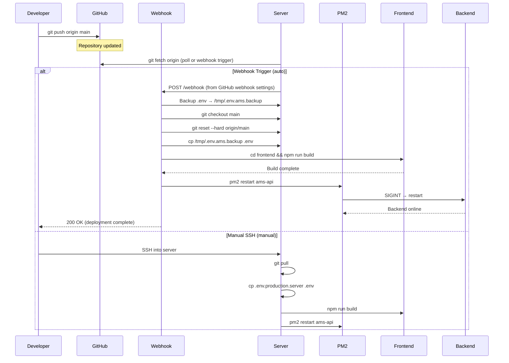
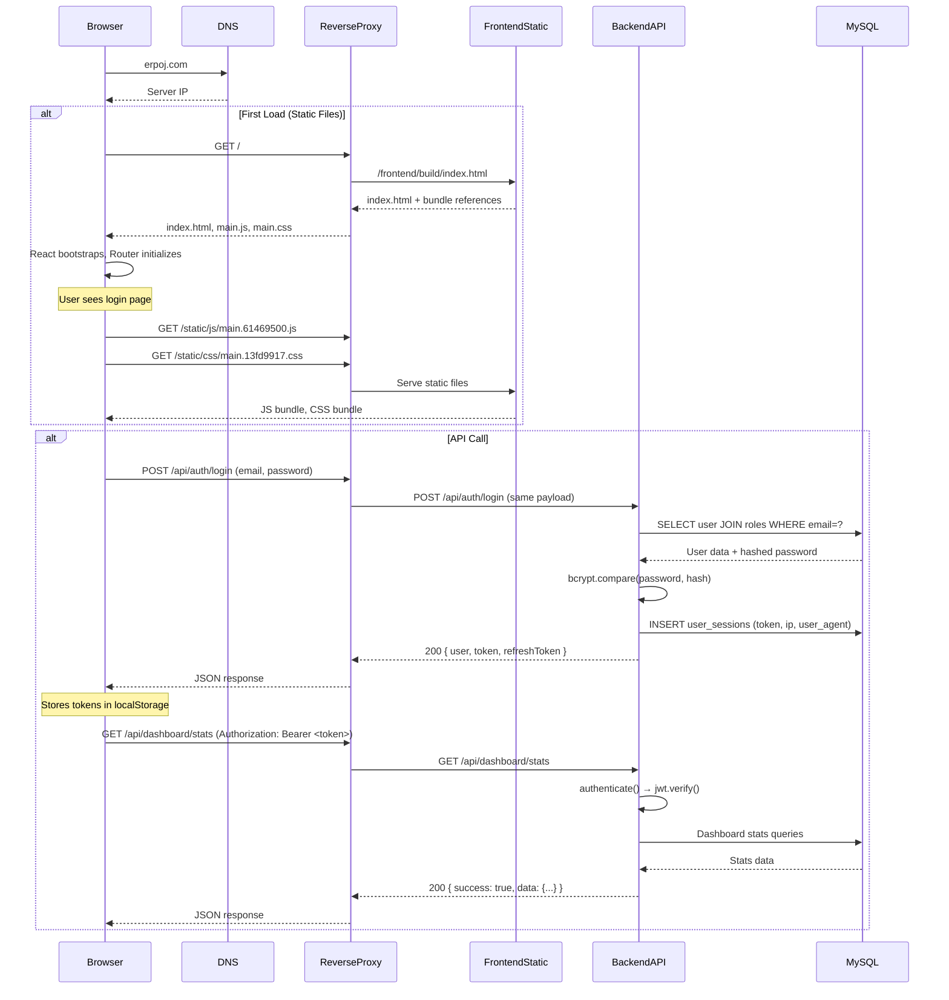

# Phase 6: Deployment & Infrastructure Analysis

> **AMSERP — Auto Management System (OMODA | JAECOO GULBERG)**
> Phase 6 of the full-stack architecture documentation series.
> Companion documents: Phase 1–5 (Architecture, Database, Backend, Frontend, Auth/Security).

---

## Table of Contents

1. [Deployment Overview](#1-deployment-overview)
2. [Environment Files](#2-environment-files)
3. [Startup Process](#3-startup-process)
4. [Required Terminals (Development)](#4-required-terminals-development)
5. [Build Process](#5-build-process)
6. [Runtime Configuration](#6-runtime-configuration)
7. [Database Deployment](#7-database-deployment)
8. [File Upload Infrastructure](#8-file-upload-infrastructure)
9. [Logging Infrastructure](#9-logging-infrastructure)
10. [Hostinger Compatibility](#10-hostinger-compatibility)
11. [Production Folder Structure](#11-production-folder-structure)
12. [Reverse Proxy](#12-reverse-proxy)
13. [Process Management](#13-process-management)
14. [Deployment Flow Diagrams](#14-deployment-flow-diagrams)
15. [Local Development Guide](#15-local-development-guide)
16. [Production Deployment Guide](#16-production-deployment-guide)
17. [Infrastructure Health Assessment](#17-infrastructure-health-assessment)
18. [Disaster Recovery](#18-disaster-recovery)
19. [Learning Guide](#19-learning-guide)
20. [Final Summary](#20-final-summary)

---

## 1. Deployment Overview

### 1.1 Architecture Summary

AMSERP is a **two-tier web application** consisting of a React SPA frontend and an Express.js REST API backend, communicating over HTTP/HTTPS. There is no message queue, no caching layer, no CDN configuration, and no containerization.

```
┌─────────────────────────────────────────────────────────────────┐
│                        PRODUCTION SERVER                         │
│                                                                   │
│  ┌──────────────────────────────────────────────────────────┐    │
│  │                    Reverse Proxy (Nginx/Apache)            │    │
│  │  ┌─────── HTTPS ────────┐    ┌────── /api/* ────────┐    │    │
│  │  │   erpoj.com:443      │    │   localhost:3002     │    │    │
│  │  └──────────────────────┘    └──────────────────────┘    │    │
│  └──────────────────────────────────────────────────────────┘    │
│                          │            │                          │
│                          ▼            ▼                          │
│  ┌─────────────────────┐  ┌────────────────────────────┐         │
│  │   Frontend (React)  │  │   Backend (Express)        │         │
│  │   /frontend/build/  │  │   /backend/                │         │
│  │   SPA served as     │  │   Port 3002               │         │
│  │   static files      │  │   PM2: ams-api            │         │
│  └─────────────────────┘  └───────────┬────────────────┘         │
│                                       │                          │
│                                       ▼                          │
│                          ┌────────────────────────────┐         │
│                          │   MySQL Database            │         │
│                          │   Host: localhost:3306      │         │
│                          │   DB: db_ams / sql_erpoj_com│         │
│                          └────────────────────────────┘         │
└─────────────────────────────────────────────────────────────────┘
```

### 1.2 Communication Flow

| From | To | Protocol | Port | Details |
|------|----|----------|------|---------|
| Browser | Reverse Proxy | HTTPS | 443 | User requests `erpoj.com` |
| Reverse Proxy | Frontend (static) | HTTP | — | Serves `index.html`, JS, CSS |
| Browser (JS) | Reverse Proxy | HTTPS | 443 | API calls to `/api/*` |
| Reverse Proxy | Backend | HTTP | 3002 | Proxies `/api/*` to Node.js |
| Backend | MySQL | MySQL Protocol | 3306 | Database queries |
| Webhook | Backend | HTTP | 3500 | Auto-deployment trigger |

### 1.3 Development vs Production Differences

| Aspect | Development | Production |
|--------|-------------|------------|
| **Frontend** | `react-scripts start` on port 3000 | Static files served from `frontend/build/` |
| **Backend** | `nodemon server.js` on port 3002 | `node server.js` via PM2 on port 3002 |
| **API proxy** | CRA proxy (`setupProxy.js`) to localhost:3002 | Reverse proxy (nginx/Apache) |
| **Environment** | `.env` (NODE_ENV=development) | `.env` (NODE_ENV=production) |
| **Database** | MySQL on localhost:3306 (root, no password) | MySQL on localhost:3306 (db_ams user) |
| **HTTPS** | None (HTTP) | Expected via reverse proxy |
| **Process mgmt** | Manual terminal windows | PM2 (`ams-api`) |
| **CORS** | `localhost:3000,localhost:3001` | `https://erpoj.com,https://www.erpoj.com` (or `*`) |
| **Log level** | `info` | `warn` |
| **Log retention** | 5 files | 10 files |

---

## 2. Environment Files

### 2.1 File Inventory

| File | Path | Purpose | In `.gitignore`? |
|------|------|---------|-----------------|
| `.env` | `C:\Freelance\AMSERP\.env` | Development defaults (active config) | **Yes** |
| `.env.production` | `C:\Freelance\AMSERP\.env.production` | Production template (placeholders) | **No** |
| `.env.production.server` | `C:\Freelance\AMSERP\.env.production.server` | Actual production config (real secrets) | **No** |
| `frontend/.env.production` | `C:\Freelance\AMSERP\frontend\.env.production` | Frontend production API URL | **No** |

### 2.2 Variable Reference

#### Backend Environment Variables

| Variable | `.env` (Dev) | `.env.production` (Template) | `.env.production.server` (Prod) | Loaded By |
|----------|-------------|------------------------------|--------------------------------|-----------|
| `NODE_ENV` | `development` | `production` | `production` | `server.js:8` via `dotenv` |
| `APP_NAME` | `Auto Management System (AMS)` | Same | Same | Application code |
| `APP_VERSION` | `1.0.0` | Same | Same | Application code |
| `ADMIN_PORT` | `3000` | `3000` | `3000` | Referenced in docs |
| `WEBSITE_PORT` | `3001` | `3001` | `3001` | Referenced in docs |
| `API_PORT` | `3002` | `3002` | `3002` | `server.js:56` |
| `DB_HOST` | `127.0.0.1` | `127.0.0.1` | `127.0.0.1` | `config/database.js:32` |
| `DB_PORT` | `3306` | `3306` | `3306` | `config/database.js:33` |
| `DB_USER` | `root` | `root` | `db_ams` | `config/database.js:14` |
| `DB_PASSWORD` | _(empty)_ | _(empty)_ | _(set — real secret)_ | `config/database.js:15` |
| `DB_NAME` | `ams_db` | `ams_db` | `db_ams` | `config/database.js:16` |
| `DB_CONNECTION_LIMIT` | `20` | `20` | `20` | `config/database.js:17` |
| `DB_SOCKET` | _(unset)_ | _(unset)_ | _(unset)_ | `config/database.js:25` |
| `JWT_SECRET` | _(set — strong)_ | _(set — strong)_ | _(set — weak pattern)_ | `middleware/auth.js:12` |
| `JWT_EXPIRES_IN` | `24h` | `24h` | `24h` | `middleware/auth.js:125` |
| `JWT_REFRESH_EXPIRES_IN` | `7d` | `7d` | `7d` | `middleware/auth.js:136` |
| `LOG_LEVEL` | `info` | `warn` | `warn` | `utils/logger.js:80` |
| `LOG_FILE_PATH` | `./logs` | `./logs` | `./logs` | `utils/logger.js:13` |
| `LOG_MAX_SIZE` | `10m` | `10m` | `10m` | `utils/logger.js:45` |
| `LOG_MAX_FILES` | `5` | `10` | `10` | `utils/logger.js:46` |
| `CORS_ORIGIN` | `http://localhost:3000,http://localhost:3001` | `https://smartbuyersclub.online,...` | `*` | `server.js:73` |
| `SMTP_HOST` | `smtp.example.com` | `smtp.example.com` | `smtp.example.com` | Codebase (unused) |
| `SMTP_PORT` | `587` | `587` | `587` | Codebase (unused) |
| `SMTP_USER` | `noreply@logixinventor.com` | `noreply@yourdomain.com` | `noreply@omodajaecoogulberg.com` | Codebase (unused) |
| `SMTP_PASS` | `your_smtp_password` | `your_smtp_password` | `your_smtp_password` | Codebase (unused) |
| `SMTP_FROM` | `"AMS <noreply@logixinventor.com>"` | Placeholder | `"AMS <noreply@omodajaecoogulberg.com>"` | Codebase (unused) |
| `UPLOAD_PATH` | `./uploads` | `./uploads` | `./uploads` | Referenced in env only |
| `MAX_FILE_SIZE` | `10485760` | `10485760` | `10485760` | Referenced in env only |
| `BACKUP_PATH` | `./db_backup` | `./db_backup` | `./db_backup` | Referenced in env only |
| `BACKUP_RETENTION_DAYS` | `30` | `30` | `30` | Referenced in env only |
| `COMPANY_NAME` | `"OMODA \| JAECOO GULBERG"` | `"Your Company Name"` | `"OMODA \| JAECOO GULBERG"` | Application code |
| `COMPANY_EMAIL` | `info@omodajaecoogulberg.com` | `info@yourdomain.com` | `info@omodajaecoogulberg.com` | Application code |
| `COMPANY_PHONE_1` | `"0302-5227979"` | Placeholder | `"0302-5227979"` | Application code |
| `COMPANY_PHONE_2` | `"0307-1766611"` | Placeholder | `"0307-1766611"` | Application code |
| `COMPANY_ADDRESS` | Lahore, Pakistan | Placeholder | Lahore, Pakistan | Application code |
| `COMPANY_WEBSITE` | `https://www.omodajaecoogulberg.com` | `https://www.yourdomain.com` | `https://www.omodajaecoogulberg.com` | Application code |

#### Frontend Environment Variables

| Variable | `frontend/.env.production` | Default (dev) | Loaded By |
|----------|---------------------------|---------------|-----------|
| `REACT_APP_API_URL` | `/api` | `/api` | `services/api.js:11` via `process.env.REACT_APP_API_URL` |

Note: The frontend only has a production env file. During development, `REACT_APP_API_URL` defaults to `/api` and the CRA proxy (`setupProxy.js`) forwards `/api` requests to `http://localhost:3002`.

### 2.3 Environment Loading Chain

**Backend** (`server.js:8`):
```javascript
require('dotenv').config({ path: '../.env' });
```

This loads `.env` from the **project root** (`C:\Freelance\AMSERP\.env`), not from the `backend/` directory. The relative path `../.env` goes up from `backend/server.js` to the root.

**Frontend**: CRA automatically loads environment variables from:
- `.env` (always)
- `.env.development` (when `NODE_ENV=development`) — does not exist
- `.env.production` (when `NODE_ENV=production`) — exists with `REACT_APP_API_URL=/api`
- `.env.local` (local overrides, gitignored) — does not exist

### 2.4 Security Considerations

1. **Production secrets committed**: `.env.production.server` contains real database credentials (`DB_PASSWORD`, `DB_USER`, `DB_NAME`) and a production JWT secret. This file is **NOT** in `.gitignore`, meaning it would be pushed to the Git repository.

2. **Production JWT secret is weak**: `ams_production_secure_jwt_token_logixinventor_2026_omoda_jaecoo` follows a clear pattern — company name + year + brand names. By contrast, the development JWT secret is a strong 52-character random string.

3. **Production .env not protected**: The deployment webhook (`.tmp_webhook.js`) backs up and restores `.env` during deployment, but this is a custom script, not a built-in mechanism.

4. **CORS_ORIGIN=*** in production: `.env.production.server` sets `CORS_ORIGIN=*`, which combined with `credentials: true` in `server.js:80` is invalid per the CORS specification — browsers will reject credentials-enabled requests to a wildcard origin.

5. **SMTP passwords are placeholders**: All environment files contain placeholder SMTP passwords (`your_smtp_password`), confirming that email features are not operational.

6. **DB_PASSWORD fallback dangerous**: `create_super_admin.js:20` uses `password: process.env.DB_PASSWORD || 'Testtest123!'` — a hardcoded fallback password in the script.

---

## 3. Startup Process

### 3.1 Backend Startup

**Command (development):** `npm run dev` (from `backend/` directory)
**Command (production):** `pm2 start server.js --name ams-api` (or `node server.js`)

**Startup sequence** (`server.js`):

```
1. Load .env from ../.env (project root)
2. Import Express, cors, helmet, swagger, logger, errorHandler, database
3. Import all 33 route modules
4. Create Express app
5. Configure security middleware:
   a. helmet() — default security headers
   b. cors(corsOptions) — dynamic origin checking
6. Configure body parsers:
   a. express.json({ limit: '10mb' })
   b. express.urlencoded({ extended: true, limit: '10mb' })
7. Configure request logger middleware (winston)
8. Configure Swagger at /api-documentation
9. Define health check at GET /api/health
10. Mount all 33 route groups under /api/*
11. Configure 404 handler
12. Configure global error handler
13. Test database connection (testConnection)
14. Listen on port (API_PORT or 3002)
```

**Important**: The server does NOT start listening unless the database connection test succeeds. If the database is unreachable, the process exits with code 1.

### 3.2 Frontend Startup

**Command (development):** `npm start` (from `frontend/` directory)
**Command (production):** Reverse proxy serves static files from `frontend/build/`

**Development startup sequence:**

```
1. react-scripts start
2. CRA dev server starts on port 3000
3. CRA reads proxy config from setupProxy.js:
   /api/* → http://localhost:3002
4. Webpack Dev Server serves app with HMR
5. Browser opens http://localhost:3000
```

### 3.3 Webhook Server

**File:** `.tmp_webhook.js` (project root)

This is a **separate Node.js HTTP server** running on port 3500. It is NOT part of the main application — it is a deployment utility that listens for POST `/webhook` requests to trigger automated deployment.

**Startup command:** `node .tmp_webhook.js` (from project root)

**Startup sequence:**

```
1. Start HTTP server on port 3500
2. Wait for POST /webhook requests
3. On receive:
   a. Backup .env → /tmp/.env.ams.backup
   b. git fetch origin
   c. git checkout main
   d. git reset --hard origin/main
   e. Restore .env from backup
   f. cd frontend && npm run build
   g. pm2 restart ams-api
```

### 3.4 Server Restart Indicator

The health check endpoint at `GET /api/health` includes an `employeesUpsert` field:

```json
{
  "status": "OK",
  "employeesUpsert": "inline-sql-v1",
  "timestamp": "..."
}
```

A separate endpoint `GET /api/employees/_build` provides a hint:

```json
{
  "employeesUpsert": "inline-sql-v1",
  "hint": "Restart backend after git pull if POST /api/employees errors on sp_employee_upsert."
}
```

This is a manual indicator that the server needs a restart after code updates — no automated health check or restart loop exists.

---

## 4. Required Terminals (Development)

During development, the following processes must be running concurrently:

| # | Process | Command | Working Directory | Port | Dependencies | Purpose |
|---|---------|---------|-------------------|------|--------------|---------|
| 1 | **Database** | MySQL service (system service or XAMPP/MAMP) | System-wide | 3306 | MySQL Server | Stores all application data |
| 2 | **Backend** | `npm run dev` | `backend/` | 3002 | nodemon, dotenv, express, mysql2, all dep | REST API server with auto-reload |
| 3 | **Frontend** | `npm start` | `frontend/` | 3000 | react-scripts, all dep | React dev server with HMR + API proxy |

### 4.1 Process Details

#### Database (MySQL)

| Detail | Value |
|--------|-------|
| **Start command** | `net start MySQL` (Windows) / `sudo systemctl start mysql` (Linux) / XAMPP GUI |
| **Alternative** | `mysql.server start` (macOS Homebrew) |
| **Default port** | 3306 |
| **Expected database** | `ams_db` |
| **User** | `root` (no password in dev) |
| **Connection check** | Backend runs `testConnection()` on startup — exits if DB unreachable |

#### Backend

| Detail | Value |
|--------|-------|
| **Start command** | `npm run dev` |
| **Alternative** | `npx nodemon server.js` |
| **Working dir** | `C:\Freelance\AMSERP\backend\` |
| **Port** | 3002 (configurable via `API_PORT`) |
| **Env file** | `../.env` (project root) |
| **Auto-reload** | Yes — nodemon watches for file changes |
| **Startup check** | Must connect to MySQL before listening |

#### Frontend

| Detail | Value |
|--------|-------|
| **Start command** | `npm start` |
| **Working dir** | `C:\Freelance\AMSERP\frontend\` |
| **Port** | 3000 (configurable via `ADMIN_PORT` but hardcoded in proxy) |
| **Proxy** | `/api` → `http://localhost:3002` |
| **HMR** | Yes — hot module replacement for React components |
| **Built-in** | Uses CRA (react-scripts 5.0.1) — no custom webpack config |

### 4.2 Terminal Startup Sequence

```
Terminal 1:  cd backend && npm run dev
             (waits for DB connection, starts on port 3002)

Terminal 2:  cd frontend && npm start
             (starts on port 3000, proxies /api to :3002)

Browser:     http://localhost:3000
             (Login page loads, API calls go through proxy)
```

### 4.3 No Concurrent Startup Script

There is **no root package.json** with a `concurrently` or `npm-run-all` script to start both frontend and backend with a single command. Each must be started in its own terminal.

---

## 5. Build Process

### 5.1 Backend Build

The backend has **no build step**. It is plain JavaScript run directly with Node.js.

```
Source:  backend/        (all .js files, raw ES6/CommonJS)
Build:   NONE — no minification, no transpilation, no bundler
Runtime: node server.js  (or nodemon in dev)
```

`package.json` scripts:
```json
{
  "start": "node server.js",
  "dev": "nodemon server.js",
  "test": "jest"
}
```

### 5.2 Frontend Build

The frontend uses **Create React App** (`react-scripts 5.0.1`) for building.

**Build command:** `npm run build` (from `frontend/` directory)
**Equivalent:** `npx react-scripts build`

**Build process:**
```
1. Set NODE_ENV=production (implicitly by react-scripts)
2. Read environment variables from .env.production (if exists)
3. Webpack (internal to react-scripts):
   a. Resolve entry point: src/index.js
   b. Transpile JSX/ES6 with Babel (preset-react-app)
   c. Compile Sass/CSS with PostCSS + Autoprefixer
   d. Bundle JavaScript into optimized chunks
   e. Extract CSS into separate files
   f. Hash filenames for cache busting (main.[hash].js)
   g. Copy public/ files to build/
   h. Generate asset-manifest.json
   i. Minify HTML, CSS, JS
4. Output to build/ directory
```

**Build output** (`frontend/build/`):

```
build/
├── index.html                    # Entry HTML (~940 bytes)
├── favicon.png                   # Favicon
├── asset-manifest.json           # File mapping for service worker
├── static/
│   ├── css/
│   │   └── main.13fd9917.css     # Compiled and minified CSS (~1KB)
│   ├── js/
│   │   ├── main.61469500.js      # Compiled and minified JS bundle
│   │   ├── main.61469500.js.LICENSE.txt
│   │   ├── main.13fd9917.css.map # Source map (dev only, removed in prod)
│   │   └── main.61469500.js.map  # Source map (dev only, removed in prod)
│   └── media/
│       ├── logo.486aff7...png    # Static asset
│       └── white_logo.e77fa...png # Static asset
└── samples/                      # Bulk import sample files
    ├── bulk-import-leads.csv
    ├── bulk-import-leads.xlsx
    ├── bulk-import-sales-orders.csv
    ├── bulk-import-sales-orders.xlsx
    ├── bulk-import-vehicle-brands.csv
    ├── bulk-import-vehicle-brands.xlsx
    ├── bulk-import-vehicles.csv
    └── bulk-import-vehicles.xlsx
```

**Build statistics:**
| Metric | Value |
|--------|-------|
| JS bundle size (main.js) | ~170 KB (compressed ~55 KB estimated) |
| CSS bundle size | ~1 KB |
| Build time estimate | 30-60 seconds |
| Source maps | Generated (can be disabled with `GENERATE_SOURCEMAP=false`) |

### 5.3 Production Artifacts

The production deployment requires:

| Artifact | Source | Destination | Notes |
|----------|--------|-------------|-------|
| Frontend build | `frontend/build/` | Server `frontend/build/` or served by reverse proxy | **Must be rebuilt after every frontend change** |
| Backend source | `backend/` (all .js files) | Server `backend/` | No build needed — runs as-is |
| Environment | `.env` (renamed from `.env.production.server`) | Server root `.env` | Must be configured per environment |
| SQL scripts | `backend/database/setup_auth_data.sql` | Run manually against MySQL | Initial role seeding |
| SQL scripts | `supplier_management_live.sql` | Run manually against MySQL | Supplier management SPs |
| Node modules | `npm install` output | `backend/node_modules/` | Must be installed on target |

---

## 6. Runtime Configuration

### 6.1 Port Configuration

| Application | Default Port | Env Variable | Config Location |
|-------------|-------------|--------------|-----------------|
| Frontend (dev) | 3000 | `ADMIN_PORT` | CRA default (hardcoded in proxy) |
| Backend API | 3002 | `API_PORT` | `server.js:56` |
| Webhook server | 3500 | Hardcoded | `.tmp_webhook.js:5` |
| MySQL | 3306 | `DB_PORT` | `config/database.js:33` |

### 6.2 CORS Configuration

CORS is configured dynamically in `server.js:62-81`:

```javascript
origin: function (origin, callback) {
    if (!origin) return callback(null, true);           // Allow non-browser clients
    if (origin.match(/^http:\/\/localhost:\d+$/))       // Allow any localhost
        return callback(null, true);
    const allowedOrigins = process.env.CORS_ORIGIN?.split(',') || [];
    if (allowedOrigins.includes(origin))                 // Match against env list
        return callback(null, true);
    callback(new Error('Not allowed by CORS'));
},
credentials: true
```

**Environment-specific behavior:**

| Environment | CORS_ORIGIN | Effect |
|-------------|-------------|--------|
| Development | `http://localhost:3000,http://localhost:3001` | Allows both admin and website dev servers |
| Production (template) | `https://smartbuyersclub.online,https://www.smartbuyersclub.online` | Allows specific domains |
| Production (server) | `*` | **Allows any origin** — incompatible with `credentials: true` |

### 6.3 API URL Configuration

**Frontend** (`services/api.js:11`):
```javascript
const API_URL = process.env.REACT_APP_API_URL || '/api';
```

| Mode | REACT_APP_API_URL | Actual API URL | How Requests Reach Backend |
|------|-------------------|----------------|---------------------------|
| Development | `/api` (default) | `http://localhost:3002/api/*` | CRA proxy (`setupProxy.js`) forwards `/api` to `localhost:3002` |
| Production | `/api` | `https://erpoj.com/api/*` | Reverse proxy forwards `/api/*` to `localhost:3002` |

The frontend always uses `/api` as the base path. The mechanism for reaching the backend differs by environment:
- **Dev**: CRA built-in proxy
- **Prod**: Reverse proxy (nginx/Apache) on the same domain

### 6.4 Environment Switching

The application switches between development and production modes based on `NODE_ENV` in `.env`:

| Behavior | `development` | `production` |
|----------|--------------|--------------|
| Error response detail | Full error + stack trace | Generic message |
| Global error handler | Shows `err` + `err.stack` | Hides non-operational errors |
| Log level | `info` | `warn` |
| Log retention | 5 files | 10 files |
| CORS | Allows any localhost | Allows enumerated origins (or `*`) |
| Frontend dev server | HMR + source maps | Static files |

---

## 7. Database Deployment

### 7.1 Database Initialization

The database setup is **manual** — there is no migration framework (no Knex, no Sequelize, no TypeORM migrations). The schema exists entirely as MySQL tables that must be created by running SQL scripts or by executing stored procedures.

### 7.2 SQL Files

| File | Path | Purpose | Status |
|------|------|---------|--------|
| `setup_auth_data.sql` | `backend/database/setup_auth_data.sql` | Seeds 9 roles (`super_admin` → `customer`) | ✅ Exists (35 lines) |
| `supplier_management_live.sql` | Project root `supplier_management_live.sql` | Creates 4 supplier management stored procedures | ✅ Exists (181 lines) |
| `clean_and_seed_vehicles.sql` | Expected at `backend/database/` | Vehicle seed data | ❌ **MISSING** — referenced by `run_seed.js` |
| `vehicle_inventory_procedures.sql` | Expected at `backend/database/` | Vehicle inventory stored procedures | ❌ **MISSING** — referenced by `refresh_vehicle_procedures.js` |

### 7.3 Seed Scripts

| Script | Path | Purpose | Status |
|--------|------|---------|--------|
| `run_seed.js` | `backend/scripts/run_seed.js` | Reads and executes `clean_and_seed_vehicles.sql` | ❌ **Broken** — referenced SQL file missing |
| `refresh_vehicle_procedures.js` | `backend/scripts/refresh_vehicle_procedures.js` | Reads and executes `vehicle_inventory_procedures.sql` | ❌ **Broken** — referenced SQL file missing |
| `create_super_admin.js` | `backend/scripts/create_super_admin.js` | Creates or updates super admin user `info@erpoj.com` | ✅ Works independently |

### 7.4 Schema Creation

The database schema is **not defined in any single file**. Instead, individual tables and stored procedures are created by:

1. **Inline SQL in stored procedures**: Database operations are wrapped in MySQL stored procedures (e.g., `sp_create_user`, `sp_create_lead`, etc.) called from controllers.
2. **Direct SQL in controllers**: Some controllers (e.g., `auth.routes.js`, `userManagement.controller.js`) execute inline SQL that references tables like `users`, `roles`, `user_sessions`, `user_activity_logs`.
3. **Views**: The `vm_users_full` view is referenced in `userManagement.controller.js` but its definition is not in the repository.
4. **SQL seed files**: `setup_auth_data.sql` references tables it assumes already exist.

### 7.5 Production Setup Sequence

Based on the `create_super_admin.js` script and `.tmp_fix_env.sh`, the production database was set up as follows:

```
1. Create MySQL database (db_ams or sql_erpoj_com)
2. Run schema scripts (NOT in repository — must have been run manually or
   the schema was created by the original developers)
3. Run setup_auth_data.sql to insert 9 roles
4. Run create_super_admin.js to create the initial admin user
5. Run supplier_management_live.sql for supplier SPs
6. Missing: clean_and_seed_vehicles.sql was intended but doesn't exist
7. Missing: vehicle_inventory_procedures.sql was intended but doesn't exist
```

### 7.6 Backup Strategy

**Configured** in `.env`:
```
BACKUP_PATH=./db_backup
BACKUP_RETENTION_DAYS=30
```

**Actual state**:
- No `db_backup/` directory exists on disk
- No backup scripts exist anywhere in the repository
- No cron jobs or scheduled tasks for database backup
- Backup configuration is declared but **not implemented**
- `.gitignore` excludes `db_backup/`

---

## 8. File Upload Infrastructure

### 8.1 Upload Configuration

**Middleware** (`routes/uploader.routes.js`): Uses **multer with memory storage** — files are held in RAM during processing, never written to disk.

```javascript
const storage = multer.memoryStorage();
const upload = multer({
    storage: storage,
    limits: { fileSize: 10 * 1024 * 1024 }, // 10MB
    fileFilter: (req, file, cb) => {
        // MIME type and extension validation
    }
});
```

**Environment variables**:
```
UPLOAD_PATH=./uploads
MAX_FILE_SIZE=10485760
```

### 8.2 Upload Directory

An `uploads/` directory is declared but:
- **Does not exist** on disk (not created)
- **Excluded** by `.gitignore` (`uploads/` is listed)
- **Not referenced** in multer configuration (memory storage is used instead of disk storage)
- The `UPLOAD_PATH` env var is read by the application but no code actually writes files to it

### 8.3 Production Behavior

| Aspect | Current State |
|--------|--------------|
| Storage type | Memory (RAM) — files not saved to disk |
| File types accepted | XLSX, CSV only |
| Max file size | 10 MB |
| Single upload endpoint | `POST /api/uploader/order-form` |
| Auth required | authenticate + authorize('super_admin', 'admin', 'manager') |
| After processing | Files discarded from memory; parsed data stored in database |
| Persistent storage | **None** — no file archive, no re-upload capability |

### 8.4 Backup Considerations

Since uploaded files are **never persisted to disk**, there is nothing to back up from the uploads perspective. However, the data parsed from uploaded files is stored in the database and would be recovered as part of database backup/restore.

---

## 9. Logging Infrastructure

### 9.1 Winston Logger Configuration

**File:** `backend/utils/logger.js` (93 lines)

Uses **Winston 3.11** with **winston-daily-rotate-file 4.7.1**.

### 9.2 Transport Configuration

| Transport | Type | Level | Destination | Format |
|-----------|------|-------|-------------|--------|
| Console | `winston.transports.Console` | Configurable (default: `info`) | stdout | Colorized, timestamped |
| Error file | `DailyRotateFile` | `error` | `logs/error-%DATE%.log` | Timestamped, includes stack traces |
| Combined file | `DailyRotateFile` | Configurable level | `logs/combined-%DATE%.log` | Timestamped |

### 9.3 Log Format

```
2026-06-30 14:30:00 [INFO]: User logged in: admin@example.com
2026-06-30 14:30:01 [ERROR]: Error fetching user: {"message":"User not found","path":"/api/users/123"}
--- Stack trace if available ---
```

### 9.4 Rotation Configuration

| Parameter | Development | Production | Env Variable |
|-----------|-------------|------------|-------------|
| Max file size | 10 MB | 10 MB | `LOG_MAX_SIZE` |
| Max files retained | 5 | 10 | `LOG_MAX_FILES` |
| Rotation pattern | Daily (`YYYY-MM-DD`) | Daily | `datePattern: 'YYYY-MM-DD'` |
| Log directory | `./logs` (relative to backend/) | `./logs` | `LOG_FILE_PATH` |

### 9.5 Log File Locations

| Directory | Contents | Status |
|-----------|----------|--------|
| `C:\Freelance\AMSERP\logs\` | Older logs: `admin_20260106_020720.log`, `api_20260107_112731.log`, `combined-*-*.log`, `error-*-*.log`, audit JSON files | Historical |
| `C:\Freelance\AMSERP\backend\logs\` | Current logs: `combined-2026-06-29.log`, `combined-2026-06-30.log`, `error-2026-06-29.log`, `error-2026-06-30.log`, audit JSON files | Active |

### 9.6 Log File Naming Convention

- `combined-YYYY-MM-DD.log` — All log levels mixed
- `error-YYYY-MM-DD.log` — Error-level logs only
- `admin_YYYYMMDD_HHMMSS.log` — Older admin-specific logs
- `api_YYYYMMDD_HHMMSS.log` — Older API-specific logs

### 9.7 Graceful Failure

The logger is designed to **never crash the application**:
- File transport initialization is wrapped in try/catch
- Each file transport has an `error` event handler
- `exitOnError: false` is set on the logger instance

### 9.8 Production Logging

In production with `LOG_LEVEL=warn`, only `warn`, `error`, and above are logged:
- Console output: warn+ messages
- Error file: error messages only
- Combined file: warn+ messages

**Request logging** (`server.js:89-95`) logs every request at `info` level:
```javascript
logger.info(`${req.method} ${req.path}`, { ip: req.ip, userAgent: req.get('User-Agent') });
```

In production (`LOG_LEVEL=warn`), these request logs will **not appear** in the combined log file (since `info` is below `warn`). Only warnings and errors will be recorded.

---

## 10. Hostinger Compatibility

### 10.1 Current State

There are **no Hostinger-specific files** in the repository:
- No `.htaccess`
- No specific Apache configuration
- No Hostinger deployment scripts
- No reference to "hostinger" or "hpanel" in any file

### 10.2 Hostinger Environment Analysis

Hostinger shared hosting typically provides:

| Feature | Available on Hostinger? | AMSERP Requirement | Compatible? |
|---------|------------------------|-------------------|-------------|
| Node.js support | ✅ Yes (via hosting panel) | Node.js 18+ for Express | ✅ Yes |
| MySQL database | ✅ Yes (MariaDB) | MySQL 5.7+ / 8.0 | ✅ Yes |
| Apache/Nginx | ✅ Yes (Apache w/ mod_proxy) | Reverse proxy to Node | ✅ Yes |
| PM2 or forever | ⚠️ Limited on shared hosting | Used in production for process management | ❌ May need adaptation |
| Webhook server | ❌ Custom port 3500 | Deployment automation | ❌ Not possible |
| SSH access | ✅ Yes (on Business plans) | `git` commands, `npm` | ✅ Yes |
| Environment variables | ⚠️ Limited (need `.env` file) | `dotenv` reads `.env` | ✅ Yes |
| `npm run build` | ✅ Yes | React build | ✅ Yes |
| HTTPS (SSL) | ✅ Yes (auto via Let's Encrypt) | Required for production | ✅ Yes |
| Custom domain | ✅ Yes | `erpoj.com` or `omodajaecoogulberg.com` | ✅ Yes |

### 10.3 Potential Issues on Hostinger Shared Hosting

| Issue | Impact | Explanation |
|-------|--------|-------------|
| **Port 3002 on shared hosting** | ⚠️ May not be accessible | Hostinger shared plans typically don't expose arbitrary ports. Node.js apps are served through Apache proxy on standard ports (80/443). |
| **PM2 on shared hosting** | ❌ Unavailable | PM2 is not available on shared hosting plans. Would need `forever` or a custom startup script via the hosting panel. |
| **Webhook on port 3500** | ❌ Unavailable | Cannot run a custom HTTP server on arbitrary ports. |
| **`git` SSH access** | ✅ Available | Business plans include SSH access for git operations. |
| **File uploads to disk** | ⚠️ Path differences | `./uploads` relative path resolves to project root on Hostinger's file system — may differ from local development. |
| **MySQL socket vs TCP** | ⚠️ Socket path difference | `config/database.js` auto-detects `/tmp/mysql.sock`. Hostinger MySQL socket location may differ. |
| **Build artifacts** | ✅ Works | Static files from `react-scripts build` can be served directly. |

### 10.4 Why No Hostinger Files Exist

The production deployment is currently on a **VPS** (likely at Hostinger's VPS or another provider) at `erpoj.com`, not on shared hosting. The evidence:

- The deployment webhook references `/root/.ssh/` (root user — VPS/root server)
- PM2 is used (requires root access)
- The temporary scripts reference `/www/wwwroot/erpoj.com` (typical VPS/cPanel layout)
- No `.htaccess` is needed because the VPS likely uses nginx or has Apache configured manually

### 10.5 Hostinger-Specific File Reference (If Migrating to Shared Hosting)

To deploy on Hostinger shared hosting, the following would be needed (currently absent):

| File | Purpose | Status |
|------|---------|--------|
| `.htaccess` | Rewrite rules for SPA routing (all paths → `index.html`) | ❌ Missing |
| `backend/server.js` | Must be started via hosting panel's Node.js app or `package.json` scripts | ✅ Exists but no shared-hosting entry point |
| `ecosystem.config.js` or `Procfile` | Process start command for hosting panel | ❌ Missing |

---

## 11. Production Folder Structure

### 11.1 Expected Production Layout

Based on the deployment scripts and codebase analysis, the production server at `erpoj.com` is expected to have:

```
/www/wwwroot/erpoj.com/          # Repository root (deployed from git)
│
├── .env                         # Production environment variables
├── .gitignore
│
├── backend/                     # Express.js API server
│   ├── server.js                # Entry point (pm2 starts this)
│   ├── package.json
│   ├── node_modules/            # Installed via npm install
│   ├── config/
│   │   └── database.js           # Database connection config
│   ├── middleware/
│   │   ├── auth.js
│   │   ├── errorHandler.js
│   │   └── validation.js
│   ├── routes/                  # 33 route files
│   ├── controllers/             # Business logic
│   ├── utils/
│   │   └── logger.js            # Winston logger
│   ├── scripts/                 # Utility scripts
│   ├── database/                # SQL setup files
│   └── logs/                    # Daily rotate log files
│
├── frontend/
│   ├── build/                   # Built React app (served as static)
│   │   ├── index.html
│   │   ├── static/
│   │   │   ├── css/
│   │   │   ├── js/
│   │   │   └── media/
│   │   └── samples/             # Bulk import templates
│   ├── public/                  # Source public files
│   ├── src/                     # React source (not needed in prod)
│   ├── package.json
│   └── node_modules/            # Only needed for build, can be removed after
│
├── logs/                        # Historical log files
│   └── ...                      (from previous deployments)
│
├── uploads/                     # Declared but not created (/gitignored)
├── db_backup/                   # Declared but not created (/gitignored)
│
├── .tmp_webhook.js              # Deployment webhook (runs on port 3500)
└── .tmp_fix_env.sh              # One-time env fix script
```

### 11.2 Directory Purpose Summary

| Directory | Required in Production? | Purpose |
|-----------|------------------------|---------|
| `backend/` | ✅ Yes | All backend code |
| `backend/node_modules/` | ✅ Yes | `npm install` must be run |
| `backend/logs/` | ✅ Yes | Created at runtime by logger |
| `frontend/build/` | ✅ Yes | Built React app served to users |
| `frontend/` (source) | ⚠️ Only for rebuilding | Can be removed if no rebuilds needed |
| `frontend/node_modules/` | ⚠️ Only for building | Can be removed after build |
| `logs/` | ⚠️ Historical | May not be needed on fresh deployment |
| `uploads/` | ❌ Not needed | Memory storage is used |
| `db_backup/` | ❌ Should be set up | Quarantine not implemented |
| `.tmp_webhook.js` | ⚠️ Only if auto-deploy needed | Optional deployment utility |
| `.tmp_fix_env.sh` | ❌ One-time fix | Not needed after initial setup |

---

## 12. Reverse Proxy

### 12.1 Current State

There are **no reverse proxy configuration files** (nginx, Apache, Caddy) in the repository. The reverse proxy is configured **outside the codebase**, directly on the production server.

### 12.2 Evidence from Deployment Scripts

The `.tmp_fix_env.sh` script reveals that production is at `erpoj.com` and the backend is on `localhost:3002`. This implies a reverse proxy (likely nginx) is configured to:

```
erpoj.com:443 (HTTPS)
    ├── / → /www/wwwroot/erpoj.com/frontend/build/    (static files)
    └── /api/* → http://localhost:3002/api/*            (reverse proxy)
```

### 12.3 Expected Reverse Proxy Configuration

**If nginx**, the expected configuration would be:

```
server {
    listen 443 ssl;
    server_name erpoj.com www.erpoj.com;

    root /www/wwwroot/erpoj.com/frontend/build;
    index index.html;

    # SPA fallback — all routes to index.html
    location / {
        try_files $uri $uri/ /index.html;
    }

    # API proxy
    location /api/ {
        proxy_pass http://localhost:3002;
        proxy_set_header Host $host;
        proxy_set_header X-Real-IP $remote_addr;
        proxy_set_header X-Forwarded-For $proxy_add_x_forwarded_for;
        proxy_set_header X-Forwarded-Proto $scheme;
    }

    # Webhook if needed
    location /webhook {
        proxy_pass http://localhost:3500;
    }

    ssl_certificate /etc/letsencrypt/live/erpoj.com/fullchain.pem;
    ssl_certificate_key /etc/letsencrypt/live/erpoj.com/privkey.pem;
}
```

**If Apache**, a similar configuration using `ProxyPass`:

```
ProxyPass /api/ http://localhost:3002/api/
ProxyPassReverse /api/ http://localhost:3002/api/
```

### 12.4 Routing Behavior

```
Browser Request:  GET https://erpoj.com/dashboard
                  ↓
DNS resolves to server IP
                  ↓
Reverse proxy (nginx/Apache) on port 443
                  ↓
/ does not match /api/ prefix
                  ↓
Serves /www/wwwroot/erpoj.com/frontend/build/dashboard
                  ↓
No such file → SPA fallback → serves index.html
                  ↓
Browser loads index.html → React boots → React Router reads URL
                  ↓
React renders Dashboard component → fetches /api/dashboard/stats
                  ↓
Browser:  GET https://erpoj.com/api/dashboard/stats
                  ↓
Reverse proxy matches /api/ → forwards to http://localhost:3002/api/dashboard/stats
                  ↓
Backend Express handles request → authenticates → returns JSON
                  ↓
Reverse proxy returns JSON to browser
```

---

## 13. Process Management

### 13.1 Current Process Manager

**PM2** is used in production. Evidence:
- `.tmp_webhook.js`: `pm2 restart ams-api`
- `.tmp_fix_env.sh`: `pm2 restart ams-api`, `pm2 show ams-api`

**Process name**: `ams-api`
**Entry point**: `backend/server.js`

### 13.2 Missing PM2 Configuration

There is **no PM2 ecosystem file** (`ecosystem.config.js`, `pm2.config.js`, or `pm2.json`) in the repository. PM2 was configured manually on the production server with a command like:

```bash
pm2 start backend/server.js --name ams-api
```

A proper ecosystem file would typically include:

```javascript
// ecosystem.config.js (NOT IN REPO — would be desirable)
module.exports = {
    apps: [{
        name: 'ams-api',
        script: 'backend/server.js',
        instances: 1,               // Single instance (no clustering)
        exec_mode: 'fork',           // Fork mode (not cluster)
        watch: false,                // No file watching in production
        env: {
            NODE_ENV: 'production'
        },
        env_file: '.env',
        max_memory_restart: '500M',  // Restart if memory exceeds 500MB
        error_file: 'backend/logs/pm2-error.log',
        out_file: 'backend/logs/pm2-out.log',
        log_date_format: 'YYYY-MM-DD HH:mm:ss',
        merge_logs: true
    }]
};
```

### 13.3 Process Management Options Comparison

| Tool | Used? | Notes |
|------|-------|-------|
| **PM2** | ✅ Production | Configured manually on server, no config file in repo |
| **Forever** | ❌ | Not used |
| **Systemd** | ❌ | Not configured (but could be an alternative) |
| **Supervisor** | ❌ | Not configured |
| **Docker** | ❌ | Not used |
| **nodemon** | ✅ Development | `npm run dev` uses nodemon for auto-reload |

### 13.4 Startup / Restart Behavior

| Event | Behavior |
|-------|----------|
| **Server boot** | PM2 starts `ams-api` automatically (if configured with `pm2 startup`) |
| **Process crash** | PM2 restarts the process automatically (default behavior) |
| **Deployment** | Webhook runs `pm2 restart ams-api` (hard restart, not graceful reload) |
| **Memory limit** | No memory limit configured — process can grow unbounded |
| **Max restarts** | PM2 default (15 crashes in 15 seconds → stop) |
| **Graceful shutdown** | Not implemented — `SIGINT`/`SIGTERM` handling is not configured in `server.js` |

---

## 14. Deployment Flow Diagrams

### 14.1 CI/CD Deployment Flow



### 14.2 Request Flow (Browser → Backend → Database)



### 14.3 File System Layout (Production)

```
┌─────────────────────────────────────────────────────────────────┐
│  /www/wwwroot/erpoj.com/                                        │
│                                                                  │
│  ┌─────────────────────┐   ┌────────────────────────────────┐   │
│  │      .env           │   │  backend/                      │   │
│  │  (production vars)  │   │  ├── server.js                 │   │
│  └─────────────────────┘   │  ├── package.json              │   │
│                            │  ├── config/                   │   │
│  ┌─────────────────────┐   │  ├── middleware/               │   │
│  │  frontend/build/    │   │  ├── routes/ (33 files)        │   │
│  │  ├── index.html     │   │  ├── controllers/              │   │
│  │  ├── static/js/     │   │  ├── utils/                    │   │
│  │  └── static/css/    │   │  ├── scripts/                  │   │
│  └─────────────────────┘   │  ├── logs/ (daily rotate)      │   │
│                            │  └── node_modules/             │   │
│  ┌─────────────────────┐   └────────────────────────────────┘   │
│  │  .tmp_webhook.js    │                                         │
│  │  (port 3500)        │   ┌────────────────────────────────┐   │
│  └─────────────────────┘   │  Reverse Proxy (nginx)         │   │
│                            │  Port 443 (HTTPS)              │   │
│  ┌─────────────────────┐   │  / → frontend/build/           │   │
│  │  PM2: ams-api       │   │  /api/* → localhost:3002      │   │
│  │  (port 3002)        │   └────────────────────────────────┘   │
│  └─────────────────────┘                                         │
│                                                                  │
│  ┌─────────────────────────────────────────────────────────────┐ │
│  │  MySQL (localhost:3306)                                     │ │
│  │  Database: db_ams (or sql_erpoj_com)                       │ │
│  └─────────────────────────────────────────────────────────────┘ │
└─────────────────────────────────────────────────────────────────┘
```

---

## 15. Local Development Guide

### 15.1 Prerequisites

| Requirement | Version | Check |
|-------------|---------|-------|
| Node.js | 18.x LTS (or 20.x) | `node --version` |
| npm | 9.x+ | `npm --version` |
| MySQL | 5.7+ or 8.0 | `mysql --version` |
| Git | Any recent | `git --version` |
| Operating System | Windows/macOS/Linux | — |

### 15.2 Step-by-Step Setup

#### Step 1: Clone the Repository

```bash
git clone <repository-url> amserp
cd amserp
```

#### Step 2: Create Environment File

Copy (or verify) the development `.env` file at the project root:

```bash
# .env should already exist in the repo with development defaults
# If not, copy from the dev config:
# CORS_ORIGIN=http://localhost:3000,http://localhost:3001
# DB_USER=root
# DB_PASSWORD= (empty)
# DB_NAME=ams_db
```

Key settings for development:
```
NODE_ENV=development
API_PORT=3002
DB_HOST=127.0.0.1
DB_USER=root
DB_PASSWORD=
DB_NAME=ams_db
CORS_ORIGIN=http://localhost:3000,http://localhost:3001
```

#### Step 3: Import Database

```bash
# Start MySQL service first, then create the database:
mysql -u root -e "CREATE DATABASE IF NOT EXISTS ams_db"

# Import role seeds:
mysql -u root ams_db < backend/database/setup_auth_data.sql

# Import supplier management procedures:
mysql -u root ams_db < supplier_management_live.sql

# Create super admin user:
cd backend && node scripts/create_super_admin.js
```

Note: The database schema itself (tables, views, stored procedures) is **not fully captured in SQL files**. You may need to obtain the full schema dump from the development team or let the application create tables via stored procedures.

#### Step 4: Install Backend Dependencies

```bash
cd backend
npm install
```

#### Step 5: Start Backend

```bash
cd backend
npm run dev
```

Expected output:
```
[nodemon] 3.0.2
[nodemon] starting `node server.js`
Database connected successfully
AMS API Server running on port 3002
API Documentation: http://localhost:3002/api-documentation
```

#### Step 6: Install Frontend Dependencies

Open a second terminal:

```bash
cd frontend
npm install
```

#### Step 7: Start Frontend

```bash
cd frontend
npm start
```

Expected output:
```
You can now view ams-frontend in the browser.
  Local: http://localhost:3000
```

#### Step 8: Verify APIs

```bash
# Health check (no auth required):
curl http://localhost:3002/api/health

# Login (test with the super admin created earlier):
curl -X POST http://localhost:3002/api/auth/login \
  -H "Content-Type: application/json" \
  -d '{"email":"info@erpoj.com","password":"admin123"}'

# Swagger docs:
open http://localhost:3002/api-documentation
```

#### Step 9: Login via Browser

1. Open `http://localhost:3000` in a browser
2. Login page loads (CRA dev server proxies `/api` to `localhost:3002`)
3. Enter super admin credentials (`info@erpoj.com` / `admin123`)
4. Dashboard loads with sidebar navigation

#### Step 10: Test Application

- Navigate through all sidebar sections
- Verify data displays correctly
- Test CRUD operations on leads, customers, vehicles, etc.
- Verify role-based sidebar filtering (Sidebar uses `hasRole()`)

### 15.3 Troubleshooting Common Issues

| Issue | Likely Cause | Solution |
|-------|-------------|----------|
| Backend fails to start | Database not running or wrong credentials | Start MySQL service, check `.env` DB settings |
| `ECONNREFUSED :3002` on frontend | Backend not running | Start backend in separate terminal |
| CORS errors in browser | CORS_ORIGIN mismatch | Ensure `CORS_ORIGIN=http://localhost:3000` in `.env` |
| Missing tables error | Database not fully set up | Request full schema dump from team |
| Module not found | `npm install` not run | Run `npm install` in both `backend/` and `frontend/` |
| Port already in use | Another process on port 3000/3002 | Kill existing process or change port in `.env` |

---

## 16. Production Deployment Guide

### 16.1 Prerequisites

| Requirement | Details |
|-------------|---------|
| **Server** | Linux VPS (Ubuntu 20.04+ or Debian 11+) |
| **Node.js** | 18.x LTS |
| **npm** | 9.x+ |
| **MySQL** | 8.0 |
| **PM2** | Latest (`npm install -g pm2`) |
| **Git** | Configured with SSH deploy key |
| **Reverse proxy** | nginx or Apache with HTTPS |
| **Domain** | Pointed to server IP |
| **SSL certificate** | Let's Encrypt (Certbot) or purchased |

### 16.2 Step-by-Step Production Setup

#### Step 1: Prepare Server

```bash
# Update system
sudo apt update && sudo apt upgrade -y

# Install Node.js 18.x
curl -fsSL https://deb.nodesource.com/setup_18.x | sudo -E bash -
sudo apt install -y nodejs

# Install MySQL 8.0
sudo apt install -y mysql-server
sudo mysql_secure_installation

# Install PM2 globally
sudo npm install -g pm2

# Install nginx
sudo apt install -y nginx certbot python3-certbot-nginx

# Create deploy user (optional, for security)
sudo adduser deploy
sudo usermod -aG sudo deploy
```

#### Step 2: Clone Repository

```bash
cd /var/www  # or /www/wwwroot
git clone <repository-url> erpoj.com
cd erpoj.com
```

#### Step 3: Configure Environment

```bash
# Copy production env file
cp .env.production.server .env

# Edit .env to verify/update values:
# - CORS_ORIGIN: set to actual domain(s)
# - JWT_SECRET: generate a strong random secret
# - DB_PASSWORD: should already be set
# - SMTP_*: update with real SMTP credentials
# - COMPANY_*: update with correct company info
nano .env
```

**Important**: Generate a strong JWT secret:
```bash
node -e "console.log(require('crypto').randomBytes(32).toString('hex'))"
```

#### Step 4: Set Up Database

```bash
# Create database and user
sudo mysql -e "CREATE DATABASE IF NOT EXISTS db_ams CHARACTER SET utf8mb4 COLLATE utf8mb4_unicode_ci;"
sudo mysql -e "CREATE USER IF NOT EXISTS 'db_ams'@'localhost' IDENTIFIED BY 'your_strong_password';"
sudo mysql -e "GRANT ALL PRIVILEGES ON db_ams.* TO 'db_ams'@'localhost';"
sudo mysql -e "FLUSH PRIVILEGES;"

# Import SQL files
mysql -u db_ams -p db_ams < backend/database/setup_auth_data.sql
mysql -u db_ams -p db_ams < supplier_management_live.sql

# Create super admin
cd backend && node scripts/create_super_admin.js
```

Note: You will need the **complete database schema** (table definitions, views, stored procedures) which is not present in the repository. Obtain the schema dump from the development team or the existing production server.

#### Step 5: Install Dependencies and Build

```bash
# Backend dependencies
cd /var/www/erpoj.com/backend
npm install --production

# Frontend dependencies and build
cd /var/www/erpoj.com/frontend
npm install
npm run build

# Optional: remove frontend dev dependencies after build
rm -rf node_modules
```

#### Step 6: Configure PM2

```bash
cd /var/www/erpoj.com
pm2 start backend/server.js --name ams-api
pm2 save
pm2 startup  # Follow the instructions to enable PM2 on boot
```

#### Step 7: Configure Reverse Proxy (nginx)

```bash
sudo nano /etc/nginx/sites-available/erpoj.com
```

```nginx
server {
    listen 80;
    server_name erpoj.com www.erpoj.com;
    return 301 https://$server_name$request_uri;
}

server {
    listen 443 ssl http2;
    server_name erpoj.com www.erpoj.com;

    root /var/www/erpoj.com/frontend/build;
    index index.html;

    # SPA fallback — all client-side routes
    location / {
        try_files $uri $uri/ /index.html;
    }

    # API proxy
    location /api/ {
        proxy_pass http://127.0.0.1:3002;
        proxy_http_version 1.1;
        proxy_set_header Upgrade $http_upgrade;
        proxy_set_header Connection 'upgrade';
        proxy_set_header Host $host;
        proxy_set_header X-Real-IP $remote_addr;
        proxy_set_header X-Forwarded-For $proxy_add_x_forwarded_for;
        proxy_set_header X-Forwarded-Proto $scheme;
        proxy_cache_bypass $http_upgrade;
    }

    # Swagger docs (served by backend)
    location /api-documentation {
        proxy_pass http://127.0.0.1:3002;
        proxy_set_header Host $host;
        proxy_set_header X-Real-IP $remote_addr;
    }

    # Webhook (optional, for auto-deployment)
    location /webhook {
        proxy_pass http://127.0.0.1:3500;
    }

    # Static files cache
    location /static/ {
        expires 1y;
        add_header Cache-Control "public, immutable";
    }

    ssl_certificate /etc/letsencrypt/live/erpoj.com/fullchain.pem;
    ssl_certificate_key /etc/letsencrypt/live/erpoj.com/privkey.pem;

    # Security headers
    add_header X-Frame-Options "SAMEORIGIN" always;
    add_header X-Content-Type-Options "nosniff" always;
    add_header Referrer-Policy "no-referrer" always;
}
```

```bash
# Enable site and get SSL
sudo ln -s /etc/nginx/sites-available/erpoj.com /etc/nginx/sites-enabled/
sudo certbot --nginx -d erpoj.com -d www.erpoj.com
sudo nginx -t && sudo systemctl reload nginx
```

#### Step 8: Verify Services

```bash
# Check PM2 status
pm2 status
pm2 show ams-api

# Check API health
curl http://localhost:3002/api/health

# Check via domain
curl https://erpoj.com/api/health

# Test login
curl -X POST https://erpoj.com/api/auth/login \
  -H "Content-Type: application/json" \
  -d '{"email":"info@erpoj.com","password":"admin123"}'

# Check nginx status
sudo systemctl status nginx

# Check MySQL status
sudo systemctl status mysql
```

### 16.3 Production Checklist

| Task | Done |
|------|------|
| Generate strong JWT secret (not the hardcoded one) | ☐ |
| Set `CORS_ORIGIN` to specific domains (not `*`) | ☐ |
| Update SMTP credentials with real values | ☐ |
| Set up database replication or automated backups | ☐ |
| Configure `LOG_LEVEL` to `warn` | ☐ |
| Set up monitoring and alerting | ☐ |
| Enable HTTPS with valid SSL certificate | ☐ |
| Configure firewall (ufw): allow 22, 80, 443 only | ☐ |
| Set up fail2ban for SSH protection | ☐ |
| Remove `.tmp_*` files from production | ☐ |
| Remove source maps from frontend build | ☐ |
| Add Content-Security-Policy header | ☐ |

---

## 17. Infrastructure Health Assessment

This section catalogues observations about the infrastructure without modifying any code.

### 17.1 Missing Files

| Missing Item | Impact | Details |
|-------------|--------|---------|
| **PM2 ecosystem file** | Configuration drift | PM2 configured manually on server; no version-controlled config |
| **nginx/Apache config** | Opaque proxy setup | Reverse proxy config not in repo; must be reconstructed from server |
| **Database schema dump** | Cannot recreate DB from scratch | Tables, views, and SPs not captured as SQL files |
| **`clean_and_seed_vehicles.sql`** | Broken seed script | `run_seed.js` references this file but it's missing from repo |
| **`vehicle_inventory_procedures.sql`** | Broken refresh script | `refresh_vehicle_procedures.js` references this file but it's missing |
| **CI/CD pipeline** | Manual deployment only | No GitHub Actions, GitLab CI, or Jenkins config |
| **Docker configuration** | No containerization | No Dockerfile or docker-compose.yml |
| **README / SETUP.md** | No onboarding docs | No instructions for new developers or deployment |
| **`.htaccess` or SPA fallback** | SPA routing breaks without reverse proxy | If deployed without nginx, deep links will 404 |

### 17.2 Potential Production Issues

| Issue | Severity | Details |
|-------|----------|---------|
| `CORS_ORIGIN=*` with `credentials: true` | **High** | Invalid per CORS spec — browsers will block credentialed requests |
| Missing database schema in repo | **High** | Fresh deployment cannot recreate the database without a schema dump |
| Weak production JWT secret | **Medium** | Pattern-based secret is predictable |
| `.env.production.server` not in `.gitignore` | **High** | Production secrets could be accidentally committed and pushed |
| No rate limiting on login | **Medium** | Login endpoint has no throttling — brute force risk |
| No backup automation | **Medium** | `BACKUP_PATH` configured but no script implements it |
| `uploads/` directory never created | **Low** | Multer uses memory storage, so no disk operations; but `UPLOAD_PATH` is misleading |
| Source maps in production build | **Low** | JS/CSS source maps are present in `frontend/build/` — exposes source code |
| `.tmp_webhook.js` not a permanent solution | **Medium** | Ad-hoc deployment webhook lacks error handling, auth, and logging |
| No graceful shutdown in server.js | **Medium** | No `SIGTERM`/`SIGINT` handler — PM2 restart may drop active requests |

### 17.3 Port Conflicts

| Port | Used By | Potential Conflict |
|------|---------|-------------------|
| 3000 | Frontend (dev) | ✅ Standard for CRA |
| 3001 | Website (declared in env) | ⚠️ Port is configured but no website code exists |
| 3002 | Backend API | ✅ Standard for this project |
| 3306 | MySQL | ✅ Default MySQL port |
| 3500 | Webhook server | ⚠️ Uncommon port, may conflict with other services |

### 17.4 Environment Inconsistencies

| Inconsistency | Between | Details |
|-------------|---------|---------|
| Domain names | `.env.production` vs `.env.production.server` | Template uses `smartbuyersclub.online`, server config uses `erpoj.com` and company info uses `omodajaecoogulberg.com` |
| CORS values | Config files | Template has specific domains, server has `*` |
| DB credentials | Dev vs Prod | Dev: `root`/empty, Prod: `db_ams`/set |
| Company info | Template vs .env | Template has placeholder company name, `.env` and `.env.production.server` have real OMODA \| JAECOO data |
| SMTP passwords | All files | All are placeholder `your_smtp_password` — no real SMTP working |

### 17.5 Backup Risks

| Risk | Details |
|------|---------|
| No database backup script | The `BACKUP_PATH` and `BACKUP_RETENTION_DAYS` env vars suggest backup was planned but never implemented |
| No database replication | Single MySQL instance — no replica, no failover |
| Environment recovery manual | `.env` backup is only done during webhook deployment; no regular backup |
| No disaster recovery plan | No documented procedure for restoring from failure |

### 17.6 Observability Gaps

| Gap | Details |
|-----|---------|
| No uptime monitoring | No health check endpoint polling |
| No APM | No application performance monitoring |
| No error tracking | No Sentry, Rollbar, or similar integration |
| No metrics | No CPU, memory, or request rate monitoring |
| No alerts | No notification on process crash or high error rate |

---

## 18. Disaster Recovery

### 18.1 Backup Locations

| Asset | Backup Location | Backup Frequency | Recovery Procedure |
|-------|----------------|-----------------|-------------------|
| Database | **None configured** | None | Restore from last manual mysqldump if available |
| `.env` file | `/tmp/.env.ams.backup` (during webhook deploys only) | Only during deployment | Copy backup back to project root |
| Frontend build | **Recreatable** | On-demand | `cd frontend && npm run build` |
| Source code | **Git repository** | Each push | `git clone` or `git pull` |
| Uploaded files | **Not persisted** | N/A | Files processed in memory, data in database |
| Log files | **None** | N/A | Logs rotate locally; no off-site backup |

### 18.2 Database Recovery

Since there are **no automated backup scripts**, database recovery depends on manual intervention:

```bash
# Step 1: Check if any backup exists
ls -la /root/backups/
ls -la /var/backups/mysql/

# Step 2: If a mysqldump exists, restore it
mysql -u db_ams -p db_ams < /path/to/backup.sql

# Step 3: If no backup exists, the database must be rebuilt
# Obtain schema from development team or another instance
# Then run seed scripts:
mysql -u db_ams -p db_ams < setup_auth_data.sql
cd /var/www/erpoj.com/backend && node scripts/create_super_admin.js
```

### 18.3 Environment Recovery

The production `.env` file is the most critical configuration file:

```bash
# From webhook backup (most recent):
cp /tmp/.env.ams.backup /var/www/erpoj.com/.env

# By reconstructing from .env.production.server (in repo):
cp .env.production.server .env
# Then verify/update values manually

# Critical values to restore manually:
# - DB_PASSWORD
# - JWT_SECRET
# - CORS_ORIGIN
# - SMTP_* (if configured)
```

### 18.4 Deployment Rollback Strategy

**Via git** (if previous commit was working):
```bash
cd /var/www/erpoj.com
git reflog  # Find the last working commit hash
git reset --hard <last-working-commit>
cp /tmp/.env.ams.backup .env  # Restore production .env
cd frontend && npm run build
pm2 restart ams-api
```

**Via backup** (if only the code is broken):
```bash
# The .tmp_webhook.js already follows this pattern:
# 1. Backup .env before any git operation
# 2. git fetch + checkout + reset
# 3. Restore .env
# 4. Rebuild frontend
# 5. Restart backend
```

### 18.5 Full Server Failure Recovery

In the event of a complete server failure:

```
1. Provision new server (same OS, same Node.js/MySQL versions)
2. Install dependencies: Node.js, npm, MySQL, PM2, nginx, certbot
3. Clone repository from git
4. Restore .env file from secure backup (password manager, encrypted storage)
5. Restore database from last mysqldump (or rebuild schema from team)
6. Run seed scripts
7. cd frontend && npm install && npm run build
8. cd backend && npm install --production
9. Configure nginx with the configuration from Section 16
10. pm2 start backend/server.js --name ams-api
11. pm2 save && pm2 startup
12. Verify health endpoint
```

**Estimated recovery time**: 2-4 hours (assuming schema dump exists and team is available)

### 18.6 Recommended Backup Implementation

The following env vars are configured but not implemented. A minimal backup script would:

```bash
#!/bin/bash
# Example: /usr/local/bin/backup-ams.sh (NOT IN REPO — recommended)

BACKUP_DIR="/var/backups/ams"
DB_NAME="db_ams"
DB_USER="db_ams"
DB_PASSWORD="your_password"
RETENTION_DAYS=30

mkdir -p $BACKUP_DIR
DATE=$(date +%Y%m%d_%H%M%S)

# Backup database
mysqldump -u $DB_USER -p$DB_PASSWORD $DB_NAME \
  --routines --events --triggers \
  | gzip > $BACKUP_DIR/ams_db_$DATE.sql.gz

# Backup .env
cp /var/www/erpoj.com/.env $BACKUP_DIR/env_$DATE.backup

# Backup uploads (if any — currently none persisted)
# tar czf $BACKUP_DIR/uploads_$DATE.tar.gz /var/www/erpoj.com/uploads

# Clean old backups
find $BACKUP_DIR -name "*.sql.gz" -mtime +$RETENTION_DAYS -delete
find $BACKUP_DIR -name "env_*.backup" -mtime +$RETENTION_DAYS -delete

echo "Backup completed: $DATE"
```

---

## 19. Learning Guide

### 19.1 Recommended Learning Order

| Order | Topic | Why This Order | Key Concepts |
|-------|-------|---------------|-------------|
| **1** | Linux Fundamentals | Foundation for everything else | SSH, file system (`/var`, `/etc`, `/home`), process management, permissions |
| **2** | Node.js Production | Understanding the runtime | Process lifecycle, environment variables, `NODE_ENV`, error handling |
| **3** | Express.js Deployment | Understanding the backend | Middleware chain, port binding, CORS, helmet, request/response cycle |
| **4** | React Production Build | Understanding the frontend | `react-scripts build`, SPA routing, static files, cache busting |
| **5** | PM2 Process Management | How the backend stays running | Cluster mode vs fork, graceful reload, log management, startup scripts |
| **6** | nginx Reverse Proxy | How requests reach the backend | Proxy pass, location blocks, SSL termination, static file serving |
| **7** | MySQL Administration | Database management | Schema dump/restore, user permissions, replication, backup strategies |
| **8** | Environment Management | Configuration 12-factor app style | `.env` files, secret management, environment-specific configs |
| **9** | CI/CD Pipelines | Automating deployment | GitHub Actions, webhooks, git workflows, build → test → deploy |
| **10** | Monitoring & Observability | Keeping production healthy | Log aggregation, uptime monitoring, APM, alerting |

### 19.2 Why This Order

1. **Linux first**: Without understanding file permissions, SSH keys, and process management, all other topics lack context.

2. **Node.js + Express before React**: The backend is the foundation — understanding how the API server starts, handles requests, and connects to the database is prerequisite to understanding how the frontend communicates with it.

3. **React build before nginx**: Understanding what `react-scripts build` produces (static HTML/JS/CSS) makes it clear why a reverse proxy or web server is needed to serve these files.

4. **PM2 before nginx**: The backend runs as a Node.js process managed by PM2. The reverse proxy forwards requests to this process. Understanding the backend process helps understand the proxy configuration.

5. **MySQL after proxy**: Database is the deepest layer — after understanding how requests flow through the proxy → backend → database, the database administration makes more sense.

6. **CI/CD last**: Automation is built on top of understanding the manual process. Automating something you don't understand leads to fragile pipelines.

### 19.3 Key Files to Study for Each Topic

| Topic | Key Files to Read |
|-------|------------------|
| Node.js Production | `backend/server.js:56-57` (port), `:190-205` (startup), `:186-187` (error handler) |
| Express Middleware | `backend/server.js:59-95` (middleware chain), `backend/middleware/errorHandler.js` |
| React Build | `frontend/package.json:20-23` (scripts), `frontend/build/asset-manifest.json` |
| PM2 | `backend/server.js` (entry point), `.tmp_webhook.js:35` (pm2 restart) |
| nginx | Section 12 of this document (proxy config pattern) |
| Environment | `.env`, `.env.production.server`, `backend/server.js:8` (dotenv load) |
| Database | `backend/config/database.js`, `backend/database/setup_auth_data.sql` |

### 19.4 Commands to Practice

```bash
# Process management
pm2 list
pm2 logs ams-api
pm2 restart ams-api
pm2 show ams-api

# Database
mysqldump -u root ams_db > backup.sql
mysql -u root ams_db < backup.sql

# nginx
sudo nginx -t
sudo systemctl reload nginx
sudo systemctl status nginx

# Node.js
node -e "console.log(process.env.NODE_ENV)"
NODE_ENV=production node backend/server.js

# Build
cd frontend && npm run build
ls -la build/static/js/

# Health check
curl http://localhost:3002/api/health
curl -X POST http://localhost:3002/api/auth/login \
  -H "Content-Type: application/json" \
  -d '{"email":"admin@test.com","password":"test123"}'
```

---

## 20. Final Summary

### 20.1 Deployment Architecture

AMSERP uses a **two-tier, manually deployed architecture** on a Linux VPS:

- **Frontend**: React SPA built with Create React App, served as static files via reverse proxy
- **Backend**: Express.js REST API managed by PM2
- **Database**: MySQL 8.0 on the same server
- **Reverse Proxy**: nginx (presumed) handling HTTPS, static file serving, and API proxying
- **Deployment**: Ad-hoc git-based workflow with a custom webhook server or manual SSH

### 20.2 Infrastructure Quality

| Aspect | Rating | Comments |
|--------|--------|----------|
| **Code separation** | ⚠️ Adequate | Routes/controllers/middleware are well-separated, but DB schema is not version-controlled |
| **Environment management** | ❌ Weak | Multiple `.env` files with inconsistent values; production secrets committed |
| **Build process** | ✅ Standard | CRA build is well-understood; backend has no build step (simpler) |
| **Process management** | ⚠️ Partial | PM2 is running but no config file in repo; no graceful shutdown |
| **Logging** | ✅ Good | Winston with daily rotation, graceful failure handling |
| **Monitoring** | ❌ Absent | No uptime monitoring, error tracking, or performance metrics |
| **Backup/Recovery** | ❌ Absent | No automated backups, no documented DR procedure |
| **CI/CD** | ❌ Absent | No pipeline; ad-hoc webhook is fragile |
| **Security configuration** | ❌ Weak | Production CORS misconfigured, weak JWT secret, no rate limiting |

### 20.3 Production Readiness

**Not production-ready in current state.** Critical issues that must be addressed:

1. **Database schema not in version control** — fresh deployment impossible
2. **Production secrets committed** — `.env.production.server` in repo
3. **CORS misconfiguration** — `*` with `credentials: true` is invalid
4. **Weak JWT secret** — Pattern-based, hardcoded fallback
5. **No rate limiting** — Brute force vulnerability
6. **No backup strategy** — Single point of failure for database
7. **No monitoring or alerting** — Blind to production issues

### 20.4 Hostinger Readiness

The application is **not specifically configured for Hostinger** but is **compatible with adaptation**:

- ✅ Node.js + MySQL are supported
- ✅ CRA build output can be served as static files
- ✅ `.env`-based configuration works
- ❌ PM2 is not available on shared hosting
- ❌ Custom port (3500) for webhook is not feasible on shared hosting
- ⚠️ Reverse proxy (Apache on Hostinger) needs explicit configuration

### 20.5 Strengths

- **Clean separation** between frontend and backend (separate package.json, separate directories)
- **Standard tooling** (CRA, Express, Winston, PM2) — easy to find documentation and community support
- **Environment-based configuration** — `NODE_ENV` switching works correctly for error handling and logging
- **Graceful logger failure** — won't crash the app if log directory is unwritable
- **Health check endpoint** — simple but effective way to verify the server is running
- **Memory-only file uploads** — no disk I/O for upload processing, no upload directory to manage

### 20.6 Weaknesses

- **Database schema not in version control** — the single biggest infrastructure gap
- **No CI/CD pipeline** — deployments are manual or via ad-hoc webhook
- **Secrets in repository** — production credentials are at risk
- **No containerization** — no Docker means environment drift between dev and prod
- **No monitoring or observability** — production is a black box
- **No automated backups** — data loss risk
- **Ad-hoc deployment tooling** — `.tmp_webhook.js` and `.tmp_fix_env.sh` are fragile, undocumented, and lack error handling
- **No SPA routing configuration** — no `.htaccess` or nginx config in repo for client-side routing

### 20.7 Preparation Needed for Phase 7

Phase 7 would logically focus on **Performance & Optimization** based on the architecture documentation series pattern. To prepare:

| Area | What to Document in Phase 7 |
|------|---------------------------|
| **API response times** | Benchmark key endpoints, identify slow queries |
| **Database query analysis** | Analyze stored procedures for performance, check indexing |
| **Frontend bundle optimization** | Analyze JS bundle size, code splitting, lazy loading |
| **Caching opportunities** | Identify what can be cached (API responses, static assets, database queries) |
| **N+1 query detection** | Check repository patterns for redundant database queries |
| **Memory/CPU profiling** | Identify memory leaks, CPU-intensive operations |
| **Network optimization** | API payload sizes, compression, HTTP/2 readiness |

---

> **End of Phase 6: Deployment & Infrastructure Analysis**
> 
> Total files analyzed: 4 env files, 3 package.json files, 2 deployment scripts, 1 webhook, 1 logger, 1 SQL file, 2 seed scripts, 1 setup proxy, 1 .gitignore
> 
> This analysis documents the existing deployment infrastructure as-is. No code was modified.
